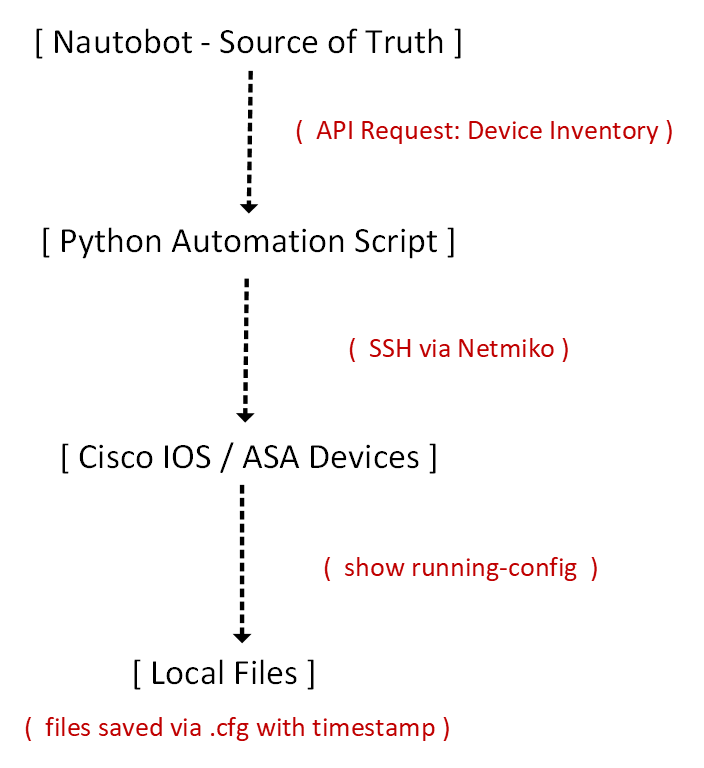
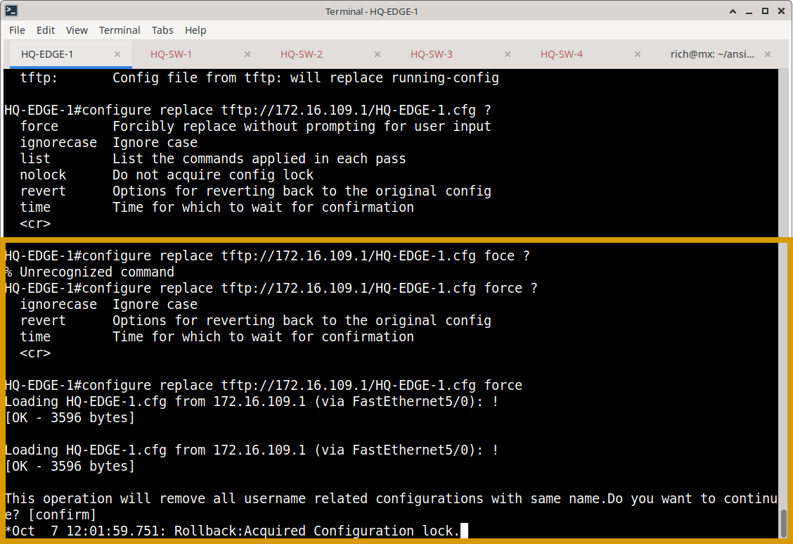
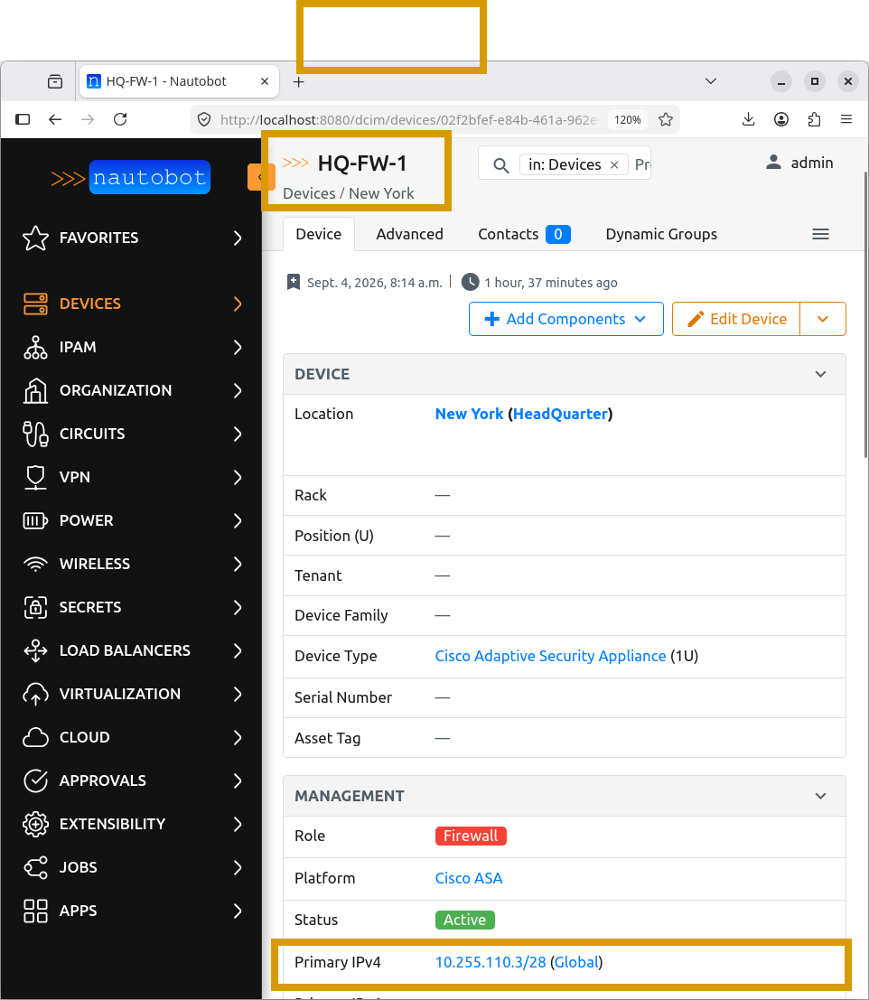
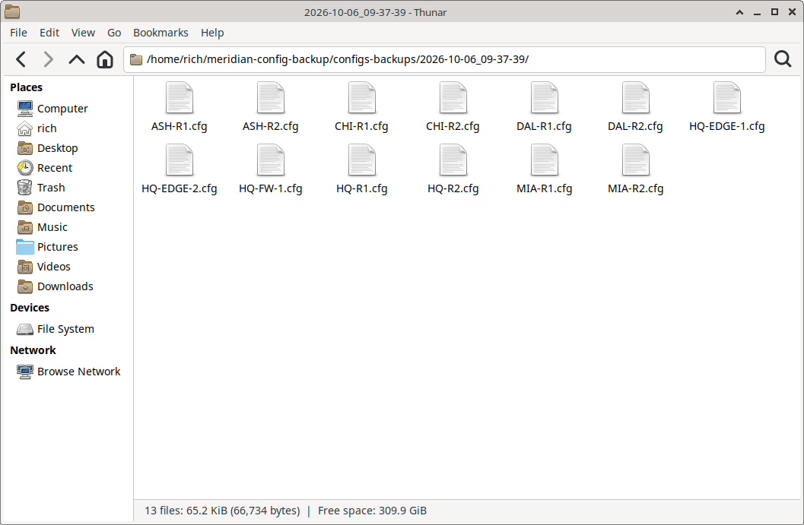

# Network Configuration Backup & Restore Automation

## Overview

This project implements a Python-based, automated network configuration backup workflow for the Meridian Financial Services enterprise environment. 

The automation script dynamically retrieves device inventory from **Nautobot** (Source of Truth), establishes secure SSH connections using **Netmiko**, collects running configurations, and saves them into timestamped, device-specific backup directories. 

Additionally, the project includes a manually validated configuration restore workflow using Cisco IOS configuration replacement to prove the integrity and recoverability of the generated backups.

**Please enlarge for clearer video**

---

## Architecture

The backup pipeline leverages modern network automation tools:

---

## Features

- **Dynamic Discovery:** Queries Nautobot API via `pynautobot` to automatically discover target devices.
- **Intelligent Connection Handling:** Dynamically selects Cisco IOS or Cisco ASA connection parameters based on device naming conventions.
- **Secure Credential Management:** Uses `python-dotenv` to load secrets from environment variables, keeping them out of source code.
- **Timestamped Archiving:** Creates organized, date-stamped backup directories.
- **Robust Error Handling:** Gracefully handles missing IPs, SSH timeouts, and authentication failures without halting the entire batch process.
- **Comprehensive Reporting:** Outputs a clear summary of successful and failed backups upon completion.

---

## Backup Workflow

1. Load required credentials and API tokens from local environment variables (`.env`).
2. Authenticate with the Nautobot API.
3. Retrieve all devices from the DCIM inventory.
4. Iterate through devices, extracting the primary IPv4 address.
5. Establish an SSH session using the appropriate Netmiko device type (`cisco_ios` or `cisco_asa`).
6. Enter privileged EXEC mode.
7. Execute `show running-config` and capture the output.
8. Save the configuration to a device-specific `.cfg` file within a timestamped directory.
9. Log and report the final success/failure status of the batch operation.

---

## Restore Validation

To prove the backups are actually usable, a manual restore test was performed on `HQ-EDGE-1`:
1. A temporary description (`RESTORE_TEST`) was added to the `Loopback0` interface.
2. The saved configuration file was served via a local TFTP server.
3. The configuration was restored using Cisco IOS configuration replacement:  
   `configure replace tftp://172.16.109.1/HQ-EDGE-1.cfg force`
4. Post-restore verification confirmed the temporary description was successfully removed, proving the backup's integrity.

*Note: The Python script handles **backup** only. The restore process is a documented operational CLI procedure, not an automated feature of the script.*

---

## Evidence

The `backups/` directory contains curated evidence documenting the automation and validation:

- **Automation Execution:** Terminal output showing successful batch processing.
- **Dynamic Evidence:** 🎬 *[Video: `videos/backup-automation-video.mp4`]* demonstrating the script executing and generating timestamped files in real-time.
- **Output Structure:** Screenshots of the organized, timestamped backup directories.
- **Source of Truth:** Nautobot device records used for discovery.
- **Restore Validation:** CLI screenshots showing the temporary change, the TFTP replace command, and the successful post-restore verification.

---
