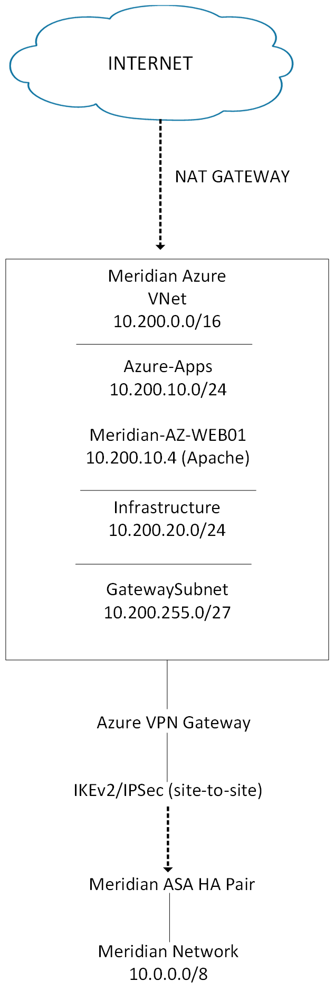

# 02 – Networking

Azure networking design and configuration for the Meridian Financial Services hybrid environment.

## Network Summary

| Component               | Configuration       |
|-------------------------|---------------------|
| VNet                    | Meridian-Azure-VNet |
| Region                  | East US             |
| VNet Address Space      | 10.200.0.0/16       |
| Application Subnet      | 10.200.10.0/24      |
| Infrastructure Subnet   | 10.200.20.0/24      |
| GatewaySubnet           | 10.200.255.0/27     |
| On-Premises Network     | 10.0.0.0/8          |

## Documentation Structure

```text
02-Networking/
├── README.md
├── vnet.md
├── subnets.md
├── routing.md
└── screenshots/
```

## Documentation

| Document        | Description                        |
|-----------------|------------------------------------|
| `vnet.md`       | Virtual Network configuration      |
| `subnets.md`    | Subnet design and allocation       |
| `routing.md`    | Hybrid routing and connectivity    |
| `screenshots/`  | Supporting architecture screenshots |

## Design Objectives

- Private addressing for Azure workloads
- Separation of application and infrastructure workloads
- Dedicated subnet for the Azure VPN Gateway
- Non-overlapping address space with the on-premises 10.0.0.0/8 network
- Private connectivity between Azure and the Meridian on-premises network
- Foundation for future Azure services and workloads

## High-Level Architecture



```text
Meridian On-Premises (10.0.0.0/8)
              |
        IPsec Site-to-Site
              |
       Azure VPN Gateway
              |
         GatewaySubnet
        10.200.255.0/27
              |
     Meridian-Azure-VNet
        10.200.0.0/16
         /          \
        /            \
Azure-Apps      Azure-Infrastructure
10.200.10.0/24     10.200.20.0/24
        |
 MERIDIAN-AZ-WEB01
    10.200.10.4
```

## Related Sections

- [01-Architecture](../01-Architecture/) – Overall hybrid architecture
- [03-Site-to-Site-VPN](../03-Site-to-Site-VPN/) – VPN Gateway and IPsec details
- [07-Routing](../07-Routing/) – Expanded routing documentation (if used)
