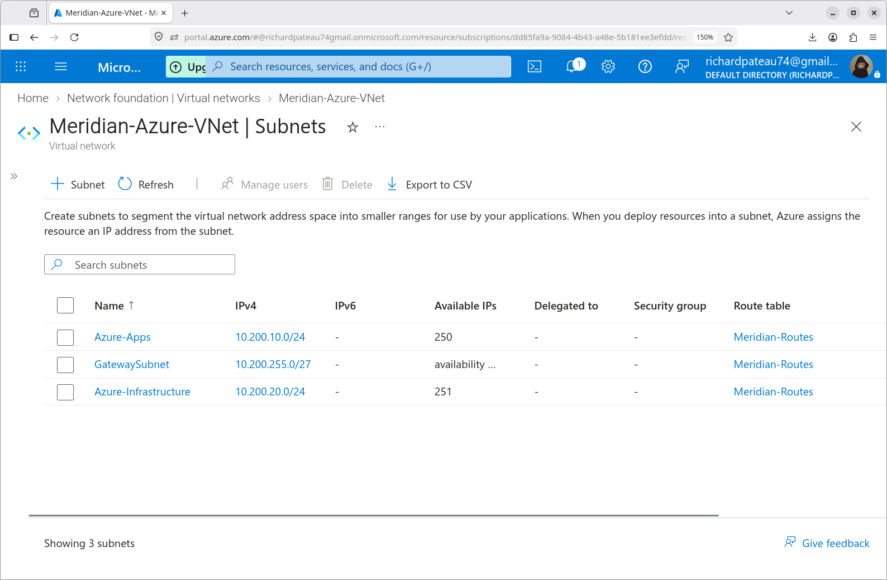
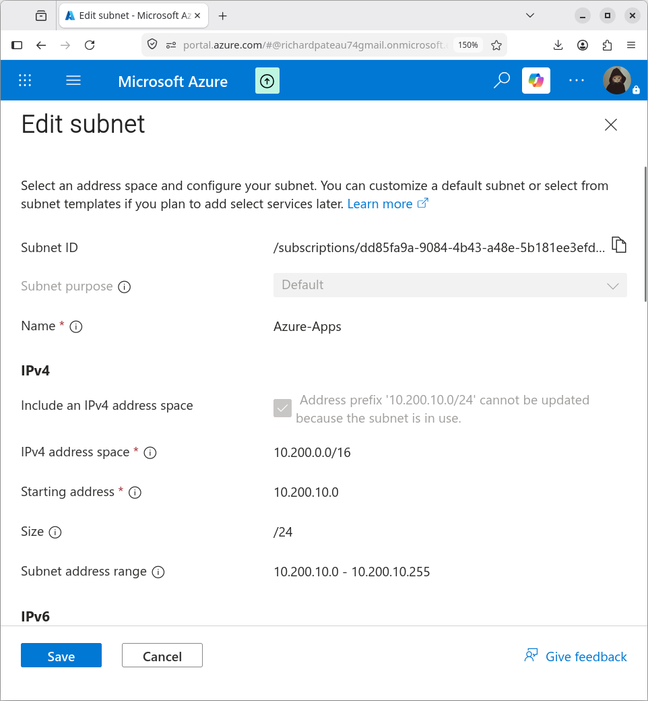
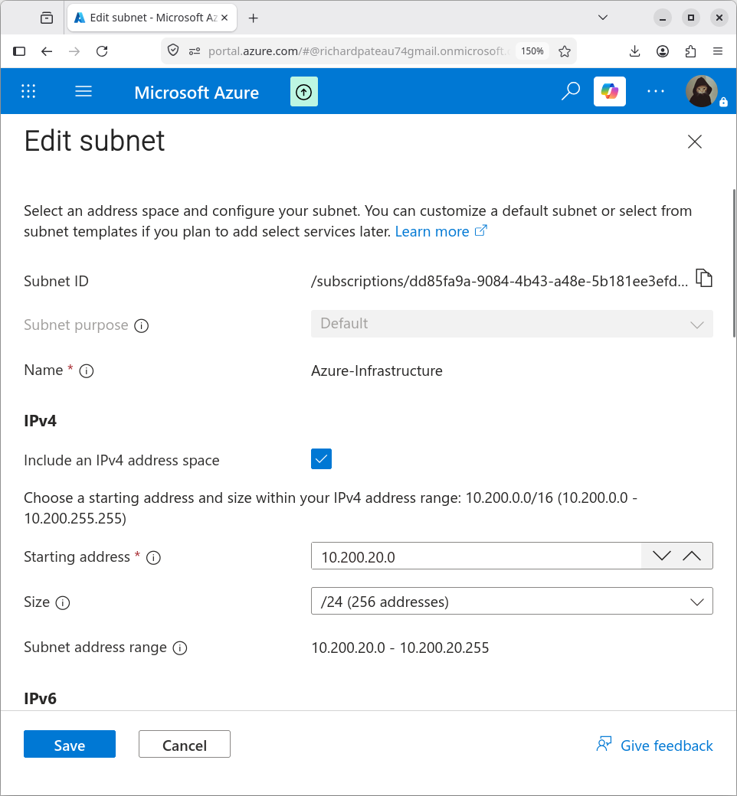
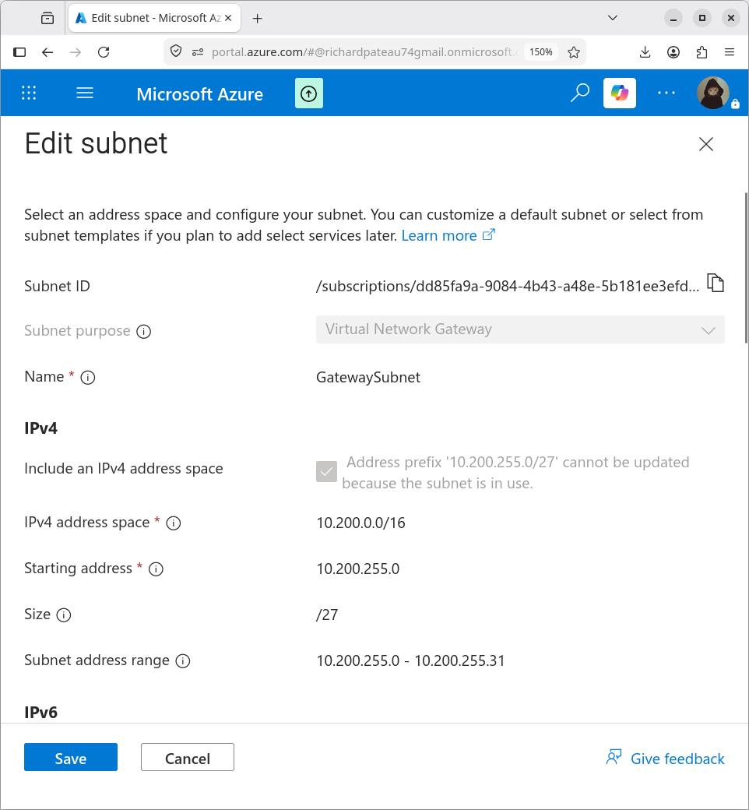

# Azure Subnet Design

## Overview

Meridian-Azure-VNet is divided into dedicated subnets for application workloads, infrastructure services, and the Azure VPN Gateway.

## Subnet Allocation

| Subnet                 | Address Space     | Purpose                        |
|------------------------|-------------------|--------------------------------|
| Azure-Apps             | 10.200.10.0/24    | Azure application workloads    |
| Azure-Infrastructure   | 10.200.20.0/24    | Azure infrastructure services  |
| GatewaySubnet          | 10.200.255.0/27   | Azure VPN Gateway              |

## Azure-Apps

| Property     | Value              |
|--------------|--------------------|
| Name         | Azure-Apps         |
| Address      | 10.200.10.0/24     |
| Purpose      | Application workloads |

This subnet hosts Azure application workloads.

**Deployed workload:**

| Attribute   | Value              |
|-------------|--------------------|
| VM          | MERIDIAN-AZ-WEB01  |
| Private IP  | 10.200.10.4        |
| Role        | Apache web server  |

The subnet is sized as a `/24` to allow room for additional application servers.

## Azure-Infrastructure

| Property     | Value                    |
|--------------|--------------------------|
| Name         | Azure-Infrastructure     |
| Address      | 10.200.20.0/24           |
| Purpose      | Infrastructure services  |

This subnet is reserved for Azure infrastructure workloads (for example future management, monitoring, or shared services).

No production application workloads are placed in this subnet.

## GatewaySubnet

| Property     | Value              |
|--------------|--------------------|
| Name         | GatewaySubnet      |
| Address      | 10.200.255.0/27    |
| Purpose      | Azure VPN Gateway  |

The GatewaySubnet is required by Azure for the VPN Gateway.

- Name must be exactly `GatewaySubnet`
- Minimum recommended size is `/27`
- Dedicated exclusively to the VPN Gateway (no other resources)

This subnet provides the Azure-side network location for the site-to-site IPsec connection to the Meridian ASA HA pair.

## Design Notes

- Application and infrastructure workloads are separated for clearer security and management boundaries
- GatewaySubnet is isolated at the top of the address space (`10.200.255.0/27`)
- NSG controls for the application subnet are documented in `06-Security/`
- No public IP addresses are assigned to resources in Azure-Apps

## Screenshots

| Description                  | File                                       |
|------------------------------|--------------------------------------------|
| Subnet Overview              | `screenshots/subnet-overview.png`          |
| Azure-Apps Subnet            | `screenshots/azure-apps-subnet.png`        |
| Azure-Infrastructure Subnet  | `screenshots/azure-infrastructure-subnet.png` |
| GatewaySubnet                | `screenshots/gateway-subnet.png`           |

## Related Documentation

- [vnet.md](vnet.md) – Virtual Network configuration
- [routing.md](routing.md) – Hybrid routing and connectivity
- [03-Site-to-Site-VPN](../03-Site-to-Site-VPN/) – VPN Gateway details
- [06-Security](../06-Security/) – Network Security Groups
