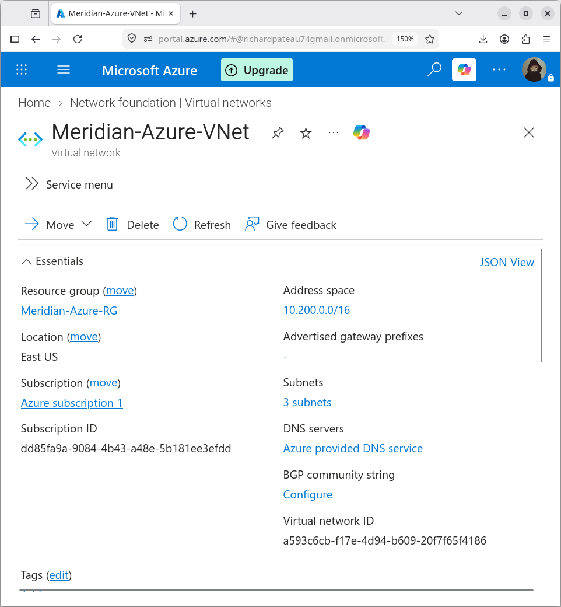
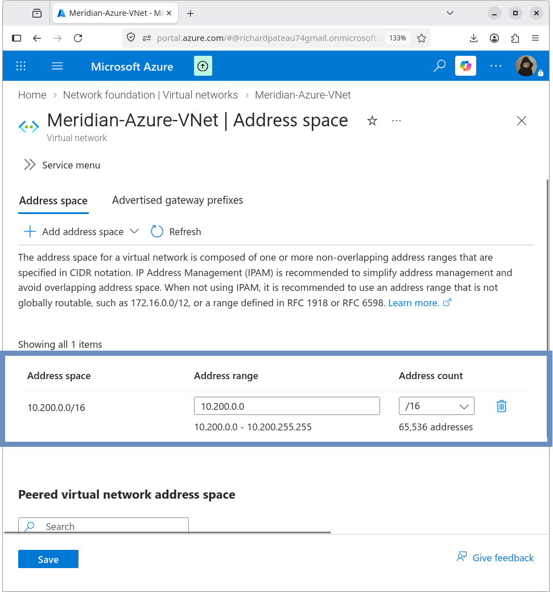

# Azure Virtual Network

## Overview

The Meridian Azure environment uses a dedicated Virtual Network to provide private connectivity for Azure workloads and hybrid integration with the on-premises Meridian network.

| Property       | Value               |
|----------------|---------------------|
| Name           | Meridian-Azure-VNet |
| Region         | East US             |
| Resource Group | Meridian-Azure-RG   |
| Address Space  | 10.200.0.0/16       |



## Address Space

The VNet is configured with the following address space:

```text
10.200.0.0/16
```
This provides a dedicated private address range for all Azure resources in the Meridian environment.



## Address Space Separation

| Network              | Address Space |
|----------------------|---------------|
| Meridian On-Premises | 10.0.0.0/8    |
| Meridian Azure VNet  | 10.200.0.0/16 |

The Azure address space does not overlap with the existing Meridian enterprise network (10.0.0.0/8). This separation simplifies routing and avoids IP conflicts in the hybrid design.

## VNet Purpose

Meridian-Azure-VNet provides the network foundation for:

- Azure application workloads
- Azure infrastructure services
- Azure VPN Gateway
- Hybrid connectivity with the Meridian on-premises network

## Design Decisions

- **Dedicated address space** – Uses 10.200.0.0/16 to remain clearly separate from on-premises 10.0.0.0/8
- **Single VNet** – All current Azure workloads and the VPN Gateway reside in one VNet for simplicity
- **Region** – Deployed in East US to align with the overall Azure deployment
- **Future growth** – /16 provides sufficient space for additional subnets and workloads

## Related Documentation

- [subnets.md](subnets.md) – Subnet design and allocation
- [routing.md](routing.md) – Hybrid routing and connectivity
- [01-Architecture](../01-Architecture/) – Overall architecture baseline
