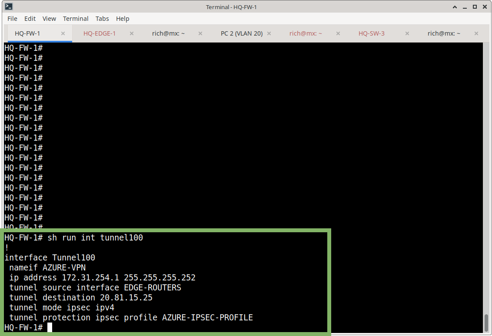
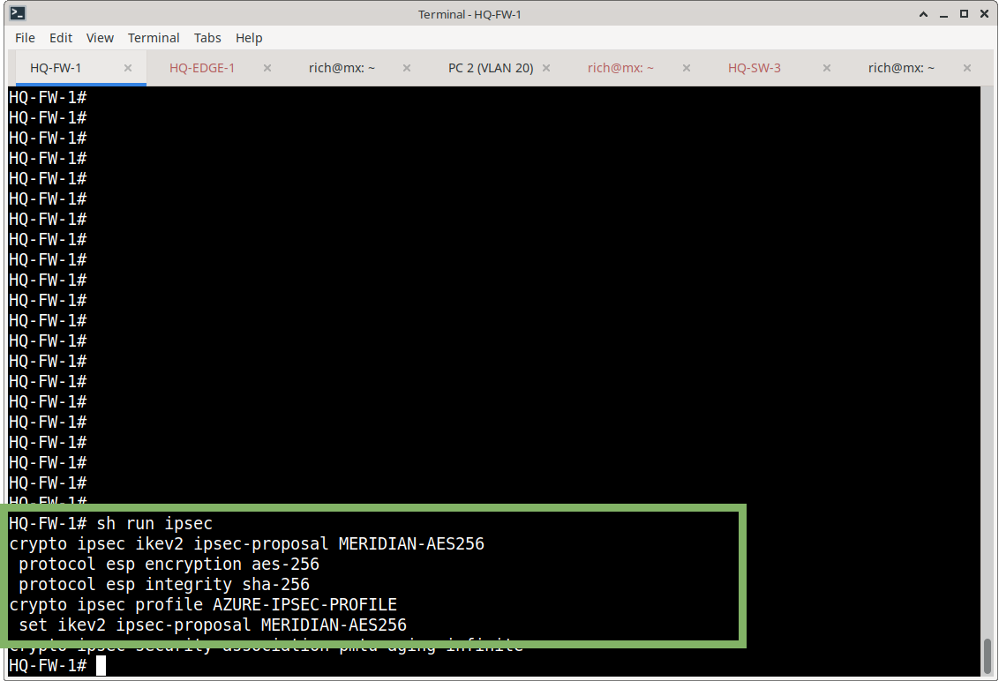
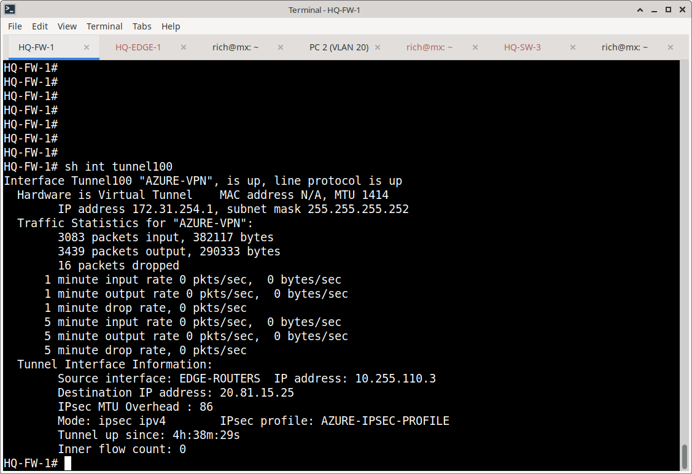

# Cisco ASA VTI Configuration

## Overview

The Meridian HQ firewall uses a route-based IPsec Virtual Tunnel Interface (VTI) for the Azure site-to-site VPN.

The VTI provides a logical Layer 3 interface for the encrypted connection to the Azure VPN Gateway.

## Tunnel Interface

```cisco
interface Tunnel100
 nameif AZURE-VPN
 ip address 172.31.254.1 255.255.255.252
 tunnel source interface EDGE-ROUTERS
 tunnel destination 20.81.15.25
 tunnel mode ipsec ipv4
 tunnel protection ipsec profile AZURE-IPSEC-PROFILE
```



## Tunnel Parameters

| Parameter          | Value                |
|--------------------|----------------------|
| Interface          | Tunnel100            |
| Nameif             | AZURE-VPN            |
| Tunnel IP          | 172.31.254.1/30      |
| Tunnel Source      | EDGE-ROUTERS         |
| Source IP          | 10.255.110.3         |
| Tunnel Destination | 20.81.15.25          |
| Tunnel Mode        | IPsec IPv4           |
| IPsec Profile      | AZURE-IPSEC-PROFILE  |

## IPsec Profile

```cisco
crypto ipsec profile AZURE-IPSEC-PROFILE
 set ikev2 ipsec-proposal MERIDIAN-AES256
```

## IPsec Proposal

```cisco
crypto ipsec ikev2 ipsec-proposal MERIDIAN-AES256
 protocol esp encryption aes-256
 protocol esp integrity sha-256
```


## Separation from Existing Crypto Map

The Azure VTI was implemented separately from the existing Meridian site-to-site crypto-map configuration.

- Existing crypto map (MERIDIAN-VPN) was not modified
- The Azure connection uses the ASA VTI’s dynamically generated IPsec crypto-map

This keeps the Azure VPN independent from the legacy policy-based VPN configuration.

## Azure Peer

The ASA peers with the Azure VPN Gateway at:

```text
20.81.15.25
```

A corresponding IKEv2 tunnel-group exists for this peer (documented in ikev2.md).



## Design Notes

- Route-based VTI is required to match the Azure route-based VPN Gateway
- /30 tunnel subnet (172.31.254.0/30) is used for the VTI addressing
- Tunnel source is the inside-facing interface toward the edge routers (EDGE-ROUTERS)
- Tunnel destination is the primary Azure VPN Gateway public IP

## Related Documentation

- [azure-vpn-gateway.md](azure-vpn-gateway.md) – Azure VPN Gateway
- [vpn-connection.md](vpn-connection.md) – Azure site-to-site connection
- [ikev2.md](ikev2.md) – IKEv2 policy and tunnel-group
- [ipsec.md](ipsec.md) – IPsec proposals and profiles
