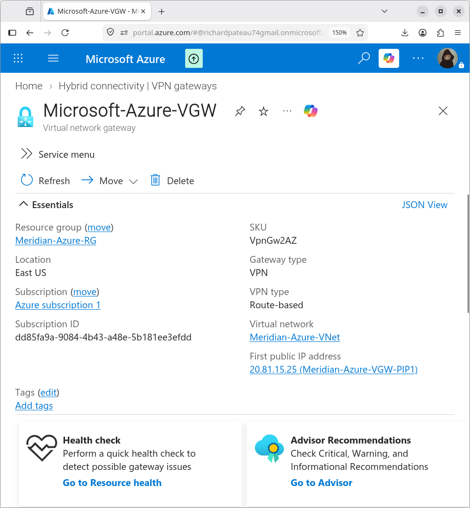
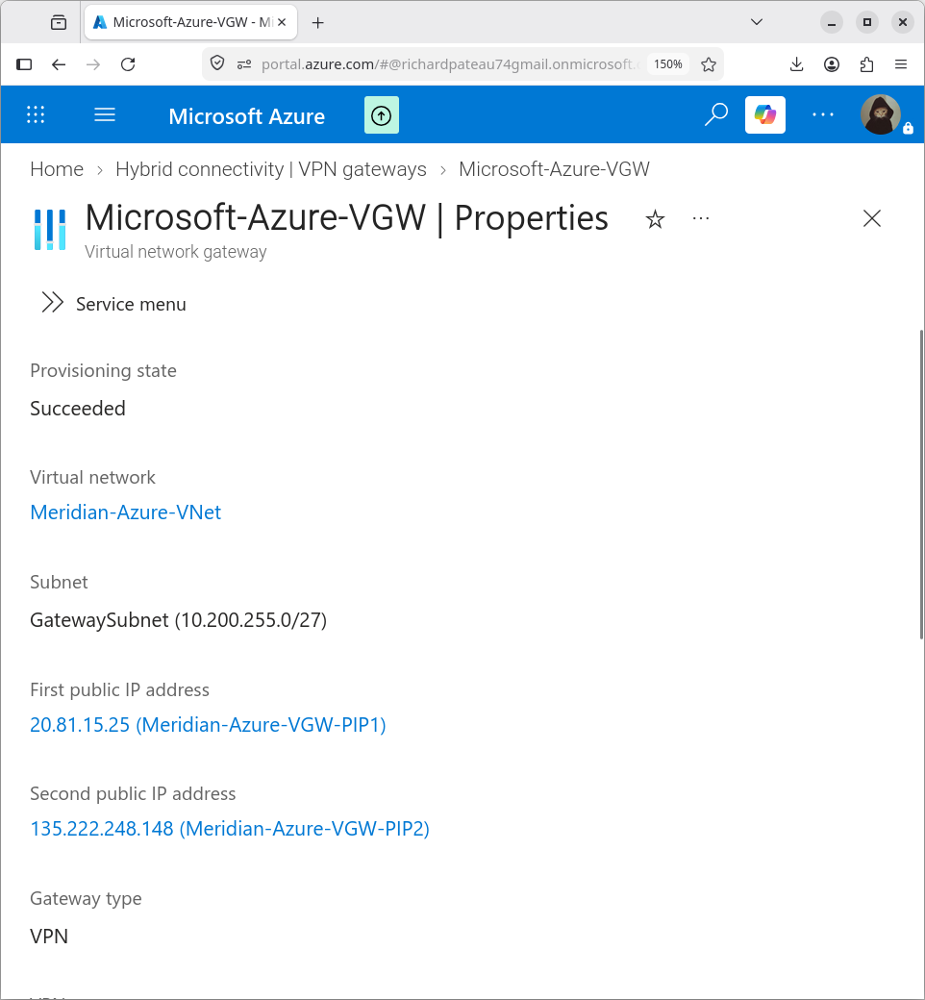
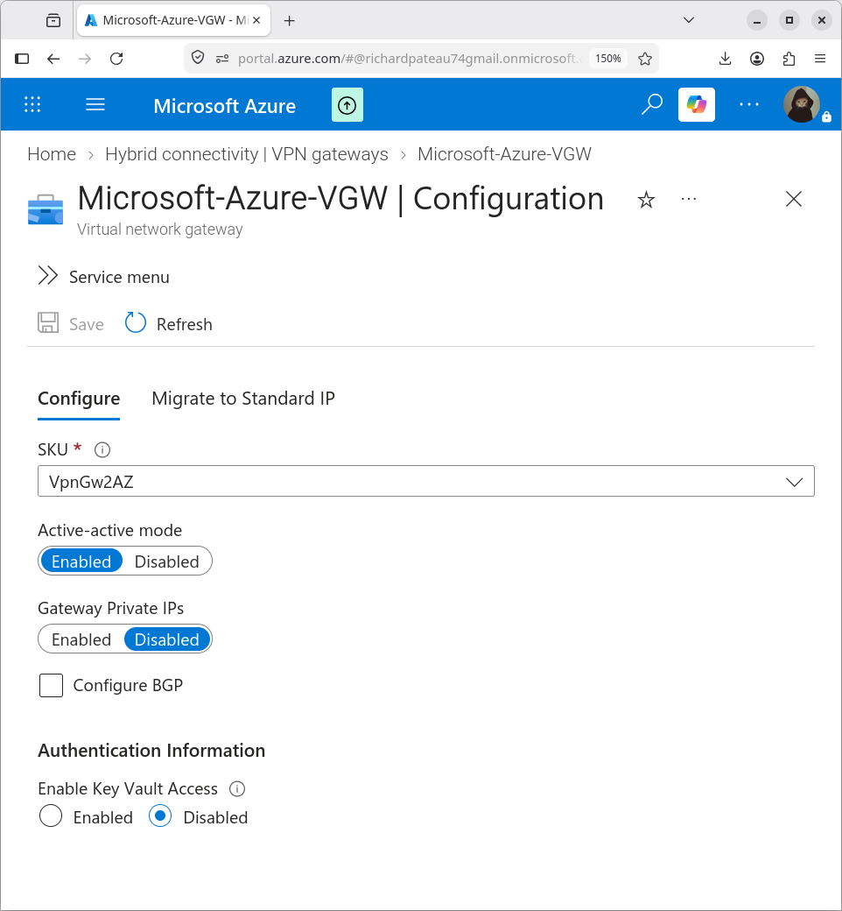

# Azure VPN Gateway

## Overview

The Azure environment uses an Azure VPN Gateway to provide site-to-site connectivity between the Meridian on-premises network and the Azure Virtual Network.

## Configuration

| Property        | Value                 |
|-----------------|-----------------------|
| Name            | Microsoft-Azure-VGW   |
| Region          | East US               |
| Resource Group  | Meridian-Azure-RG     |
| SKU             | VpnGw2AZ              |
| Gateway Type    | VPN                   |
| VPN Type        | Route-based           |
| Active-Active   | Enabled               |
| BGP             | Disabled              |
| VNet            | Meridian-Azure-VNet   |
| Gateway Subnet  | 10.200.255.0/27       |




## Public IP Addresses

The active-active VPN Gateway uses two public IP addresses:

```text
20.81.15.25
135.222.248.148
```

The initial site-to-site connection is configured against the primary Azure VPN Gateway public endpoint:

```text
20.81.15.25
```



## Gateway Subnet

The VPN Gateway is deployed into:

| Property | Value           |
|----------|-----------------|
| Name     | GatewaySubnet   |
| Address  | 10.200.255.0/27 |

The GatewaySubnet is reserved exclusively for Azure VPN Gateway services. No other resources are placed in this subnet.

## Purpose

The VPN Gateway provides the Azure-side termination point for the Meridian site-to-site IPsec connection.

- Terminates the IKEv2/IPsec tunnel from the Meridian ASA HA pair
- Enables private connectivity to the Azure VNet (10.200.0.0/16)
- Allows traffic between Meridian on-premises and Azure workloads to traverse the encrypted VPN path rather than the public Internet

## Design Notes

- Route-based VPN type is required for VTI integration on the ASA
- Active-Active is enabled for higher availability
- BGP is disabled (static routing via Local Network Gateway)
- SKU VpnGw2AZ provides zone-redundant capacity suitable for the current design



## Related Documentation

- [local-network-gateway.md](local-network-gateway.md) – Local Network Gateway
- [vpn-connection.md](vpn-connection.md) – Site-to-site connection
- [asa-vti.md](asa-vti.md) – ASA route-based VTI
- [02-Networking/subnets.md](../02-Networking/subnets.md) – GatewaySubnet design
