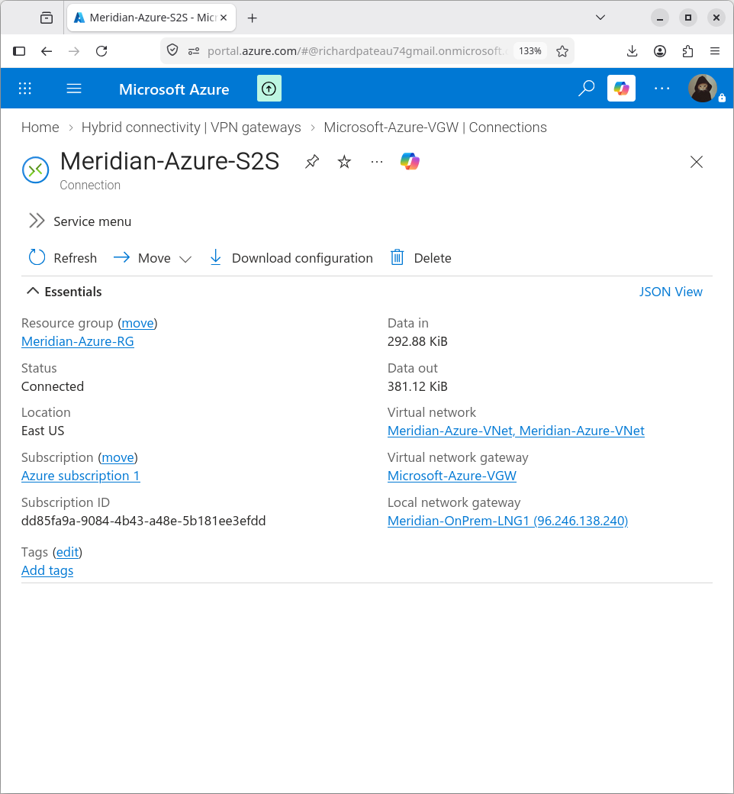
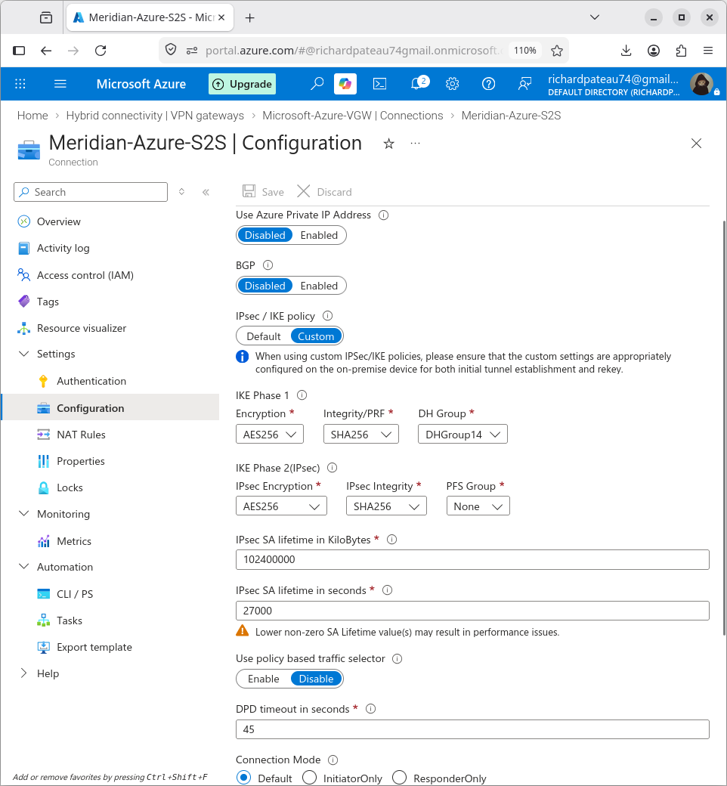

# Azure Site-to-Site VPN Connection

## Overview

The Azure site-to-site connection links the Azure VPN Gateway with the Meridian on-premises Local Network Gateway. It defines the logical IPsec tunnel on the Azure side.

## Configuration

| Property                        | Value                    |
|---------------------------------|--------------------------|
| Name                            | Meridian-Azure-S2S       |
| Connection Type                 | Site-to-site (IPsec)     |
| Virtual Network Gateway         | Microsoft-Azure-VGW      |
| Local Network Gateway           | Meridian-OnPrem-LNG1     |
| IKE Version                     | IKEv2                    |
| BGP                             | Disabled                 |
| Authentication                  | Pre-shared key           |
| Use Azure Private IP            | Disabled                 |
| Policy-based Traffic Selectors  | Disabled                 |

## IKE Configuration

| Setting              | Value     |
|----------------------|-----------|
| Encryption           | AES-256   |
| Integrity            | SHA-256   |
| Diffie-Hellman Group | 14        |

## IPsec Configuration

| Setting              | Value     |
|----------------------|-----------|
| Encryption           | AES-256   |
| Integrity            | SHA-256   |
| Perfect Forward Secrecy (PFS) | None |

## Security Association Lifetime

| Setting                | Value            |
|------------------------|------------------|
| SA Lifetime (seconds)  | 27000            |
| SA Lifetime (KB)       | 102400000        |

## Dead Peer Detection

| Setting | Value      |
|---------|------------|
| DPD     | 45 seconds |

## Purpose

This connection object provides the Azure-side configuration for the IPsec tunnel between:

- Azure VPN Gateway (`Microsoft-Azure-VGW`)
- Meridian on-premises endpoint (`96.246.138.240` via Local Network Gateway)

It works together with the VPN Gateway and Local Network Gateway to establish and maintain the encrypted site-to-site path.

## Design Notes

- Route-based connection (no policy-based traffic selectors)
- Pre-shared key authentication (key is not stored in this repository)
- BGP disabled — routing relies on address spaces defined on the Local Network Gateway
- Parameters are aligned with the ASA IKEv2/IPsec configuration for successful negotiation

## Related Documentation

- [azure-vpn-gateway.md](azure-vpn-gateway.md) – Azure VPN Gateway
- [local-network-gateway.md](local-network-gateway.md) – Local Network Gateway
- [asa-vti.md](asa-vti.md) – ASA route-based VTI
- [ikev2.md](ikev2.md) – IKEv2 details
- [ipsec.md](ipsec.md) – IPsec details
