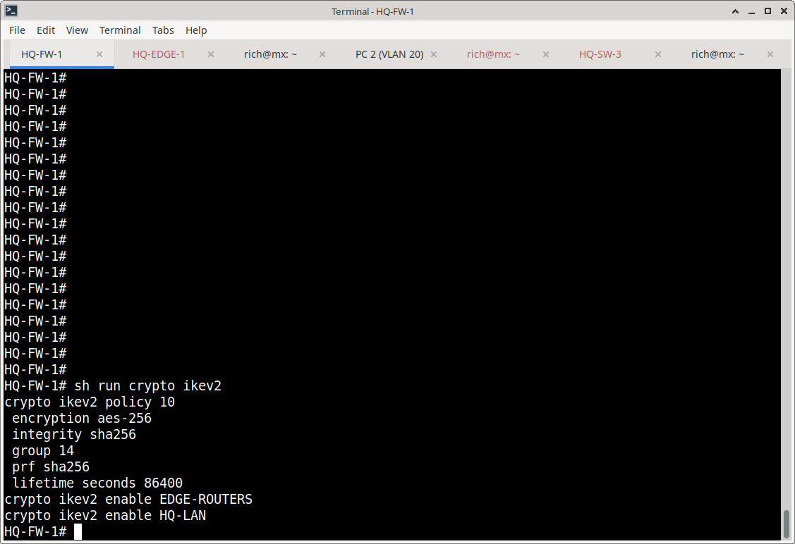
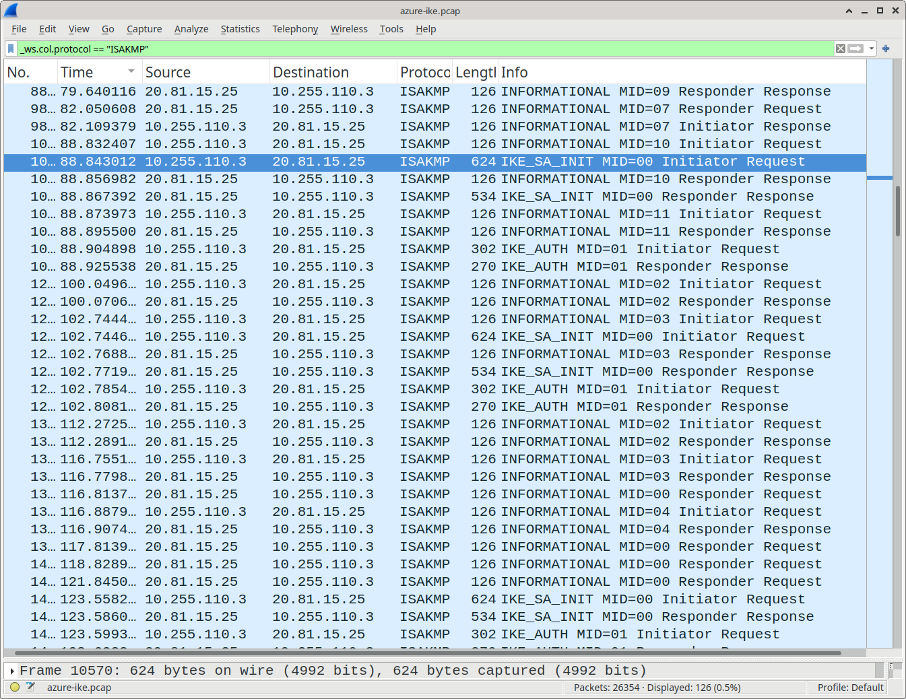
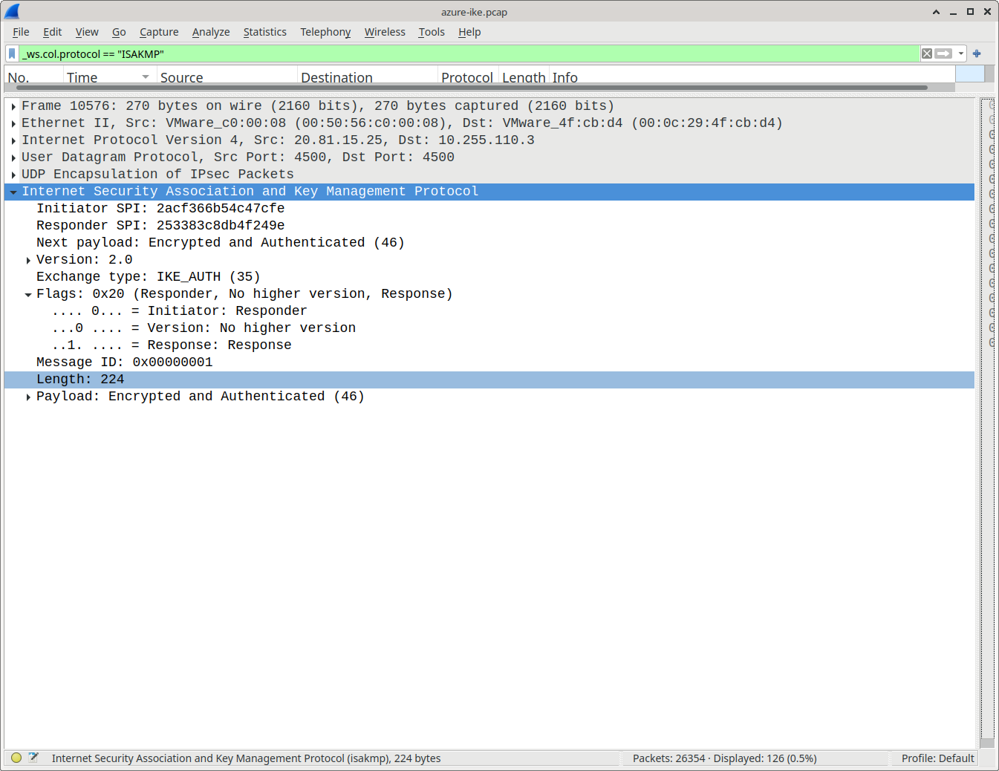
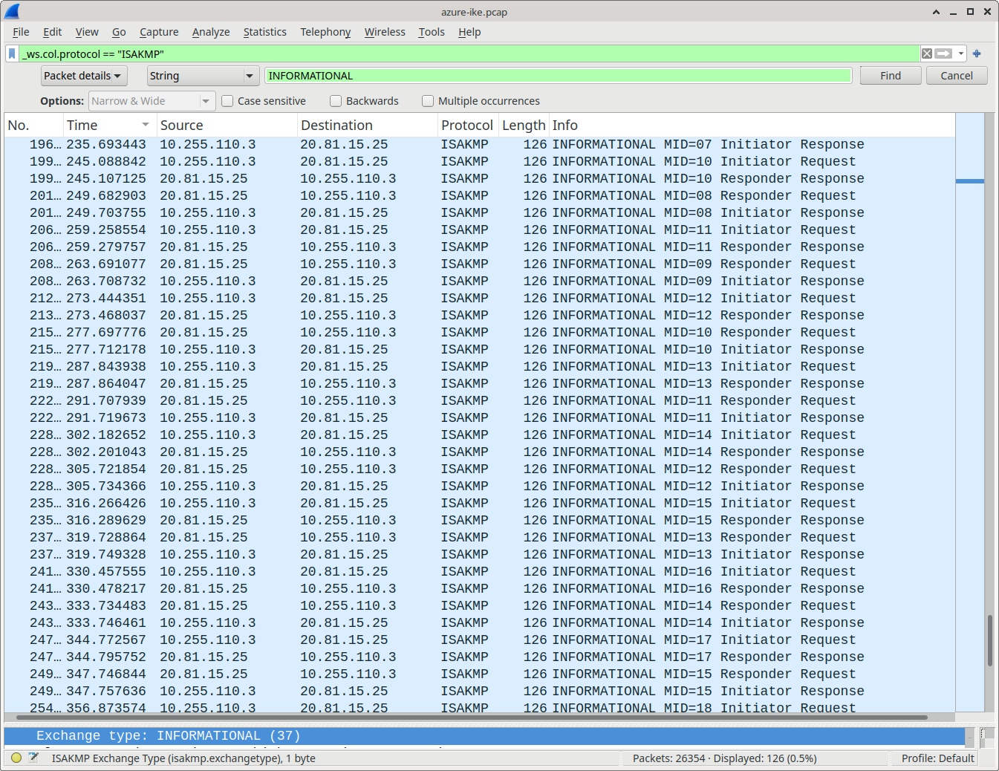

# IKEv2

## Overview

The Meridian-to-Azure VPN uses Internet Key Exchange version 2 (IKEv2) to negotiate and establish the IPsec security associations.

## ASA IKEv2 Policy

```cisco
crypto ikev2 policy 10
 encryption aes-256
 integrity sha256
 group 14
 prf sha256
 lifetime seconds 86400
```

IKEv2 is enabled on the external firewall interface:

```cisco
crypto ikev2 enable EDGE-ROUTERS
```



## IKE Parameters

| Parameter      | Value         |
|----------------|---------------|
| Encryption     | AES-256       |
| Integrity      | SHA-256       |
| PRF            | SHA-256       |
| Diffie-Hellman | Group 14      |
| Lifetime       | 86400 seconds |
| IKE Version    | IKEv2         |

## Azure Peer

The ASA uses the following Azure VPN Gateway public IP as the remote IKEv2 endpoint:

```text
20.81.15.25
```

A corresponding IKEv2 tunnel-group is configured for this peer.

## Authentication

The VPN uses pre-shared key authentication.

The actual pre-shared key is intentionally not stored in this repository.

## IKEv2 Negotiation Evidence

A packet capture was collected during VPN negotiation. The capture shows successful bidirectional IKEv2 exchange:

| Direction                  | Message               |
|----------------------------|-----------------------|
| 10.255.110.3 → 20.81.15.25 | IKE_SA_INIT Request   |
| 20.81.15.25 → 10.255.110.3 | IKE_SA_INIT Response  |
| 10.255.110.3 → 20.81.15.25 | IKE_AUTH Request      |
| 20.81.15.25 → 10.255.110.3 | IKE_AUTH Response     |

Key observations:

- The IKE_AUTH exchange transitioned to UDP/4500, confirming NAT-T negotiation
- The IKE_AUTH response contained encrypted and authenticated payload data
- Negotiation completed successfully

## Evidence

Packet capture:

** INIT and AUTH pcaps**



**SPI Verification**



**INFORMATIONAL packets**



## Design Notes

- Policy parameters (AES-256 / SHA-256 / DH14) are aligned with the Azure connection settings
- Lifetime of 86400 seconds matches common Azure defaults
- NAT-T is required because the ASA sits behind the edge/public path

## Related Documentation

- [asa-vti.md](asa-vti.md) – ASA route-based VTI
- [ipsec.md](ipsec.md) – IPsec proposals and profiles
- [vpn-connection.md](vpn-connection.md) – Azure site-to-site connection
- [azure-vpn-gateway.md](azure-vpn-gateway.md) – Azure VPN Gateway
