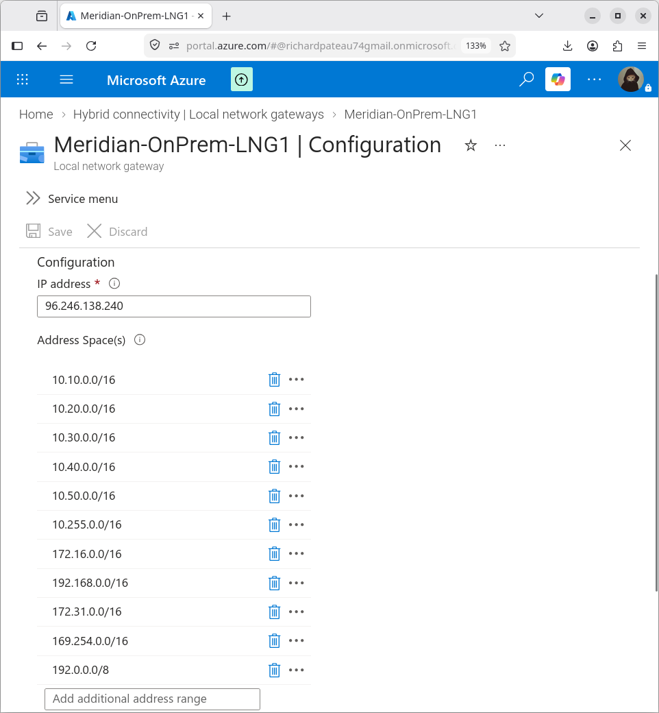

# Local Network Gateway

## Overview

The Azure Local Network Gateway represents the Meridian on-premises network from the Azure perspective. It defines the remote VPN endpoint and the on-premises address spaces that are reachable over the site-to-site connection.

## Configuration

| Property       | Value                     |
|----------------|---------------------------|
| Name           | Meridian-OnPrem-LNG1      |
| Public IP      | 96.246.138.240            |
| VPN Device     | Meridian HQ Firewall (ASA HA pair) |
| Region         | East US                   |
| Resource Group | Meridian-Azure-RG         |

## On-Premises Address Spaces

The Local Network Gateway is configured with the following Meridian address spaces:

```text
10.10.0.0/16
10.20.0.0/16
10.30.0.0/16
10.40.0.0/16
10.50.0.0/16
10.255.0.0/16
172.16.0.0/16
192.168.0.0/16
172.31.0.0/16
169.254.0.0/16
192.0.0.0/8
```

These prefixes represent the networks used within the Meridian environment that should be reachable from Azure over the VPN.

## Public Endpoint

Azure establishes the site-to-site connection to the Meridian environment using this public endpoint:

```text
96.246.138.240
```

This address is the public IP of the Meridian Internet connection (FiOS) in front of the HQ firewall HA pair.



## Purpose

The Local Network Gateway allows Azure to identify:

- The Meridian VPN endpoint (public IP)
- The on-premises network address spaces
- The networks that are reachable through the site-to-site VPN

It is required for the Azure site-to-site connection object and works together with the VPN Gateway and Connection resources.

## Design Notes

- Address spaces listed here must match (or be a subset of) the networks that the ASA actually advertises/routes over the tunnel
- Overly broad prefixes (for example 192.0.0.0/8) should be reviewed and tightened if not required
- BGP is disabled; routing relies on the address spaces defined on this Local Network Gateway

## Related Documentation

- [azure-vpn-gateway.md](azure-vpn-gateway.md) – Azure VPN Gateway
- [vpn-connection.md](vpn-connection.md) – Site-to-site connection
- [asa-vti.md](asa-vti.md) – ASA route-based VTI
- [02-Networking/routing.md](../02-Networking/routing.md) – Hybrid routing
