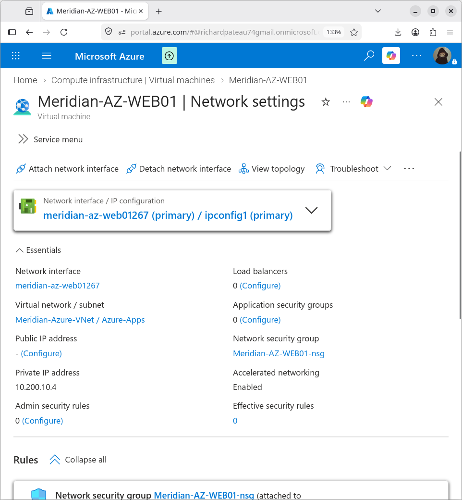
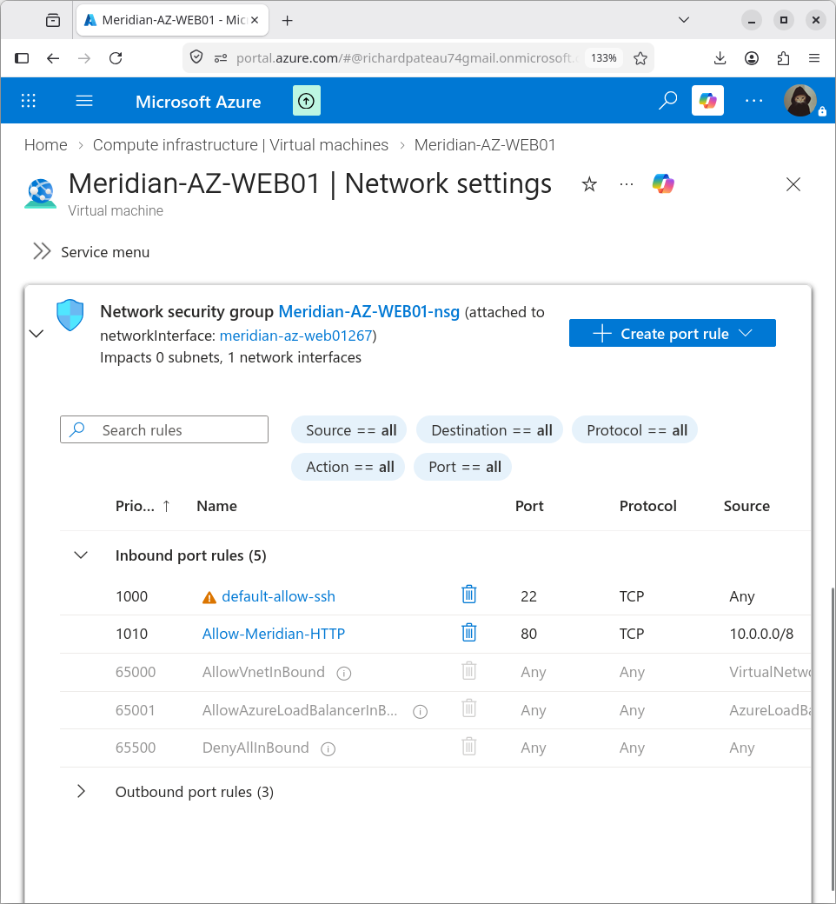

# Azure Virtual Machine

## Overview

`MERIDIAN-AZ-WEB01` is the Azure-hosted application server for the Meridian Financial Services hybrid environment.

The VM is deployed into the Azure application subnet and uses a private IP address only.

## VM Configuration

| Property         | Value                    |
|------------------|--------------------------|
| Name             | MERIDIAN-AZ-WEB01        |
| Resource Group   | Meridian-Azure-RG        |
| Region           | East US                  |
| Operating System | Ubuntu Server 24.04 LTS  |
| VM Size          | Standard_D2as_v4         |
| Authentication   | SSH public key           |
| Username         | meridianadmin            |
| Public IP        | None                     |

## Network Configuration

| Property            | Value                   |
|---------------------|-------------------------|
| VNet                | Meridian-Azure-VNet     |
| VNet Address Space  | 10.200.0.0/16           |
| Subnet              | Azure-Apps              |
| Subnet Address      | 10.200.10.0/24          |
| Private IP          | 10.200.10.4             |
| NIC NSG             | Meridian-AZ-WEB01-nsg   |



## Network Security Group

The VM’s network security group includes an HTTP rule permitting traffic from the Meridian enterprise address space.

| Setting           | Value                |
|-------------------|----------------------|
| Rule Name         | Allow-Meridian-HTTP  |
| Source            | 10.0.0.0/8           |
| Source Port       | *                    |
| Destination       | Any                  |
| Destination Port  | 80                   |
| Protocol          | TCP                  |
| Action            | Allow                |
| Priority          | 1010                 |

Full NSG documentation is maintained in `06-Security/`.



## SSH Access

Administrative access was tested from the Meridian network using the VM’s private IP address.

Example:

```bash
ssh -i ~/.ssh/Meridian-AZ-WEB01_key.pem meridianadmin@10.200.10.4
```

Successful SSH access confirms private-network reachability of the Azure VM over the site-to-site VPN.


## Private Network Design

The VM intentionally has no public IP address.

All administrative and application traffic uses the private address:

```text
10.200.10.4
```

This keeps the workload inside the hybrid/private network architecture.

## Design Notes

- Private-only deployment aligns with the overall architecture principle of no public IPs on application servers
- SSH key-based authentication is used (no password authentication)
- Outbound Internet access (package updates, etc.) is provided via the Azure NAT Gateway (see 05-Internet-Egress/)

## Related Documentation

- [web-server.md](web-server.md) – Apache installation and webpage
- [02-Networking/subnets.md](../02-Networking/subnets.md) – Azure-Apps subnet
- [05-Internet-Egress](../05-Internet-Egress/) – NAT Gateway outbound access
- [06-Security](../06-Security/) – Network Security Groups
