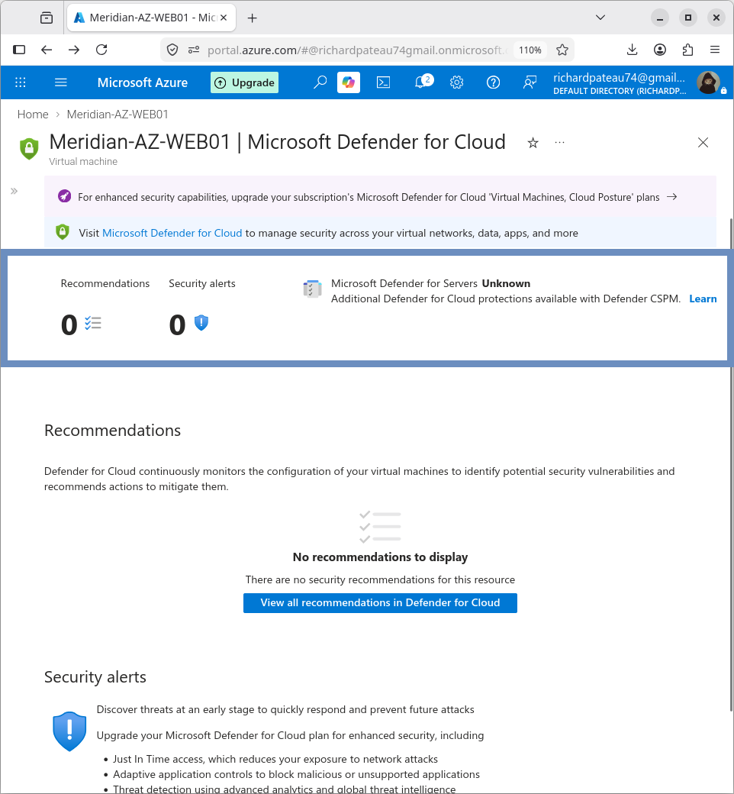

# 06 – Security

## Overview

This section documents the security controls implemented and validated for the Meridian Financial Services Azure environment.

The security design focuses on:

- Network Security Groups (NSGs)
- Restricted administrative access
- Controlled application access
- Default-deny inbound behavior
- Trusted Launch
- Microsoft Defender for Cloud recommendations
- Resource deletion protection
- Effective security-rule validation

### Primary Resources

| Resource              | Value                    |
|-----------------------|--------------------------|
| Resource Group        | Meridian-Azure-RG        |
| Virtual Network       | Meridian-Azure-VNet      |
| Application VM        | MERIDIAN-AZ-WEB01        |
| VM NSG                | Meridian-AZ-WEB01-nsg    |

## Security Architecture

The application VM is deployed in the `Azure-Apps` subnet and protected by an NSG on its network interface.

```text
                    Internet
                        |
                 Azure NAT Gateway
                        |
              +-------------------+
              |   Azure VNet      |
              |  10.200.0.0/16    |
              |                   |
              |   Azure-Apps      |
              |  10.200.10.0/24   |
              |         |         |
              |  MERIDIAN-AZ-WEB01|
              |     10.200.10.4   |
              |         |         |
              |  NSG: WEB01-nsg   |
              +-------------------+
```

## Network Security Group

The VM NIC is associated with:

```text
Meridian-AZ-WEB01-nsg
```

### Custom Inbound Rules

| Priority | Rule Name           | Protocol | Port | Source     | Action |
|----------|---------------------|----------|------|------------|--------|
| 1000     | default-allow-ssh   | TCP      | 22   | 10.0.0.0/8 | Allow  |
| 1010     | Allow-Meridian-HTTP | TCP      | 80   | 10.0.0.0/8 | Allow  |

### Default Azure Rules (still in effect)

#### Inbound

Final rule: DenyAllInBound (priority 65500)

#### Outbound

- AllowVnetOutBound
- AllowInternetOutBound
- DenyAllOutBound


## Trusted Launch

MERIDIAN-AZ-WEB01 uses Trusted Launch security features:

| Feature              | Status  |
|----------------------|---------|
| Secure Boot          | Enabled |
| vTPM                 | Enabled |
| Integrity Monitoring | Enabled |

The VM was rebooted after enabling these settings and connectivity was re-verified.


## Microsoft Defender for Cloud

Defender for Cloud recommendations were reviewed after security configuration.

| Category                 | Count |
|--------------------------|-------|
| Critical recommendations | 0     |
| High recommendations     | 0     |
| Medium recommendations   | 0     |
| Low recommendations      | 0     |
| Active attack paths      | 0     |
| Overdue recommendations  | 0     |

No active recommendations were reported at the time of validation.



## Resource Deletion Protection

A delete lock was applied to the resource group:

| Property       | Value                        |
|----------------|------------------------------|
| Resource Group | Meridian-Azure-RG            |
| Lock Name      | Meridian-Azure-RG-DeleteLock |
| Lock Type      | Delete                       |

The lock prevents accidental deletion of the resource group while still allowing normal resource management operations.


## Security Validation

### NSG Validation

Effective security rules were inspected on the VM network interface. Confirmed:

- SSH restricted to 10.0.0.0/8
- HTTP restricted to 10.0.0.0/8
- Default inbound deny remains active
- VNet outbound traffic allowed
- Internet outbound traffic allowed
- Default outbound deny remains active

### VM Security Validation

Trusted Launch settings were verified as enabled.

### Defender Validation

Defender for Cloud showed no active recommendations at the time of testing.

### Resource Protection Validation

The resource-group delete lock was verified as present and active.

## Security Outcome

The Azure application VM is protected by layered controls:

- Network segmentation
- NSG filtering
- Restricted administrative access (SSH from 10.0.0.0/8 only)
- Restricted application access (HTTP from 10.0.0.0/8 only)
- Default-deny inbound behavior
- Trusted Launch (Secure Boot, vTPM, Integrity Monitoring)
- Microsoft Defender for Cloud
- Resource-group deletion protection

These controls were configured and validated through the Azure portal.

## Documentation Structure

```text
06-Security/
├── README.md                 ← this file
├── nsg.md
├── trusted-launch.md
├── defender.md
├── resource-locks.md
└── screenshots/
```

## Related Sections

- [01-Architecture](../01-Architecture/) – Overall hybrid architecture
- [02-Networking](../02-Networking/) – VNet and subnet design
- [04-Application-Server](../04-Application-Server/) – Application VM
- [05-Internet-Egress](../05-Internet-Egress/) – NAT Gateway outbound access
