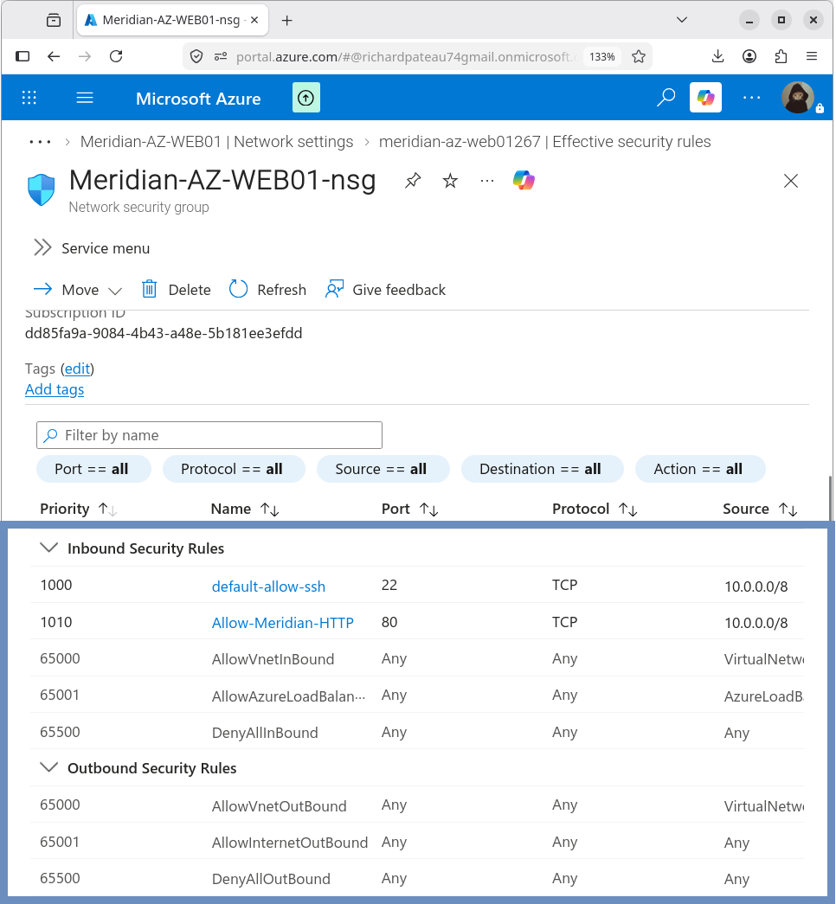
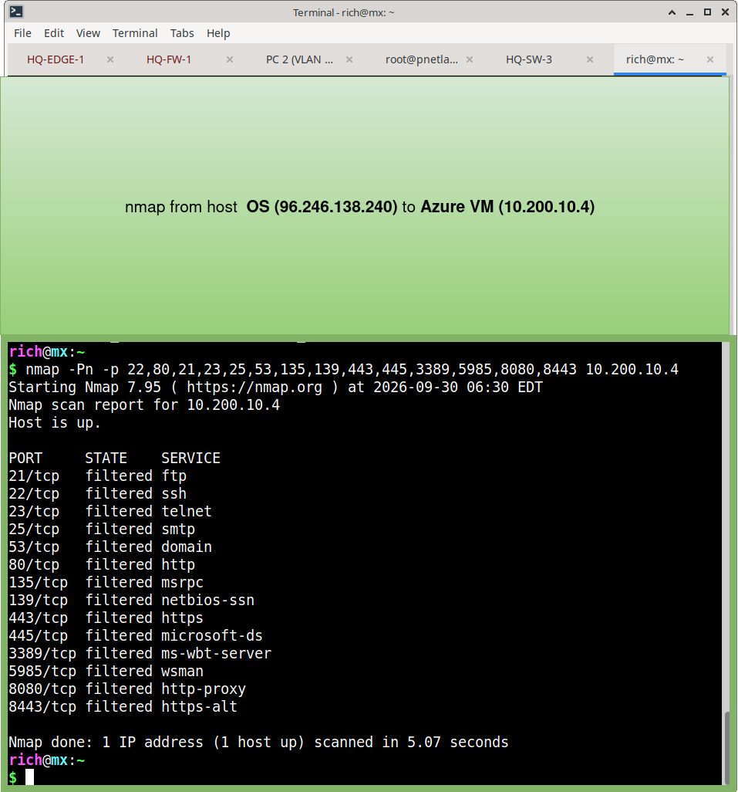

# Network Security Group

## Resource

| Property       | Value                      |
|----------------|----------------------------|
| NSG Name       | Meridian-AZ-WEB01-nsg      |
| Attached to    | meridian-az-web01267 (NIC) |
| Resource Group | Meridian-Azure-RG          |
| Location       | East US                    |
| Associated VM  | MERIDIAN-AZ-WEB01          |

The NSG is associated with the network interface of `MERIDIAN-AZ-WEB01`.

## Inbound Rules

### SSH

| Setting   | Value            |
|-----------|------------------|
| Name      | default-allow-ssh |
| Priority  | 1000             |
| Protocol  | TCP              |
| Port      | 22               |
| Source    | 10.0.0.0/8       |
| Action    | Allow            |

SSH was restricted from unrestricted Internet access to the Meridian enterprise address space (`10.0.0.0/8`).

### HTTP

| Setting   | Value                |
|-----------|----------------------|
| Name      | Allow-Meridian-HTTP  |
| Priority  | 1010                 |
| Protocol  | TCP                  |
| Port      | 80                   |
| Source    | 10.0.0.0/8           |
| Action    | Allow                |

HTTP access to the application server is restricted to the Meridian enterprise address space.

### Default Inbound Rules

The NSG retains Azure’s default inbound rules. The final default rule is:

| Setting   | Value          |
|-----------|----------------|
| Priority  | 65500          |
| Name      | DenyAllInBound |
| Action    | Deny           |

This provides **default-deny** behavior for any inbound traffic that does not match an earlier allow rule.

## Outbound Rules

The default outbound rules remain enabled:

| Priority | Name                  | Action |
|----------|-----------------------|--------|
| 65000    | AllowVnetOutBound     | Allow  |
| 65001    | AllowInternetOutBound | Allow  |
| 65500    | DenyAllOutBound       | Deny   |

No additional restrictive outbound rules were added. This allows the VM to use the configured Azure NAT Gateway for Internet egress.

## Effective Security Rules

Effective security rules were inspected on the VM network interface.

**Validated inbound behavior:**

| Traffic                          | Result |
|----------------------------------|--------|
| TCP/22 from 10.0.0.0/8           | Allow  |
| TCP/80 from 10.0.0.0/8           | Allow  |
| Other unmatched inbound traffic  | Deny   |

**Validated outbound behavior:**

| Traffic                | Result |
|------------------------|--------|
| VNet outbound          | Allow  |
| Internet outbound      | Allow  |
| Other unmatched        | Deny   |

 

## Validation

The NSG configuration was validated through:

- Azure VM Network Settings page
- Effective Security Rules view

Operational tests also confirmed:

- SSH connectivity succeeded from the Meridian network
- HTTP application access succeeded from the Meridian network
- Internet egress through the NAT Gateway succeeded

**Host PC (172.16.109.1) cannot access ANY port via nmap**

## Design Notes

- Both SSH and HTTP are limited to the Meridian enterprise range (`10.0.0.0/8`)
- No public inbound access is permitted
- Default-deny inbound behavior is preserved
- Outbound Internet access is intentionally allowed so the NAT Gateway can function

## Related Documentation

- [06-Security/README.md](README.md) – Security overview
- [04-Application-Server](../04-Application-Server/) – Application VM
- [05-Internet-Egress](../05-Internet-Egress/) – NAT Gateway
