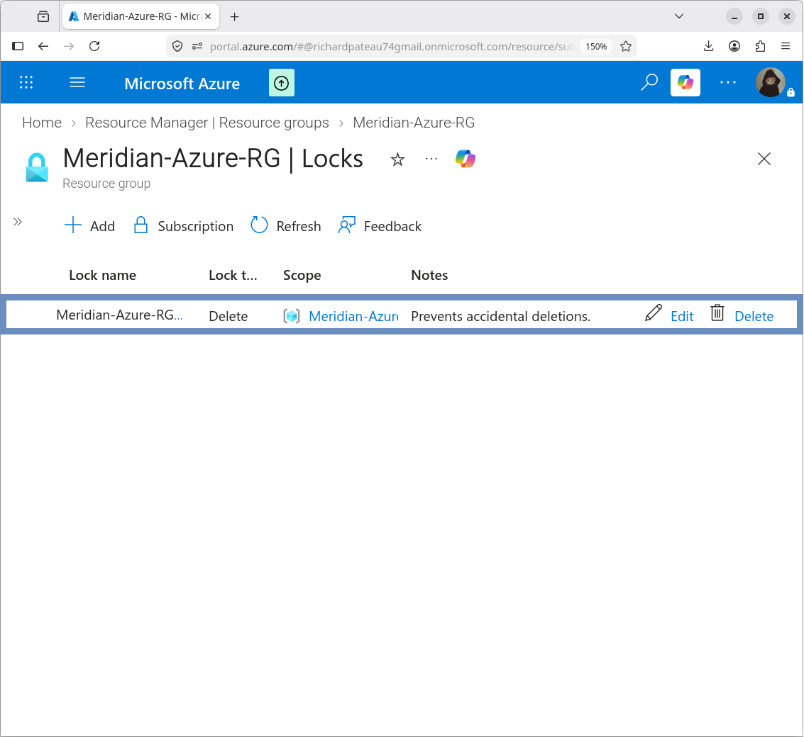
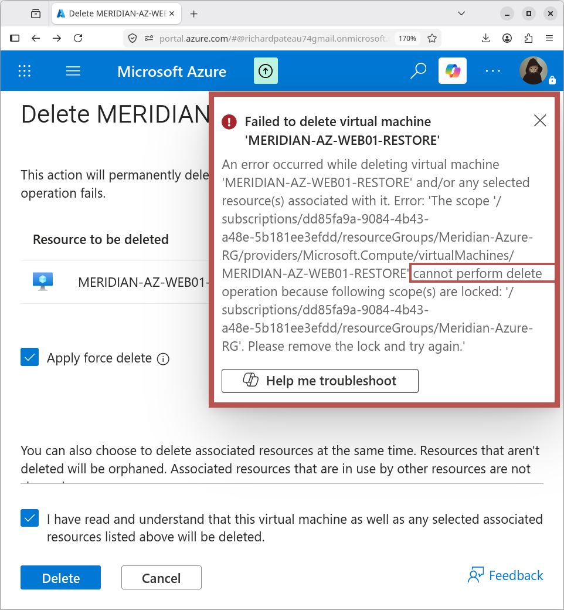

# Resource Group Delete Lock

## Resource Group

`Meridian-Azure-RG`

A resource lock was configured to reduce the risk of accidental deletion of the Azure environment.

## Lock Configuration

| Property | Value                        |
|----------|------------------------------|
| Name     | Meridian-Azure-RG-DeleteLock |
| Type     | Delete                       |
| Scope    | Meridian-Azure-RG            |

## Purpose

The delete lock protects the resource group from accidental deletion.

- It does **not** prevent normal resource configuration or operational changes
- It is intended as an additional administrative safeguard for the Meridian Azure environment

## Validation

The lock was verified in the Azure resource group’s **Locks** configuration and confirmed as active.

## Design Notes

- Delete locks are a simple but effective control against accidental removal of critical resources
- The lock can be removed by an authorized administrator if deliberate deletion is required
- Complements the other security controls (NSG, Trusted Launch, Defender for Cloud)

## Related Documentation

- [06-Security/README.md](README.md) – Security overview
- [nsg.md](nsg.md) – Network Security Group
- [trusted-launch.md](trusted-launch.md) – Trusted Launch
- [defender.md](defender.md) – Microsoft Defender for Cloud
