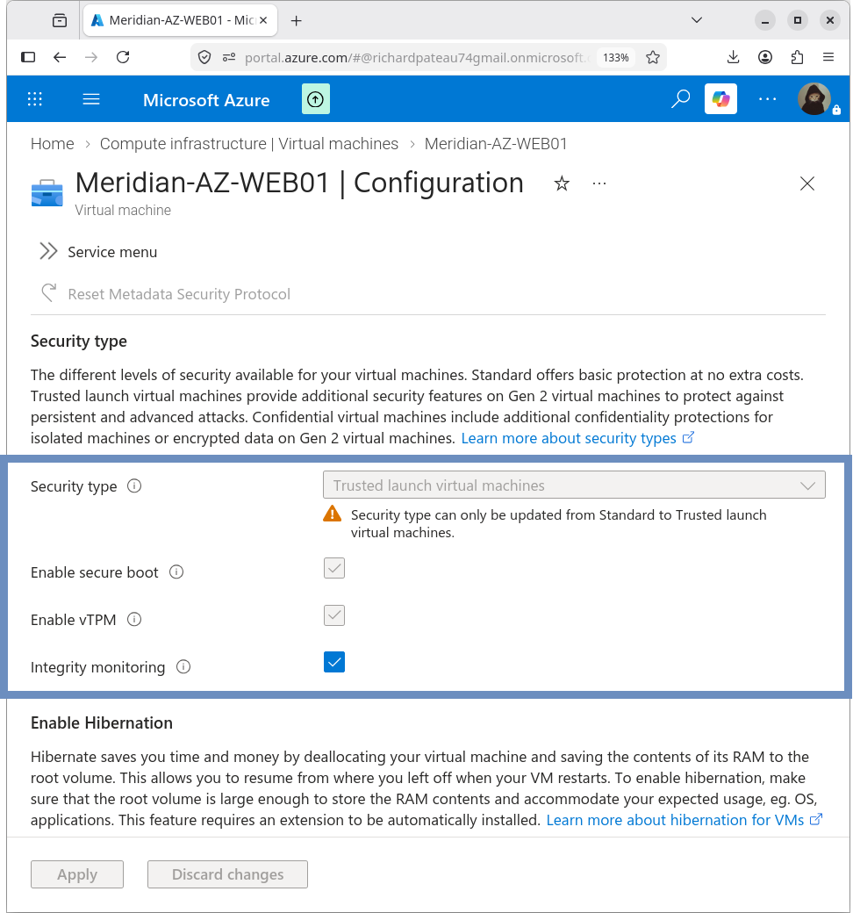

# Trusted Launch

## VM

`MERIDIAN-AZ-WEB01`

Trusted Launch security features were enabled for the Azure application VM.

## Configuration

| Feature              | State    |
|----------------------|----------|
| Secure Boot          | Enabled  |
| vTPM                 | Enabled  |
| Integrity Monitoring | Enabled  |

Trusted Launch provides hardware-backed security capabilities for the virtual machine, including protection against bootkits, rootkits, and firmware-level attacks.

## Integrity Monitoring

Integrity Monitoring was initially disabled during VM creation.

It was subsequently enabled through the Azure VM security configuration.

The VM was rebooted after the configuration change to apply the settings.

## Validation

After enabling Trusted Launch and Integrity Monitoring:

- VM remained operational
- SSH connectivity was verified
- Application (HTTP) connectivity remained functional
- Apache service remained active

This confirmed that enabling the security features did not disrupt normal VM operation or hybrid connectivity.

## Design Notes

- Trusted Launch is aligned with Azure security best practices for production workloads
- Secure Boot and vTPM provide measured boot and hardware-rooted trust
- Integrity Monitoring enables ongoing attestation of the VM’s boot state

## Related Documentation

- [06-Security/README.md](README.md) – Security overview
- [04-Application-Server/azure-vm.md](../04-Application-Server/azure-vm.md) – Azure VM configuration
