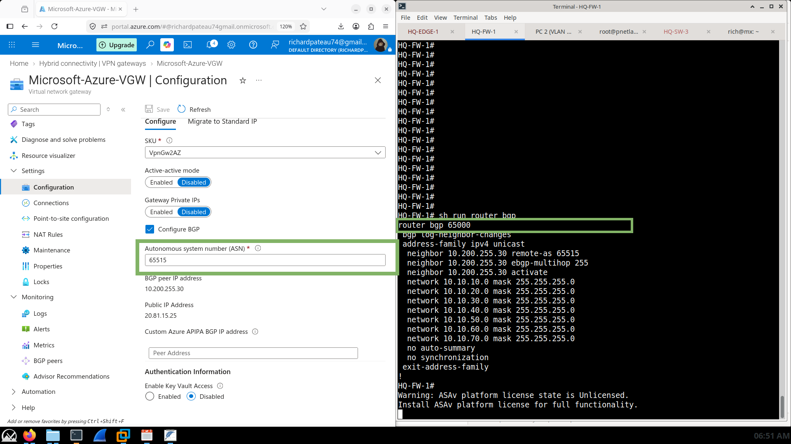
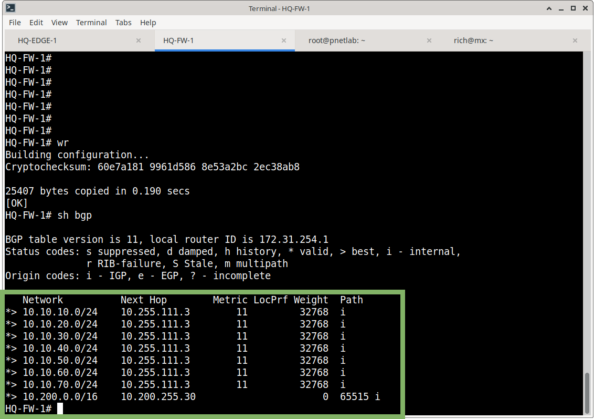
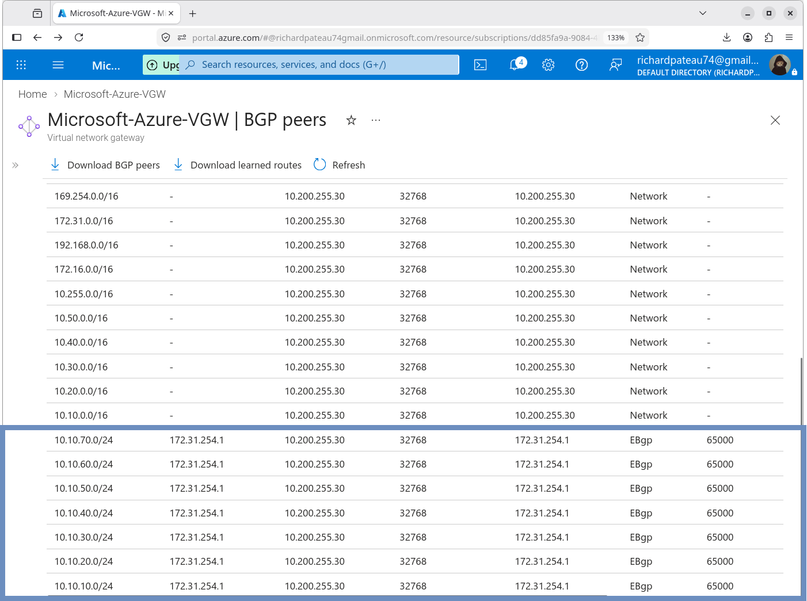
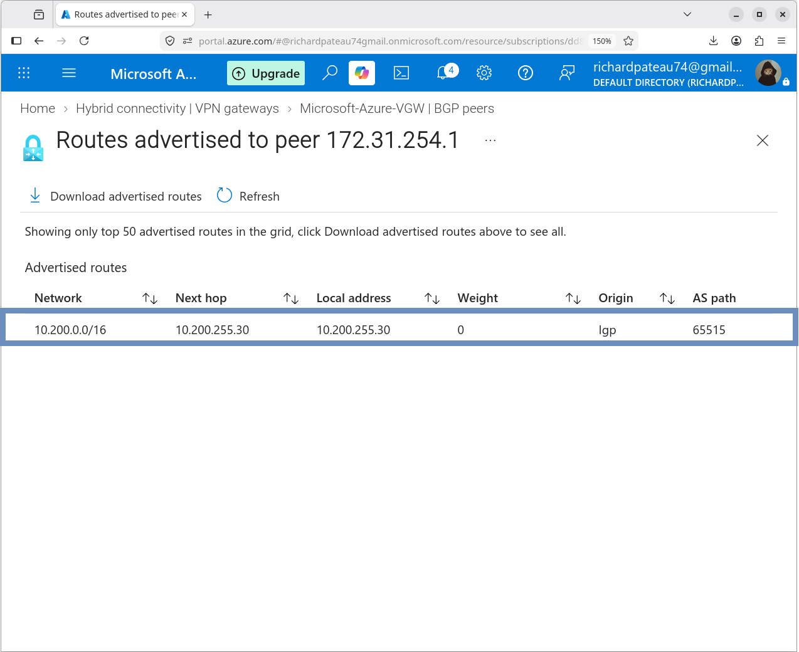
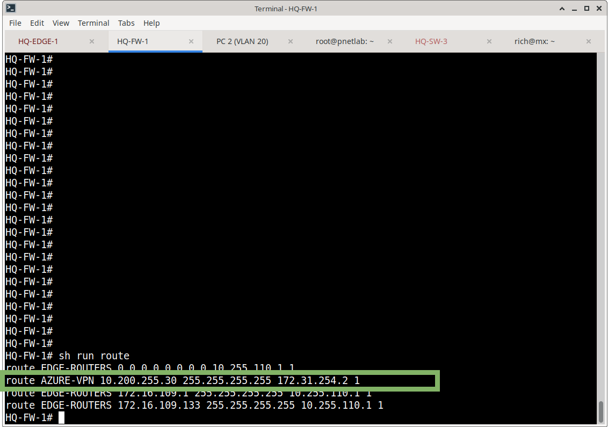

# 07 – Azure Routing

## Overview

This section documents the routing architecture connecting the Meridian Financial Services on-premises network with the Azure hybrid environment.

The Azure routing design uses:

* Azure Virtual Network routing
* Azure VPN Gateway
* Site-to-site IPsec
* External BGP (eBGP)
* Cisco ASA as the on-premises BGP router
* Azure VPN Gateway as the Azure BGP peer

The site-to-site IPsec tunnel provides the transport path while BGP dynamically exchanges routes across the hybrid connection.

## Routing Architecture

```text
                Meridian On-Premises
                        |
                 HQ-FW-1 / ASA
                  BGP ASN 65000
                        |
                 Tunnel100 / IPsec
                        |
                 Azure VPN Gateway
                  BGP ASN 65515
                        |
                   Azure VNet
                  10.200.0.0/16

```

### Autonomous Systems

| Device / Platform | ASN |
| --- | --- |
| Meridian on-premises | 65000 |
| Azure VPN Gateway | 65515 |

The ASNs are different, so the session operates as eBGP.



### BGP Peers

| Side | Value |
| --- | --- |
| Azure VPN Gateway | Microsoft-Azure-VGW |
| Azure BGP peer IP | 10.200.255.30 |
| Azure ASN | 65515 |
| On-premises peer | 172.31.254.1 |
| On-premises ASN | 65000 |

Azure reports the BGP peer status as **Connected**.

## Route Advertisement

### On-Premises → Azure

The ASA advertises the following HQ networks to Azure:

```text
10.10.10.0/24
10.10.20.0/24
10.10.30.0/24
10.10.40.0/24
10.10.50.0/24
10.10.60.0/24
10.10.70.0/24

```

These represent the primary HQ VLAN networks.





### Azure → On-Premises

Azure advertises:

```text
10.200.0.0/16

```

to the on-premises ASA through BGP. The route is learned dynamically rather than relying on a static 10.200.0.0/16 route.



## Routing Design

* The original static route for the Azure VNet was removed after BGP became operational.
* The ASA retains a host route to the Azure BGP peer:

```text
10.200.255.30/32
    via 172.31.254.2
    interface AZURE-VPN

```

* This host route provides reachability to the Azure BGP peer over the VTI.
* The Azure VNet route (10.200.0.0/16) itself is learned dynamically via BGP.



## Validation

BGP validation confirmed:

* BGP neighbor established
* Azure ASN 65515 observed
* On-premises ASN 65000 observed
* HQ /24 networks advertised to Azure
* Azure VNet route (10.200.0.0/16) learned by the ASA
* Azure learned the seven HQ /24 networks
* Azure VM routing toward the on-premises network works
* On-premises routing toward Azure works

## Documentation Structure

```text
07-Routing/
├── README.md              ← this file
├── bgp.md
├── route-advertisement.md
└── screenshots/

```

## Related Sections

* [01-Architecture](https://www.google.com/search?q=../01-Architecture/) – Overall hybrid architecture
* [02-Networking](https://www.google.com/search?q=../02-Networking/) – VNet and subnet design
* [03-Site-to-Site-VPN](https://www.google.com/search?q=../03-Site-to-Site-VPN/) – VPN Gateway and IPsec
* [04-Application-Server](https://www.google.com/search?q=../04-Application-Server/) – Application VM
