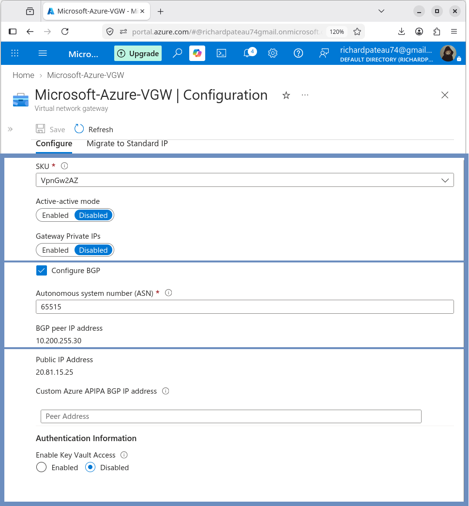
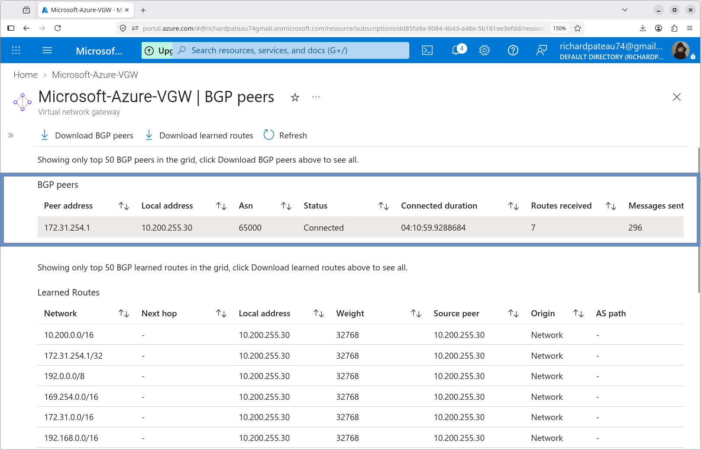
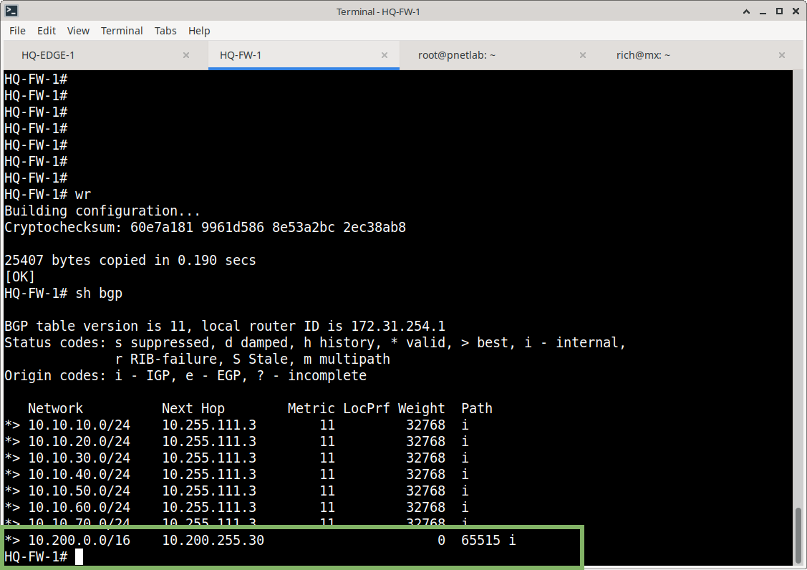

# Azure Routing

## Azure Virtual Network

| Property       | Value               |
|----------------|---------------------|
| VNet           | Meridian-Azure-VNet |
| Address Space  | 10.200.0.0/16       |

### Subnets

| Subnet                 | Address Space     |
|------------------------|-------------------|
| Azure-Apps             | 10.200.10.0/24    |
| Azure-Infrastructure   | 10.200.20.0/24    |
| GatewaySubnet          | 10.200.255.0/27   |

## VPN Gateway

| Property       | Value              |
|----------------|--------------------|
| Resource       | Microsoft-Azure-VGW |
| SKU            | VpnGw2AZ           |
| Gateway Type   | VPN                |
| VPN Type       | Route-based        |
| BGP            | Enabled            |
| Active-Active  | Disabled           |

The gateway currently operates in **active-standby** mode.

## Azure BGP Configuration

| Setting                | Value          |
|------------------------|----------------|
| Azure ASN              | 65515          |
| Azure BGP peer address | 10.200.255.30  |

The Azure BGP peer address resides in the `GatewaySubnet` (`10.200.255.0/27`).



## On-Premises Peer

| Setting     | Value          |
|-------------|----------------|
| BGP ASN     | 65000          |
| BGP peer    | 10.200.255.30  |

The ASA reaches the Azure BGP peer through the Azure VTI (`Tunnel100` / `AZURE-VPN`).



## Dynamic Routing

After BGP was established, the static route for the Azure VNet was removed from the ASA.

The ASA now learns:

```text
10.200.0.0/16
```

through BGP. This allows the Azure VNet prefix to be dynamically learned rather than manually configured as a static route.



## Azure Learned Routes

Azure learned the following on-premises prefixes through BGP:

```text
10.10.10.0/24
10.10.20.0/24
10.10.30.0/24
10.10.40.0/24
10.10.50.0/24
10.10.60.0/24
10.10.70.0/24
```


The Azure VPN Gateway identifies the on-premises BGP peer as:

```text
172.31.254.1
```


## Routing Relationship

```text
HQ Networks
10.10.10.0/24 … 10.10.70.0/24
        |
       BGP
        |
  ASA ASN 65000
        |
    IPsec VTI
        |
Azure VPN Gateway
    ASN 65515
        |
   Azure VNet
  10.200.0.0/16
```

## Design Notes

- eBGP is used because the ASNs differ (65000 ↔ 65515)
- The Azure VNet prefix is no longer static on the ASA
- A host route to `10.200.255.30/32` remains on the ASA so the BGP peer is reachable over the VTI
- Active-Active is currently disabled (active-standby operation)

## Related Documentation

- [07-Routing/README.md](README.md) – Routing overview
- [03-Site-to-Site-VPN](../03-Site-to-Site-VPN/) – VPN Gateway and IPsec
- [02-Networking](../02-Networking/) – VNet and subnet design

