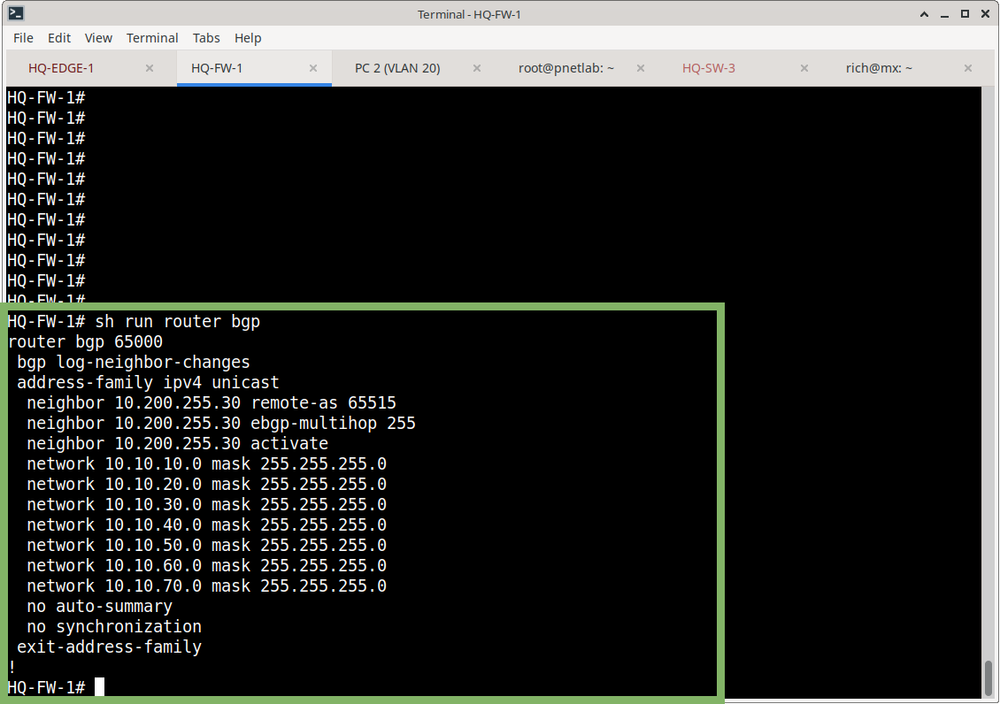

# BGP

## Overview

External BGP (eBGP) was implemented between the Meridian on-premises ASA and the Azure VPN Gateway.

The BGP session operates across the existing site-to-site IPsec VTI and provides dynamic exchange of the Azure VNet and Meridian HQ prefixes.

## Autonomous Systems

| Platform           | ASN   |
|--------------------|-------|
| Meridian ASA       | 65000 |
| Azure VPN Gateway  | 65515 |

## Azure BGP Neighbor

| Setting    | Value          |
|------------|----------------|
| Neighbor   | 10.200.255.30  |
| Remote AS  | 65515          |

The ASA uses **eBGP multihop** because the Azure BGP peer is reached across the VTI rather than being directly connected at Layer 3.

## ASA Configuration

```cisco
router bgp 65000
 bgp log-neighbor-changes
 address-family ipv4 unicast
  neighbor 10.200.255.30 remote-as 65515
  neighbor 10.200.255.30 ebgp-multihop 255
  neighbor 10.200.255.30 activate
```



### Advertised Prefixes

The ASA advertises the following HQ networks to Azure:

```text
10.10.10.0/24
10.10.20.0/24
10.10.30.0/24
10.10.40.0/24
10.10.50.0/24
10.10.60.0/24
10.10.70.0/24
```

## BGP Session

BGP summary confirmed the following:

| Neighbor       | Version | AS    | State / Prefixes Received |
|----------------|---------|-------|---------------------------|
| 10.200.255.30  | 4       | 65515 | Established / 1           |

The neighbor reached an **Established** state and the ASA received one Azure prefix.


## Azure Prefix Learned by ASA

The ASA learned:

```text
10.200.0.0/16
```

from:

```text
10.200.255.30
```

The route is identified as:

```text
Known via "bgp 65000"
```


## Azure Learned Prefixes

Azure learned the following HQ networks via BGP:

```text
10.10.10.0/24
10.10.20.0/24
10.10.30.0/24
10.10.40.0/24
10.10.50.0/24
10.10.60.0/24
10.10.70.0/24
```

Azure identifies the on-premises next hop as:

```text
172.31.254.1
```


## BGP Validation

The BGP implementation was validated by checking:

- BGP neighbor state
- Remote ASN
- Prefixes received
- Prefixes advertised
- Azure learned routes
- ASA routing table
- End-to-end Azure ↔ on-premises connectivity

All required BGP routing relationships were established successfully.

## Design Notes

- eBGP is used because ASNs differ (65000 ---- 65515)
- eBGP multihop is required for the VTI-based peer
- The previous static route for `10.200.0.0/16` was removed after BGP became operational while maintaining connectivity.
- A host route to `10.200.255.30/32` remains so the BGP peer is reachable over the VTI

## Related Documentation

- [07-Routing/README.md](README.md) – Routing overview
- [azure-routing.md](azure-routing.md) – Azure-side routing details
- [03-Site-to-Site-VPN](../03-Site-to-Site-VPN/) – VPN Gateway and IPsec

