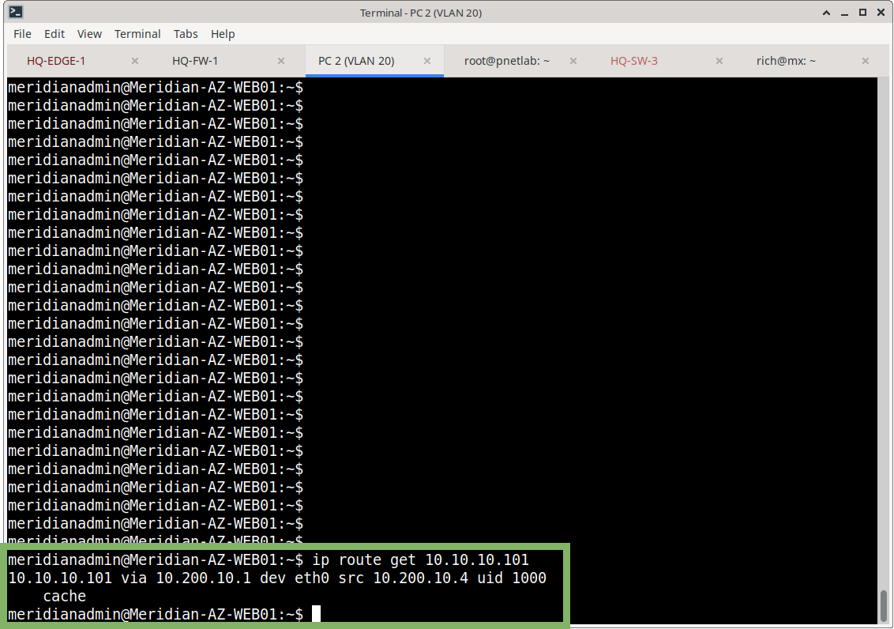
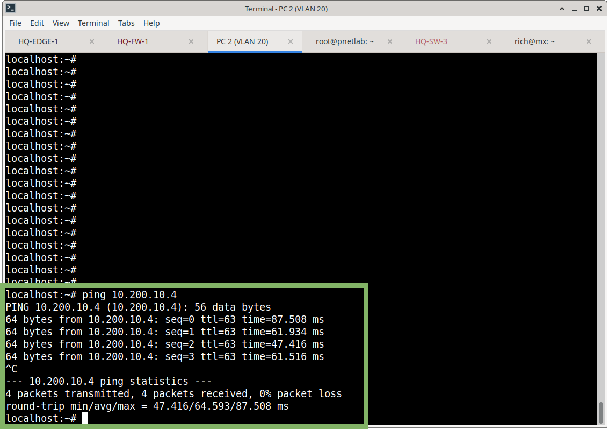

# Route Validation

## Purpose

This document records the operational validation of routing between the Azure environment and the Meridian on-premises network.

Tests cover both routing directions.

## Azure Effective Routes

The Azure VM’s effective routes showed the on-premises networks being directed through the Azure Virtual Network Gateway.

The Azure platform therefore had routes toward the Meridian enterprise networks.

## Azure VM Route Lookup

From `MERIDIAN-AZ-WEB01`:

```bash
ip route get 10.10.10.101
```

Result:

```text
10.10.10.101 via 10.200.10.1 dev eth0 src 10.200.10.4
```

The Linux guest does **not** require a manually configured route for the remote on-premises networks. Azure provides the route through the platform networking layer.



## Azure → On-Premises Test

| Item        | Value              |
|-------------|--------------------|
| Source      | MERIDIAN-AZ-WEB01  |
| Destination | 10.10.10.101       |
| Test        | `ping -c 4 10.10.10.101` |

**Result:**

```text
4 packets transmitted
4 packets received
0% packet loss
```

Average round-trip time during final validation: **43.370 ms**

**Outcome: PASS**


## On-Premises → Azure Test

| Item        | Value        |
|-------------|--------------|
| Source      | 10.10.10.101 |
| Destination | 10.200.10.4  |

The Azure application VM responded successfully.

**Outcome: PASS**

 

## Routing Validation Summary

| Direction              | Destination                        | Result |
|------------------------|------------------------------------|--------|
| Azure → On-premises    | 10.10.10.101                       | PASS   |
| On-premises → Azure    | 10.200.10.4                        | PASS   |
| ASA → Azure VNet       | 10.200.0.0/16                      | BGP    |
| Azure → HQ VLANs       | 10.10.10.0/24 – 10.10.70.0/24      | BGP    |

## Important Routing Note

The Azure / on-premises IPsec tunnel provides the **transport** mechanism for the BGP session.

BGP provides **dynamic route exchange**.

These are separate functions:

| Component | Function                |
|-----------|-------------------------|
| IPsec     | Secure transport        |
| BGP       | Dynamic route exchange  |

## Related Documentation

- [07-Routing/README.md](README.md) – Routing overview
- [azure-routing.md](azure-routing.md) – Azure-side routing details
- [bgp.md](bgp.md) – BGP configuration and session
- [03-Site-to-Site-VPN](../03-Site-to-Site-VPN/) – VPN Gateway and IPsec
