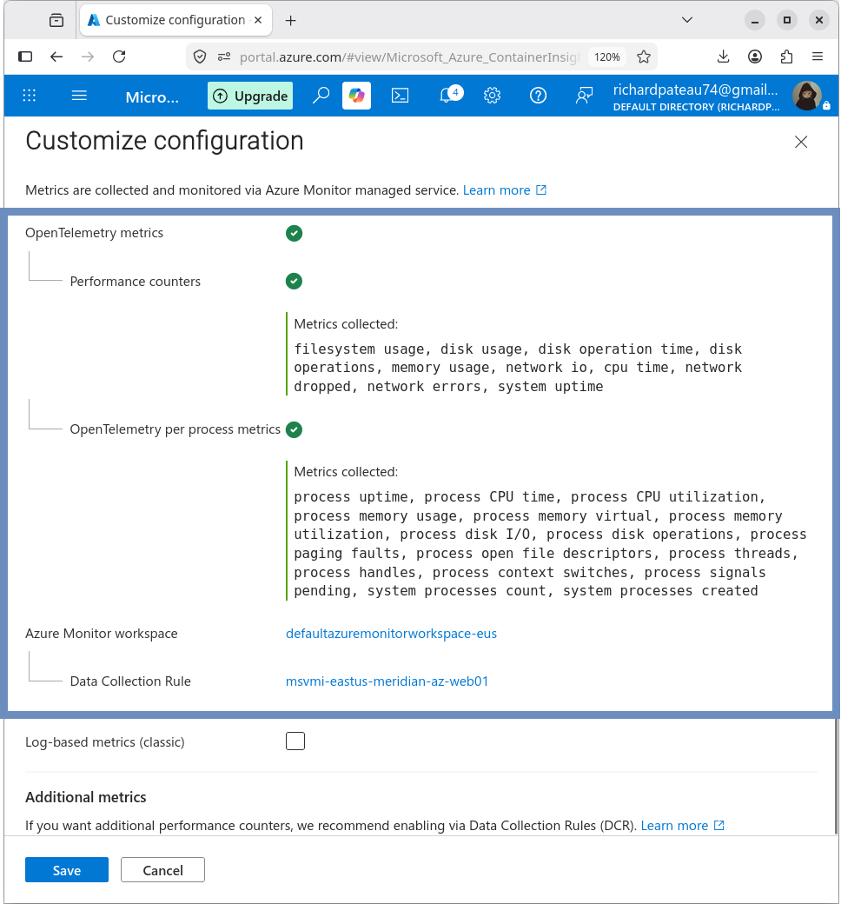
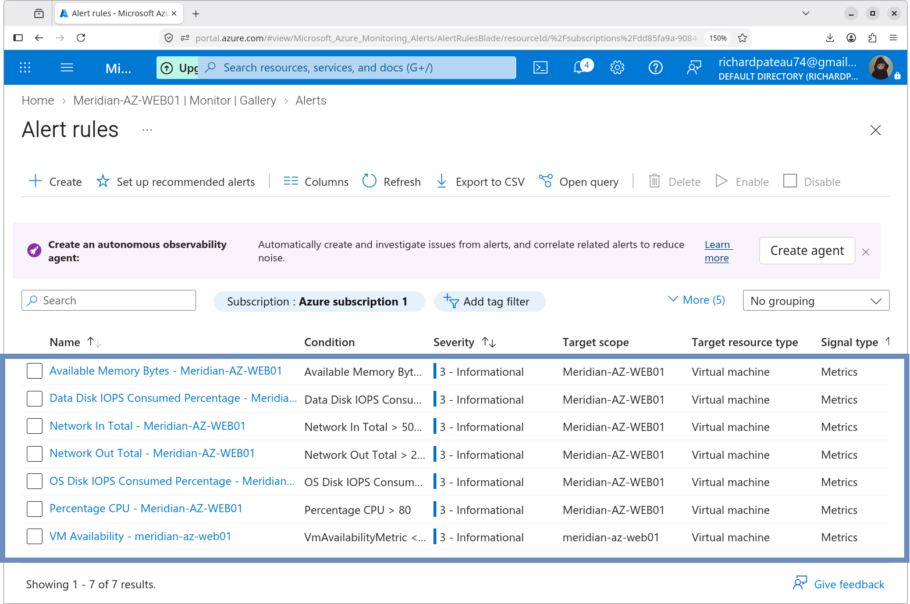
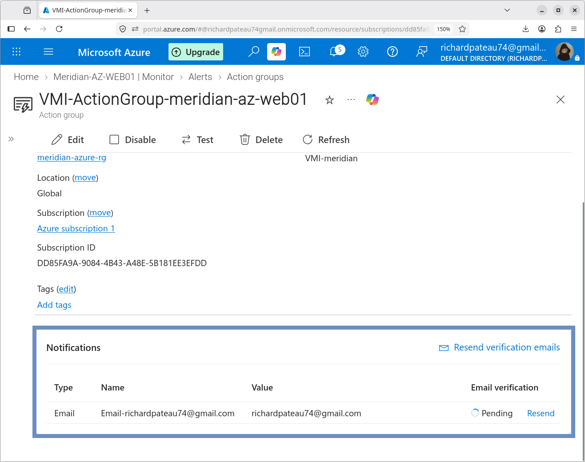
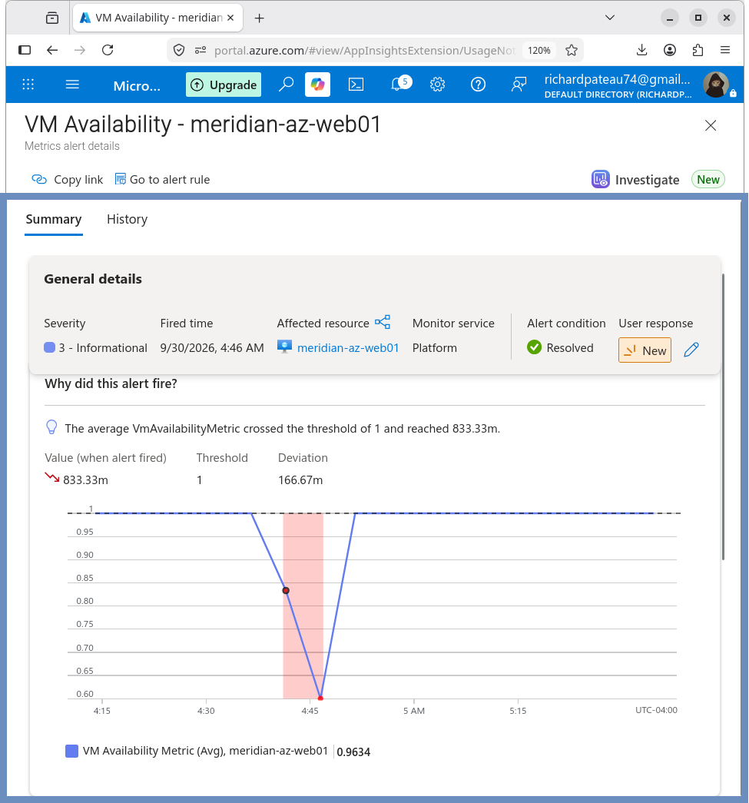

# Azure Monitoring

## Overview

This section documents the monitoring implementation for the Meridian Financial Services Azure environment.

Azure Monitor was configured for the `MERIDIAN-AZ-WEB01` application server to provide visibility into VM availability, guest operating-system metrics, resource utilization, and alert conditions.

The monitoring implementation uses Azure Monitor with OpenTelemetry-based detailed metrics and a Data Collection Rule.

## Monitored Resource

| Resource | Value |
|---|---|
| VM | `MERIDIAN-AZ-WEB01` |
| Resource Group | `Meridian-Azure-RG` |
| Region | East US |
| Operating System | Ubuntu Server 24.04 LTS |
| Private IP | `10.200.10.4` |
| VNet | `Meridian-Azure-VNet` |
| Subnet | `Azure-Apps` |

## Monitoring Components

The monitoring design includes:

- Azure Monitor
- OpenTelemetry detailed metrics
- Azure Monitor workspace
- Data Collection Rule
- VM availability monitoring
- Guest operating-system metrics
- Recommended metric alerts
- Azure Monitor alert instances

## Monitoring Workspace

The Azure Monitor workspace created for the VM is:

`defaultazuremonitorworkspace-eus`

The workspace is located in East US.

## Data Collection Rule

The Data Collection Rule created for the VM is:

`msvmi-eastus-meridian-az-web01`

The rule provides the configuration required to collect detailed VM and guest operating-system metrics.

## Metrics

The monitoring implementation successfully populated metrics including:

- CPU utilization
- Memory utilization
- VM availability
- Process-level CPU information
- Host metrics

Observed host CPU data included an average of approximately 43.% and a maximum of approximately .82% during validation.

## Alerts

Recommended alerts were enabled for the VM.

The configured alert conditions included:

- VM availability below 100%
- CPU utilization greater than 80%
- Available memory below 1 GB
- Data disk IOPS greater than 95%
- OS disk IOPS greater than 95%
- Network inbound traffic greater than 500 GB
- Network outbound traffic greater than 200 GB

Email notification was configured for:

`richardpateau74@gmail.com`

## Validation

Monitoring onboarding completed successfully.

The VM Monitor page subsequently displayed populated metrics for CPU, memory, availability, and process-level CPU information.

Alert instances were also observed in Azure Monitor.

One VM Availability alert instance was observed with:

- Threshold: `1`
- Condition: Less Than
- Observed value: approximately `0.833`
- Severity: `3`
- Monitor service: Platform
- Signal type: Metric

The availability metric subsequently returned to `1.0`.

The alert occurrence was recorded as an observed monitoring event rather than treated as evidence of a persistent VM failure.

## Result

Azure monitoring is configured and operational for `MERIDIAN-AZ-WEB01`.

The implementation provides centralized visibility into VM availability and resource utilization and provides alerting for defined resource thresholds.
