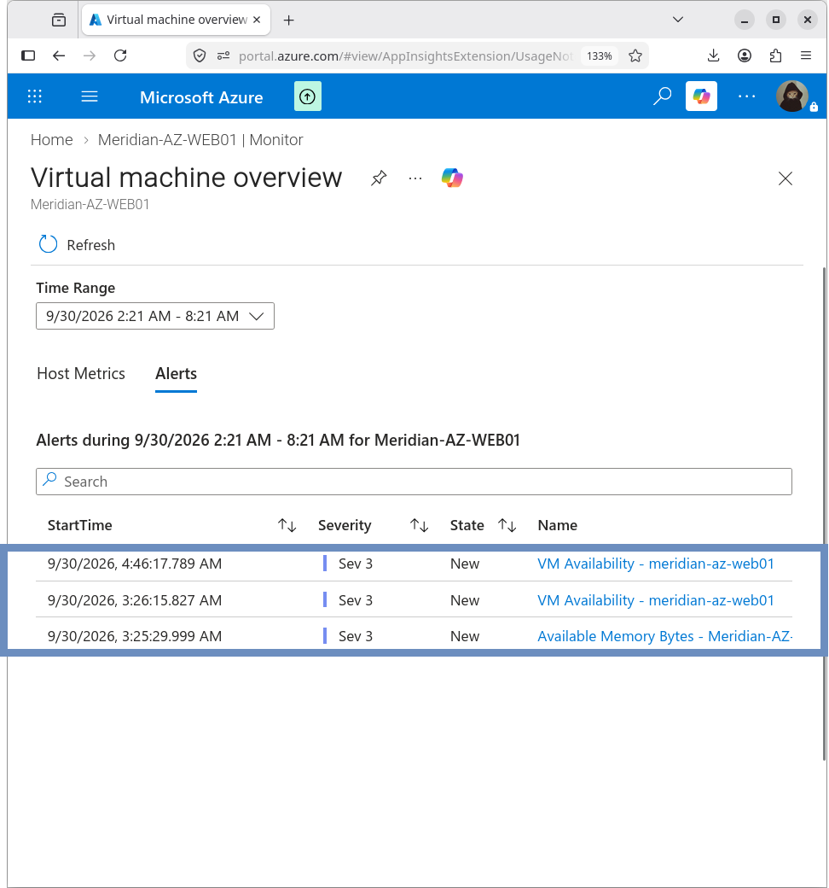

# Azure Monitor Alerts

## Overview

Metric alerts were configured for `MERIDIAN-AZ-WEB01` to provide notification when defined resource or availability thresholds are reached.

## Notification

Email notification was configured for:

```text
richardpateau74@gmail.com
```


## Configured Alerts

Recommended VM alerts enabled for the environment:

| Alert              | Condition              |
|--------------------|------------------------|
| VM Availability    | Less than 100%         |
| CPU Utilization    | Greater than 80%       |
| Available Memory   | Less than 1 GB         |
| Data Disk IOPS     | Greater than 95%       |
| OS Disk IOPS       | Greater than 95%       |
| Network In         | Greater than 500 GB    |
| Network Out        | Greater than 200 GB    |


## VM Availability Alert

Azure Monitor generated an observed VM Availability alert instance during validation.

| Setting          | Value              |
|------------------|--------------------|
| Threshold        | 1                  |
| Observed value   | ~0.833             |
| Operator         | Less Than          |
| Severity         | 3                  |
| Monitor service  | Platform           |
| Signal type      | Metric             |
| Timestamp        | 9/30/2026 4:46 AM  |

The availability metric subsequently returned to `1.0`.

This event is documented as an observed monitoring alert. It does not by itself establish the cause of the temporary availability change.


## Alert Instances

The Alerts page displayed alert instances including:

- VM Availability
- Available Memory Bytes

The presence of these alert instances confirms that Azure Monitor was processing the configured metric signals.



## Result

Azure Monitor metric alerting was configured and verified for the Meridian Azure application server.

## Related Documentation

- [08-Monitoring/README.md](README.md) – Monitoring overview
- [azure-monitor.md](azure-monitor.md) – Azure Monitor configuration
- [data-collection.md](data-collection.md) – Data Collection Rule
- [metrics.md](metrics.md) – Metrics details
```
