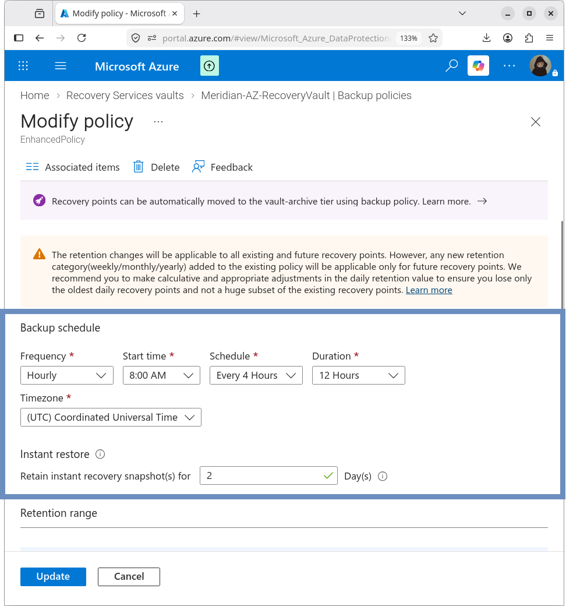
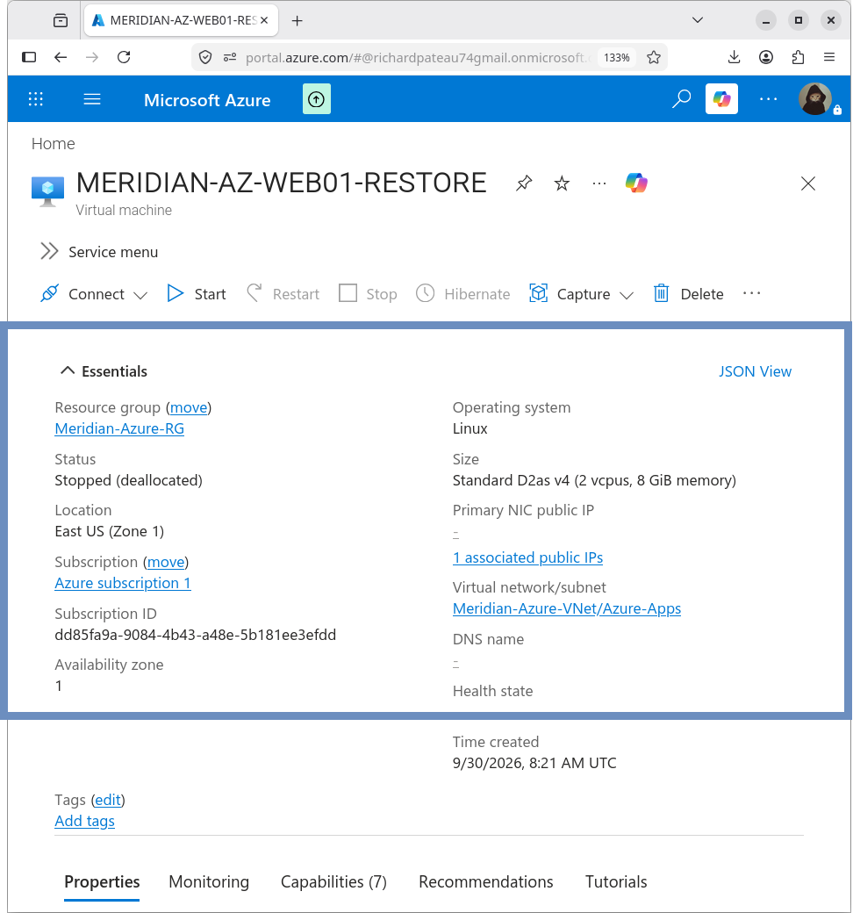

# 09 – Azure Backup and Disaster Recovery

## Overview

This section documents the Azure backup and disaster recovery implementation for the Meridian Financial Services Azure environment.

Azure Backup was configured for the `MERIDIAN-AZ-WEB01` application server using an Azure Recovery Services vault.

A recovery point was successfully created and used to perform a restore test to a separate Azure VM.

## Protected Resource

| Property         | Value                    |
|------------------|--------------------------|
| VM               | MERIDIAN-AZ-WEB01        |
| Resource Group   | Meridian-Azure-RG        |
| Region           | East US                  |
| Operating System | Ubuntu Server 24.04 LTS  |
| Private IP       | 10.200.10.4              |

## Recovery Services Vault

| Property              | Value                      |
|-----------------------|----------------------------|
| Vault                 | Meridian-AZ-RecoveryVault  |
| Resource Group        | Meridian-Azure-RG          |
| Region                | East US                    |
| Storage redundancy    | GRS                        |
| Cross Region Restore  | Disabled                   |
| Immutability          | Disabled                   |


## Backup Policy

The VM was protected using the enhanced backup policy:

```text
EnhancedPolicy
```

| Setting                              | Value                          |
|--------------------------------------|--------------------------------|
| Backup frequency                     | Every 4 hours                  |
| Backup window start                  | 8:00 AM UTC                    |
| Daily backup window                  | 12 hours                       |
| Instant restore snapshot retention   | 2 days                         |
| Daily backup point retention         | 30 days                        |
| Consistency                          | File-system consistent         |
| Disks                                | All disks                      |
| Future disks                         | Include                        |



## Backup Validation

| Item                | Value   |
|---------------------|---------|
| Last backup status  | Success |


### Recovery/Restore Points

| Timestamp                 | Type                                      |
|---------------------------|-------------------------------------------|
| 9/30/2026 8:19:27 AM      | File-system Consistent — Snapshot       |
| 9/30/2026 4:20:55 AM      | File-system Consistent — Snapshot |
| 9/30/2026 3:52:24 AM      | File-system Consistent — Snapshot and Vault-Storage |
| 9/30/2026 3:42:20 AM      | File-system Consistent — Snapshot and Vault-Storage |


## Restore Test

A recovery point was selected and restored as a new VM:

| Property         | Value                      |
|------------------|----------------------------|
| Restored VM name | MERIDIAN-AZ-WEB01-RESTORE  |
| Resource Group   | Meridian-Azure-RG          |
| VNet             | Meridian-Azure-VNet        |
| Subnet           | Azure-Apps                 |
| Private IP       | 10.200.10.5                |

The restore operation completed successfully.



## Restore Validation

SSH connectivity to the restored VM was successful.

### Hostname

```bash
hostname
```

Returned:

```text
Meridian-AZ-WEB01
```

The restored VM retained the original guest hostname.

### Network

```text
10.200.10.5/24
```


### Apache Service

```bash
systemctl status apache2 --no-pager
```

Reported the Apache service as **active (running)**.


### Local HTTP Validation

```bash
curl http://localhost
```

Returned the Meridian Financial Services web application.


## Result

The Azure Backup and restore workflow was successfully configured and validated.

The test demonstrated that a protected Azure VM could be restored from a recovery point into a separate VM while preserving the application workload.

## Documentation Structure

```text
09-Backup-DR/
├── README.md              ← this file
├── recovery-vault.md
├── backup-policy.md
├── restore-test.md
└── screenshots/
```

## Related Sections

- [01-Architecture](../01-Architecture/) – Overall hybrid architecture
- [04-Application-Server](../04-Application-Server/) – Application VM
- [08-Monitoring](../08-Monitoring/) – Azure monitoring
```
