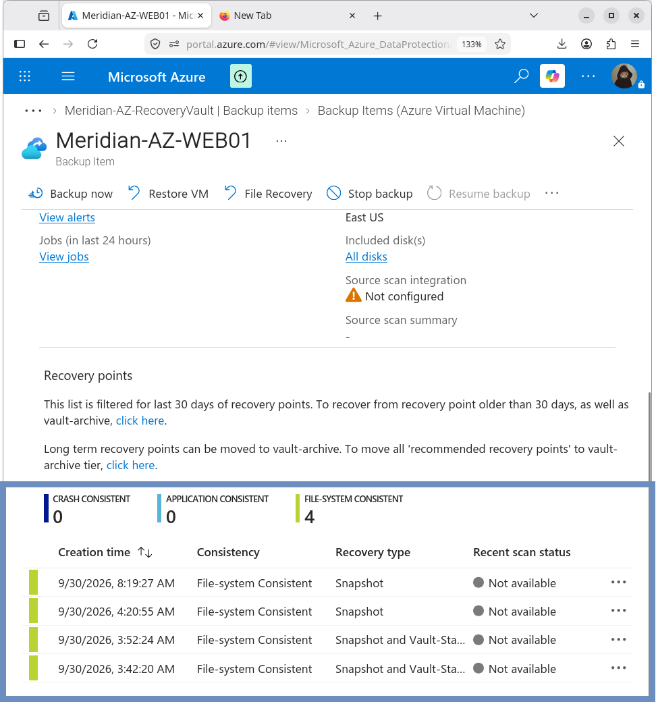

# Backup Policy

## Overview

The `MERIDIAN-AZ-WEB01` VM is protected using Azure Backup with an enhanced backup policy.

## Policy

```text
EnhancedPolicy
```

## Schedule

| Setting        | Value          |
|----------------|----------------|
| Frequency      | Every 4 hours  |
| Start time     | 8:00 AM UTC    |
| Backup window  | 12 hours       |

This provides multiple recovery opportunities throughout the configured backup window.


## Retention

| Recovery Type              | Retention |
|----------------------------|-----------|
| Instant restore snapshot   | 2 days    |
| Daily backup point         | 30 days   |

## Backup Consistency

The backup configuration uses file-system / application-aware consistency settings supported by the enhanced policy.

Successful recovery points observed during validation were:

```text
File-system Consistent
```


## Disk Protection

The backup configuration includes:

- All disks
- Future disks

Enabling **future disks** ensures subsequently attached disks can be included in protection according to the backup configuration.

## Pre-check

The Azure Backup pre-check completed successfully before protection was finalized.

## Result

The enhanced Azure Backup policy was successfully configured for `MERIDIAN-AZ-WEB01`.

## Related Documentation

- [09-Backup-DR/README.md](README.md) – Backup and DR overview
- [recovery-services-vault.md](recovery-services-vault.md) – Recovery Services vault
- [restore-test.md](restore-test.md) – Restore validation
```
