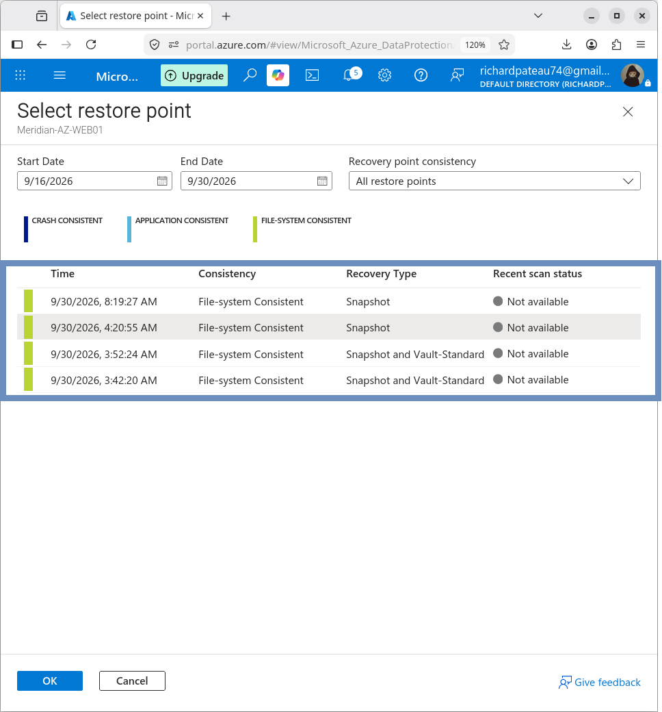
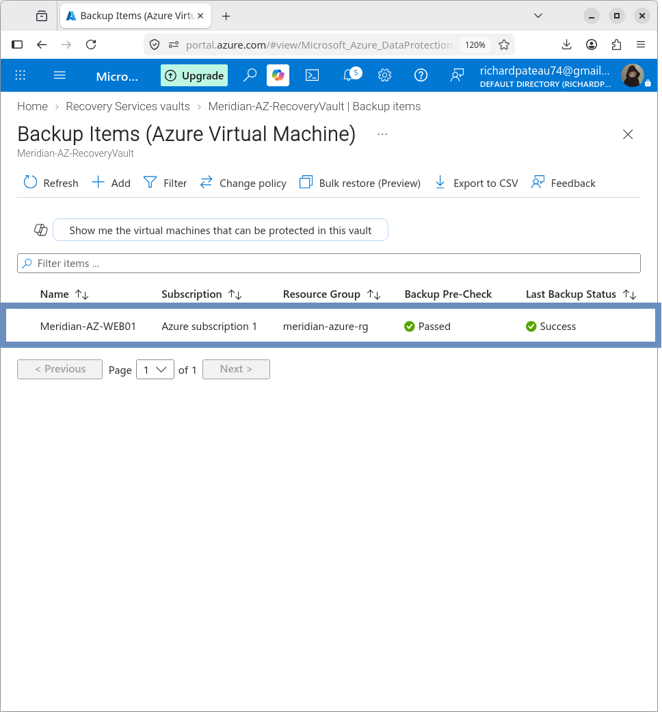

# Recovery Points

## Overview

Azure Backup generated recovery points for `MERIDIAN-AZ-WEB01`.

These recovery points provide restore points for disaster recovery operations.

## Successful Recovery Points

The following recovery points were observed during validation:

| Date/Time | Consistency | Storage |
|---|---|---|
| `9/30/2026 8:19:27 AM` | File-system Consistent | Snapshot |
| `9/30/2026 4:20:55 AM` | File-system Consistent | Snapshot |
| `9/30/2026 3:52:24 AM` | File-system Consistent | Snapshot and Vault-Storage|
| `9/30/2026 3:42:20 AM` | File-system Consistent | Snapshot and Vault-Storage |

## Latest Recovery Point

The latest recovery point used for the restore test was:

`9/30/2026 8:19:27 AM`

Consistency:

`File-system Consistent`

## Backup Item Status

The backup item reported:

`Last backup status: Success`

Recovery-point counts during validation:

- File-system consistent: 4
- Crash consistent: 0
- Application consistent: 0

## Restore Source

The latest file-system-consistent recovery point was selected as the source for the disaster recovery restore test.

## Result

A valid recovery point was available and successfully used for the restore validation.
