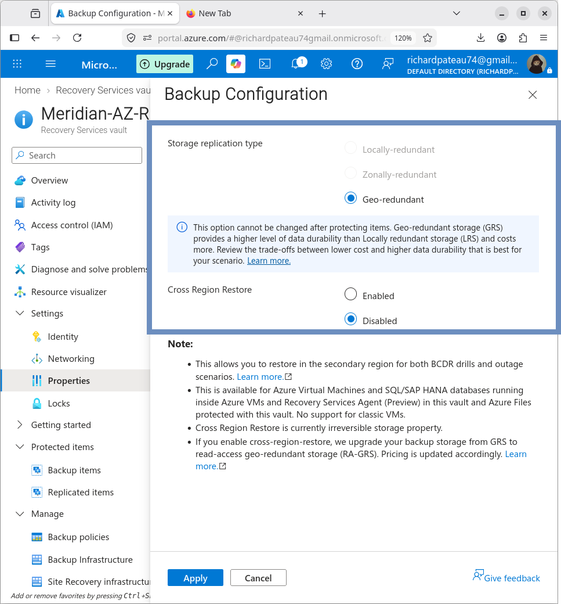

# Recovery Services Vault

## Purpose

Azure Recovery Services Vault provides the backup storage and management location for protected Azure workloads.

The Meridian Azure environment uses a Recovery Services vault to protect the application server.

## Vault Configuration

| Property                   | Value                      |
|----------------------------|----------------------------|
| Name                       | Meridian-AZ-RecoveryVault  |
| Resource Group             | Meridian-Azure-RG          |
| Region                     | East US                    |
| Backup storage redundancy  | GRS                        |
| Cross Region Restore       | Disabled                   |
| Immutability               | Disabled                   |

## Backup Storage

The vault uses **geo-redundant storage (GRS)**.

This provides geographically redundant backup storage for the protected workload.



## Protected Workload

The following VM is protected by the vault:

```text
MERIDIAN-AZ-WEB01
```

## Recovery Model

The vault provides recovery points that can be used to restore the protected VM.

For this project, a recovery point was successfully used to create a separate restored VM for disaster recovery validation.

## Result

The Recovery Services vault was successfully created and used to protect the Meridian Azure application server.

## Related Documentation

- [09-Backup-DR/README.md](README.md) – Backup and DR overview
- [backup-policy.md](backup-policy.md) – Backup policy details
- [restore-test.md](restore-test.md) – Restore validation
- [04-Application-Server](../04-Application-Server/) – Application VM
```
