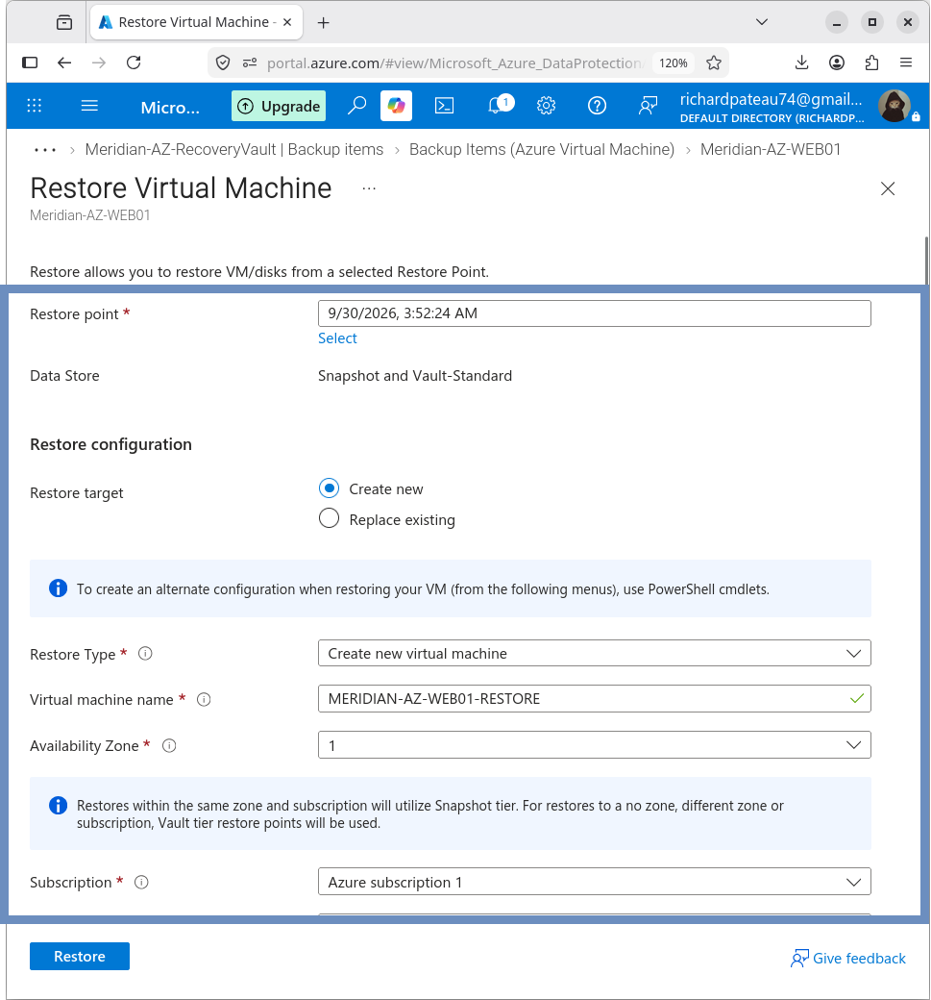
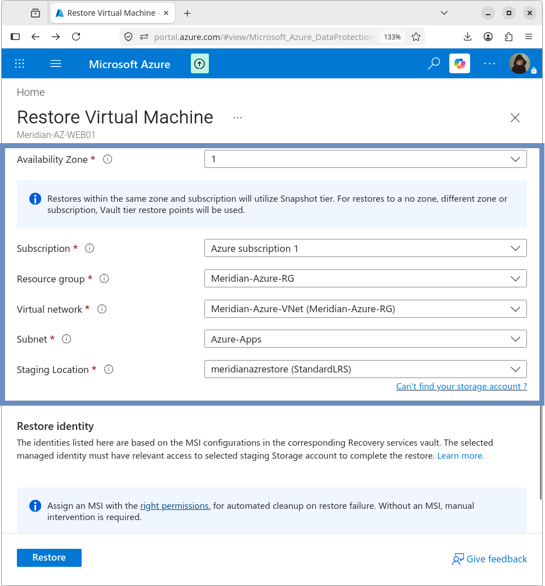
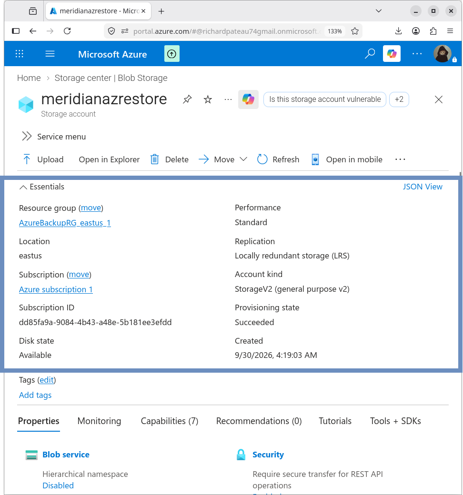
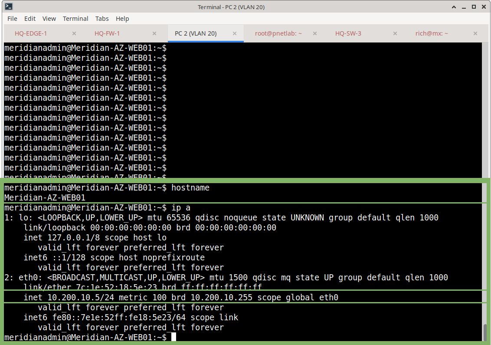
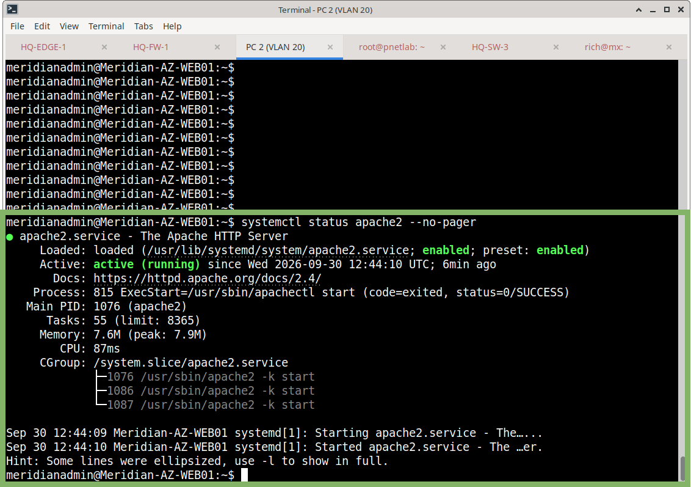
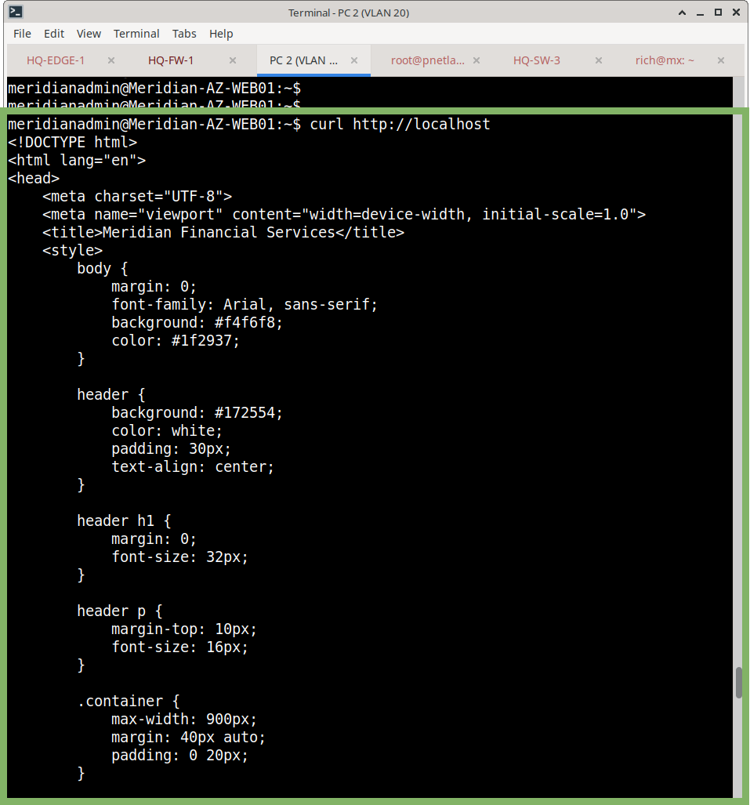

# Disaster Recovery Restore Test

## Objective

Verify that the protected Azure VM can be recovered from an Azure Backup recovery point.

The test used the latest available file-system-consistent recovery point.

## Recovery Point

| Property | Value |
| --- | --- |
| Timestamp | 9/30/2026 3:52:24 AM |
| Consistency | File-system Consistent |

## Restore Method

| Setting | Value |
| --- | --- |
| Restore type | Create new VM |
| Restored name | MERIDIAN-AZ-WEB01-RESTORE |



## Restore Target

| Property | Value |
| --- | --- |
| VM | MERIDIAN-AZ-WEB01-RESTORE |
| Resource Group | Meridian-Azure-RG |
| VNet | Meridian-Azure-VNet |
| Subnet | Azure-Apps |
| Private IP | 10.200.10.5 |
| OS | Ubuntu 24.04 |
| Public IP | None |

## Staging Storage

Azure required a staging storage account for the restore operation.

| Property | Value |
| --- | --- |
| Storage account | meridianazrestore |
| Resource Group | AzureBackupRG_eastus_1 |
| Region | East US |
| Performance | Standard |
| Redundancy | LRS |
| Account kind | StorageV2 |
| Secure transfer | Enabled |
| TLS version | 1.2 |





## Restore Result

The restore operation completed successfully.

The restored VM entered a running state and became accessible over the Meridian network.

## SSH Validation

SSH connectivity to the restored VM succeeded.

```bash
hostname

```

Returned:

```text
Meridian-AZ-WEB01

```

The restored guest retained the original VM’s hostname.

## Network Validation

The restored VM received:

```text
10.200.10.5/24

```

on `eth0`.



## Application Validation

### Apache Service

```bash
systemctl status apache2 --no-pager

```

Reported active (running).



### Local HTTP Test

```bash
curl http://localhost

```

Returned the Meridian Financial Services web application.



## Result

**PASS**

The Azure VM was successfully restored from a backup recovery point into a separate VM. The restored operating system, networking, and web application were validated.

The temporary restored VM was subsequently stopped after testing.

## Related Documentation

* `09-Backup-DR/README.md` – Backup and DR overview
* `recovery-services-vault.md` – Recovery Services vault
* `backup-policy.md` – Backup policy
* `recovery-points.md` – Recovery points
