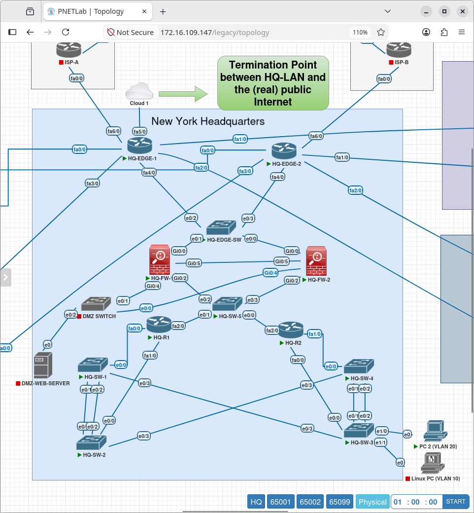
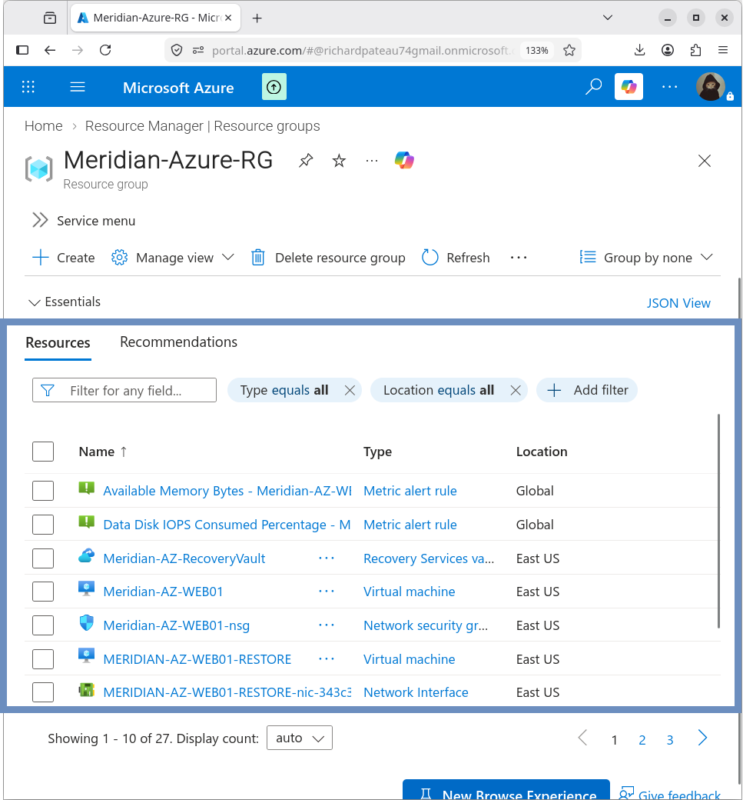
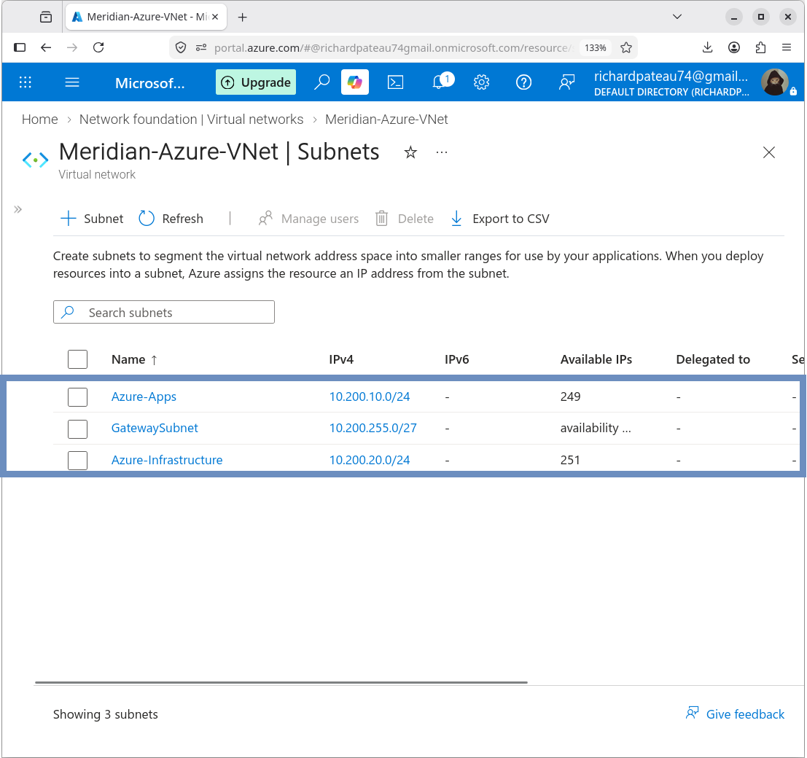
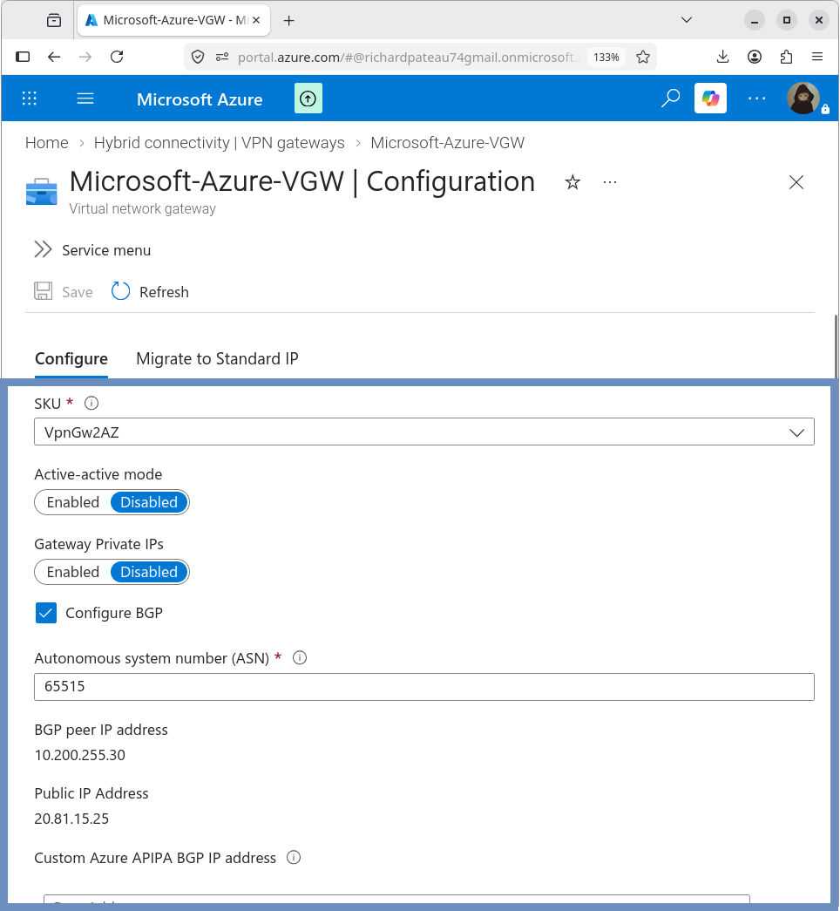
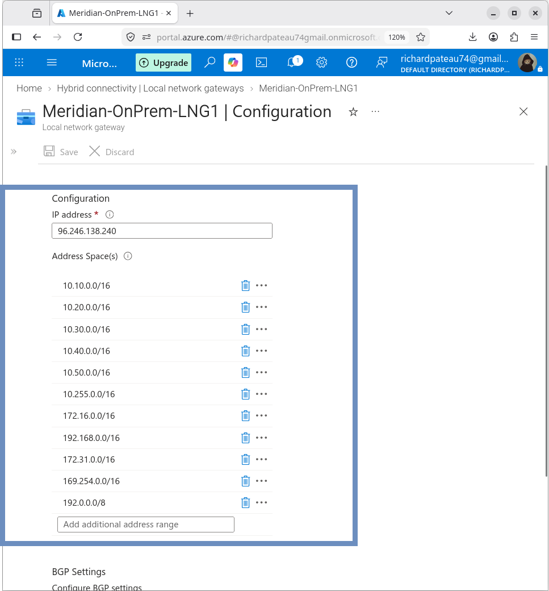
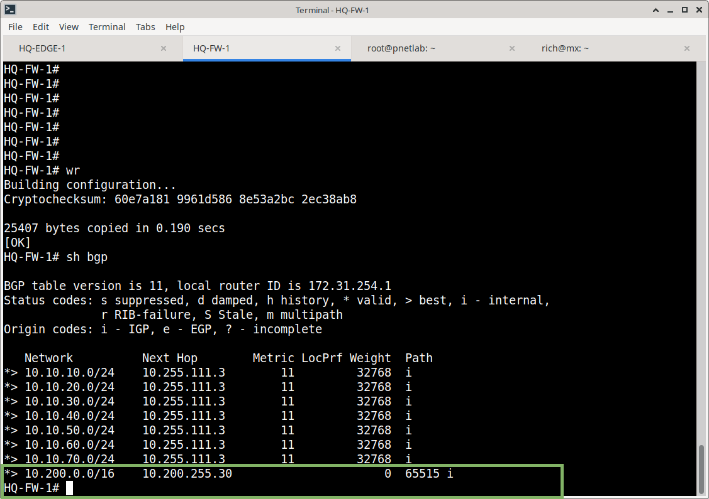
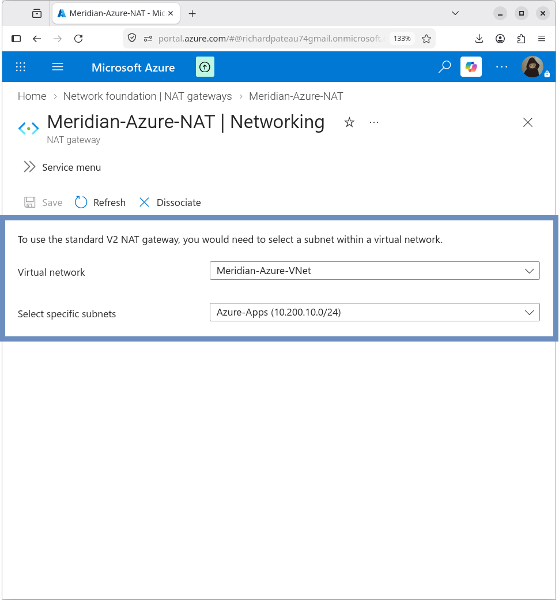
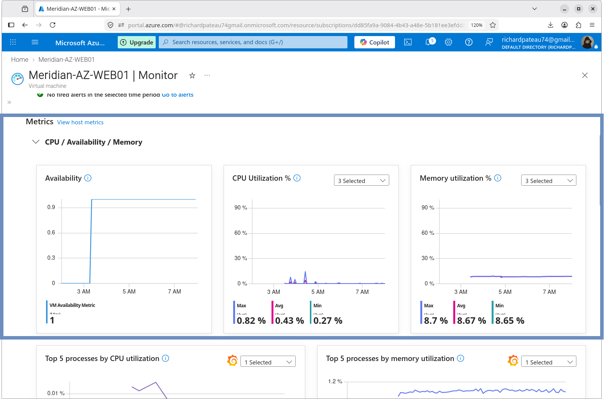
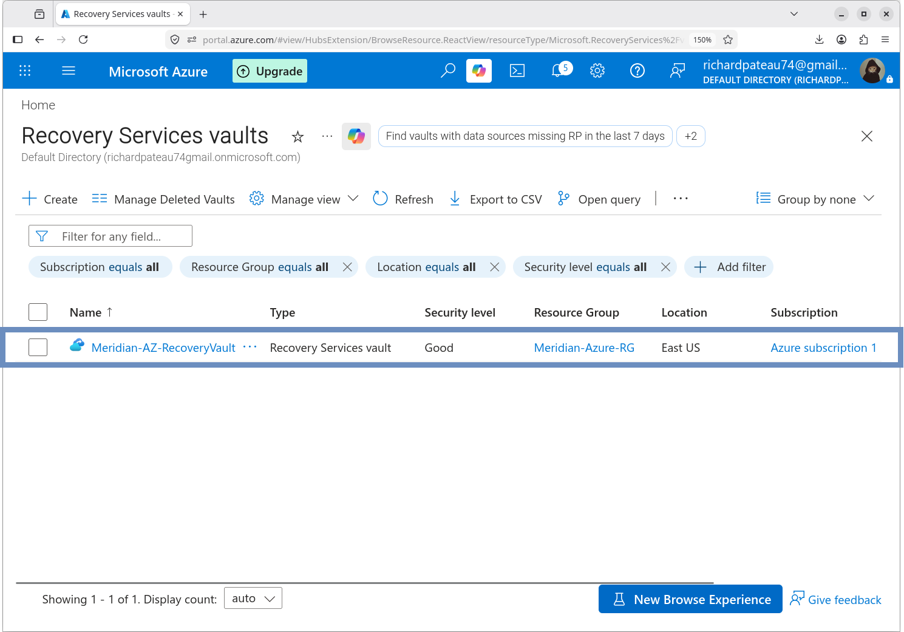
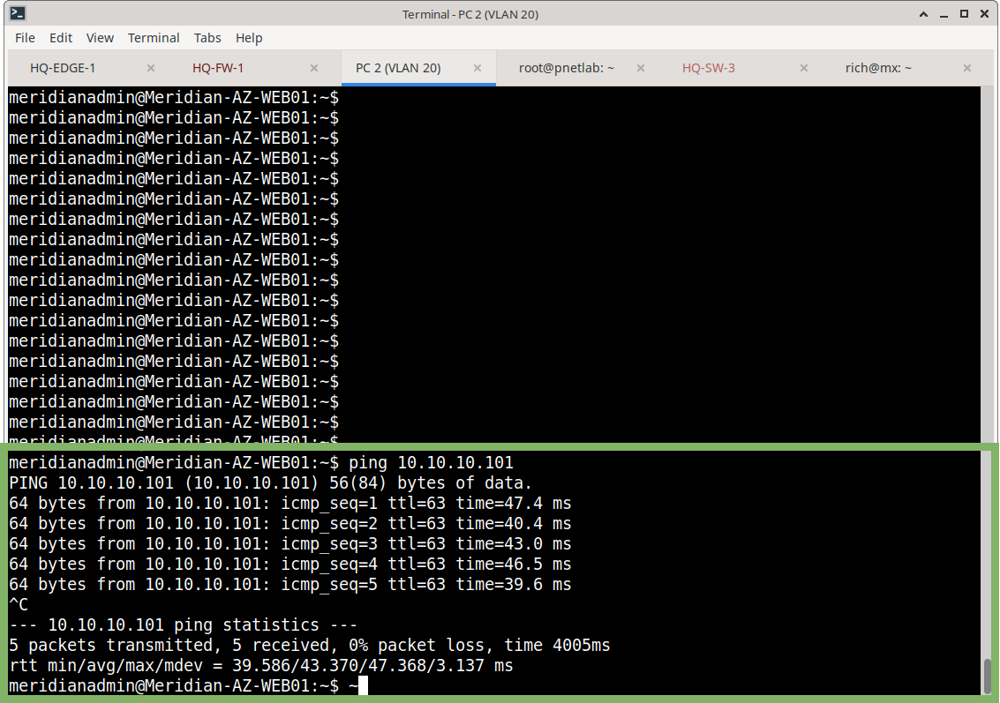

# Meridian Financial Services — Azure Hybrid Infrastructure

## Overview

This directory documents the Azure portion of the Meridian Financial Services enterprise network project.

The Azure environment extends the on-premises Meridian network into Microsoft Azure through a site-to-site IPsec VPN and dynamic BGP routing.

The design provides:

- Azure application hosting
- Hybrid on-premises/Azure connectivity
- Dynamic routing with BGP
- Network segmentation
- Network security controls
- Internet egress through NAT Gateway
- Azure Monitor telemetry and alerting
- Azure Backup
- Disaster recovery and restore validation

---

# Architecture

The Azure environment is built around the following architecture:

```text
                         Internet
                            │
                            │
                     Azure NAT Gateway
                            │
                            ▼
                    ┌─────────────────┐
                    │  Azure VNet     │
                    │ 10.200.0.0/16   │
                    │                 │
                    │ ┌─────────────┐ │
                    │ │ Azure-Apps  │ │
                    │ │10.200.10/24│ │
                    │ │             │ │
                    │ │ WEB01       │ │
                    │ │10.200.10.4  │ │
                    │ └─────────────┘ │
                    │                 │
                    │ Infrastructure  │
                    │ 10.200.20.0/24 │
                    │                 │
                    │ GatewaySubnet   │
                    │ 10.200.255.0/27│
                    └────────┬────────┘
                             │
                    Azure VPN Gateway
                    ASN 65515
                    BGP 10.200.255.30
                             │
                       IPsec / IKEv2
                             │
                       Tunnel 100
                             │
                    ┌────────▼────────┐
                    │   HQ-FW-1       │
                    │   ASA           │
                    │   ASN 65000     │
                    └────────┬────────┘
                             │
                     Meridian On-Prem
```

**Topology**



---

# Azure Environment

## Resource Group

```text
Meridian-Azure-RG
```

Region:

```text
East US
```

The resource group contains the primary Azure networking, application, security, monitoring, and backup resources used by the project.



---

# Azure Virtual Network

VNet:

```text
Meridian-Azure-VNet
```

Address space:

```text
10.200.0.0/16
```

## Subnets

| Subnet               | Address Space     | Purpose                 |
| -------------------- | ----------------- | ----------------------- |
| Azure-Apps           | `10.200.10.0/24`  | Application workloads   |
| Azure-Infrastructure | `10.200.20.0/24`  | Infrastructure services |
| GatewaySubnet        | `10.200.255.0/27` | Azure VPN Gateway       |



---

# Hybrid Connectivity

Azure is connected to the Meridian on-premises network through a site-to-site IPsec VPN.

## VPN Gateway

```text
Microsoft-Azure-VGW
```

Configuration:

* Route-based VPN
* SKU: `VpnGw2AZ`
* IKEv2
* BGP enabled
* Active-active disabled
* Active-standby architecture

Azure BGP ASN:

```text
65515
```

Azure BGP peer:

```text
10.200.255.30
```



## Local Network Gateway

```text
Meridian-OnPrem-LNG1
```

On-premises public IP:

```text
96.246.138.240
```

On-premises BGP ASN:

```text
65000
```

On-premises BGP peer:

```text
172.31.254.1
```

The IPsec tunnel provides the transport for the BGP session.

Detailed VPN configuration and IKE/IPsec validation are documented in:

`03-Site-to-Site-VPN`



---

# Routing

BGP provides dynamic route exchange between the Meridian on-premises network and Azure.

## Azure → On-Premises

Azure learned the Meridian HQ VLAN prefixes:

```text
10.10.10.0/24
10.10.20.0/24
10.10.30.0/24
10.10.40.0/24
10.10.50.0/24
10.10.60.0/24
10.10.70.0/24
```

## On-Premises → Azure

The on-premises ASA learned:

```text
10.200.0.0/16
```

from Azure BGP peer:

```text
10.200.255.30
```

The previous static `10.200.0.0/16` route was removed after BGP was established.

A host route remains for the Azure BGP peer:

```text
10.200.255.30/32
```

via the Azure VTI.

Detailed routing and BGP evidence is documented in:

`07-Routing`



---

# Application Server

Azure VM:

```text
MERIDIAN-AZ-WEB01
```

Configuration:

| Property   | Value                   |
| ---------- | ----------------------- |
| OS         | Ubuntu Server 24.04 LTS |
| Size       | Standard D2as_v4        |
| Private IP | `10.200.10.4`           |
| Subnet     | `Azure-Apps`            |
| Public IP  | None                    |

Apache is installed on the VM and hosts the Meridian Financial Services demonstration application.

The application server was validated through SSH and HTTP testing.

Detailed application documentation is located in:

`04-Application-Server`

---

# Internet Egress

The Azure application VM does not have a public IP.

Outbound Internet access is provided through:

```text
Meridian-AZ-NAT
```

The NAT Gateway is associated with:

```text
Azure-Apps
```

The application VM successfully accessed the Internet through the NAT Gateway.

Detailed configuration and validation are documented in:

`05-Internet-Egress`



---

# Security

The Azure application server is protected using Azure Network Security Groups and VM security features.

Security controls include:

* Restricted SSH access
* Restricted HTTP access
* Effective NSG rule validation
* Trusted Launch
* Secure Boot
* vTPM
* Integrity monitoring
* Defender for Cloud review
* Resource-group delete lock

The VM's configured source range for required inbound services is:

```text
10.0.0.0/8
```

A delete lock is configured on:

```text
Meridian-Azure-RG
```

Detailed security configuration and validation are documented in:

`06-Security`


---

# Monitoring

Azure Monitor was configured for:

```text
MERIDIAN-AZ-WEB01
```

Monitoring components include:

* OpenTelemetry detailed metrics
* Azure Monitor workspace
* Data Collection Rule
* VM availability monitoring
* CPU monitoring
* Memory monitoring
* Process-level metrics
* Host metrics
* Metric alerts
* Email notification

Azure Monitor workspace:

```text
defaultazuremonitorworkspace-eus
```

Data Collection Rule:

```text
msvmi-eastus-meridian-az-web01
```

Monitoring successfully populated VM metrics and processed alert conditions.

Detailed monitoring documentation is located in:

`08-Monitoring`



---

# Backup and Disaster Recovery

Azure Backup protects:

```text
MERIDIAN-AZ-WEB01
```

Recovery Services vault:

```text
Meridian-AZ-RecoveryVault
```

Backup storage redundancy:

```text
GRS
```

Backup policy:

```text
EnhancedPolicy
```

The configured policy includes:

* Four-hour backup frequency
* 2-day instant restore retention
* 30-day daily recovery-point retention
* All disks
* Future disks
* File-system-consistent recovery points

A recovery point was successfully restored into:

```text
MERIDIAN-AZ-WEB01-RESTORE
```

The restored VM was validated through:

* SSH
* Network configuration
* Apache service status
* Local HTTP application response

Detailed backup and disaster-recovery documentation is located in:

`09-Backup-DR`



---

# Final Validation

The completed Azure environment was validated after implementation.

Validation included:

| Component                         | Validation |
| --------------------------------- | ---------- |
| IPsec VPN                         | PASS       |
| BGP                               | PASS       |
| Azure routing                     | PASS       |
| On-premises connectivity          | PASS       |
| Azure-to-on-premises connectivity | PASS       |
| NSG security rules                | PASS       |
| NAT Internet egress               | PASS       |
| Azure Monitor                     | PASS       |
| Metric alerting                   | PASS       |
| Azure Backup                      | PASS       |
| VM restore                        | PASS       |
| Restored application              | PASS       |

Final Azure-to-on-premises connectivity was verified from the Azure VM:

```bash
ping -c 4 10.10.10.101
```

Result:

```text
4 packets transmitted
4 packets received
0% packet loss
```

Average latency during final validation was approximately:

```text
43.370 ms
```


---

# Documentation Structure

```text
Azure/
├── README.md
├── 01-Architecture/
├── 02-Networking/
├── 03-Site-to-Site-VPN/
├── 04-Application-Server/
├── 05-Internet-Egress/
├── 06-Security/
├── 07-Routing/
├── 08-Monitoring/
└── 09-Backup-DR/
```

## Section Overview

### 01 — Architecture

Documents the Azure architecture, resource group, VNet design, subnet structure, and relationship between Azure and the Meridian on-premises environment.

### 02 — Networking

Documents the Azure VNet, address space, subnets, and Azure networking configuration.

### 03 — Site-to-Site VPN

Documents the Azure VPN Gateway, Local Network Gateway, IKEv2/IPsec configuration, ASA VTI, and VPN validation.

### 04 — Application Server

Documents the Ubuntu application VM, NSG, Apache installation, SSH access, and application validation.

### 05 — Internet Egress

Documents the Azure NAT Gateway and private VM Internet egress.

### 06 — Security

Documents NSG controls, Trusted Launch, Defender for Cloud, and resource locks.

### 07 — Routing

Documents BGP configuration, route exchange, Azure effective routes, and routing validation.

### 08 — Monitoring

Documents Azure Monitor, OpenTelemetry, Data Collection Rules, metrics, and alerting.

### 09 — Backup/DR

Documents Azure Backup, Recovery Services Vault, backup policies, recovery points, and restore validation.

# Project Result

The Azure environment extends the Meridian Financial Services enterprise network into Microsoft Azure using a hybrid networking architecture.

The completed implementation demonstrates:

* Enterprise Azure network segmentation
* Site-to-site IPsec connectivity
* Dynamic BGP routing
* Private application hosting
* Controlled Internet egress
* Network security controls
* Infrastructure monitoring
* Metric-based alerting
* Backup and recovery
* Disaster recovery validation
* End-to-end hybrid connectivity

The Azure environment was implemented, tested, and documented as part of the broader Meridian Financial Services enterprise network project.
