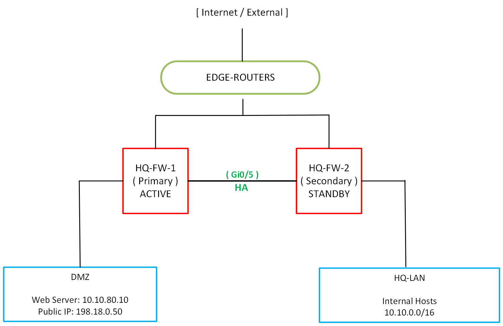
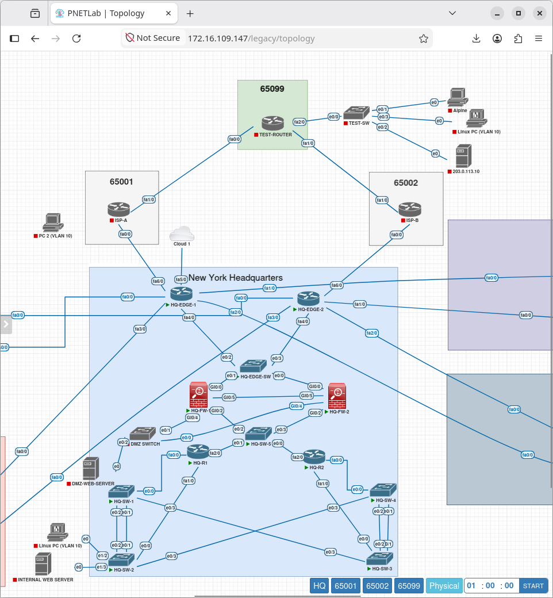
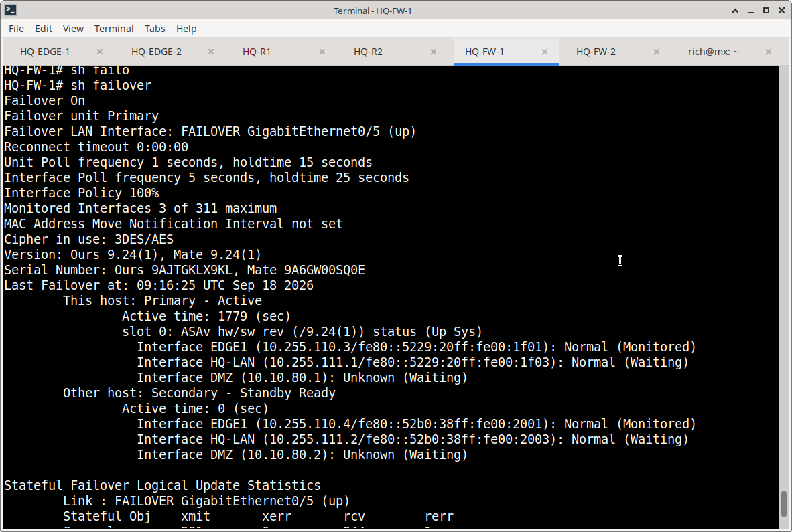
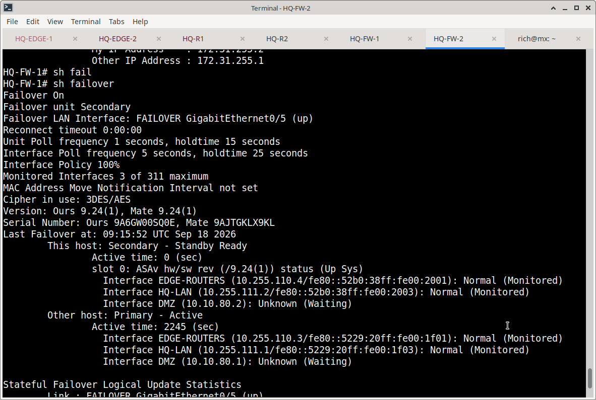
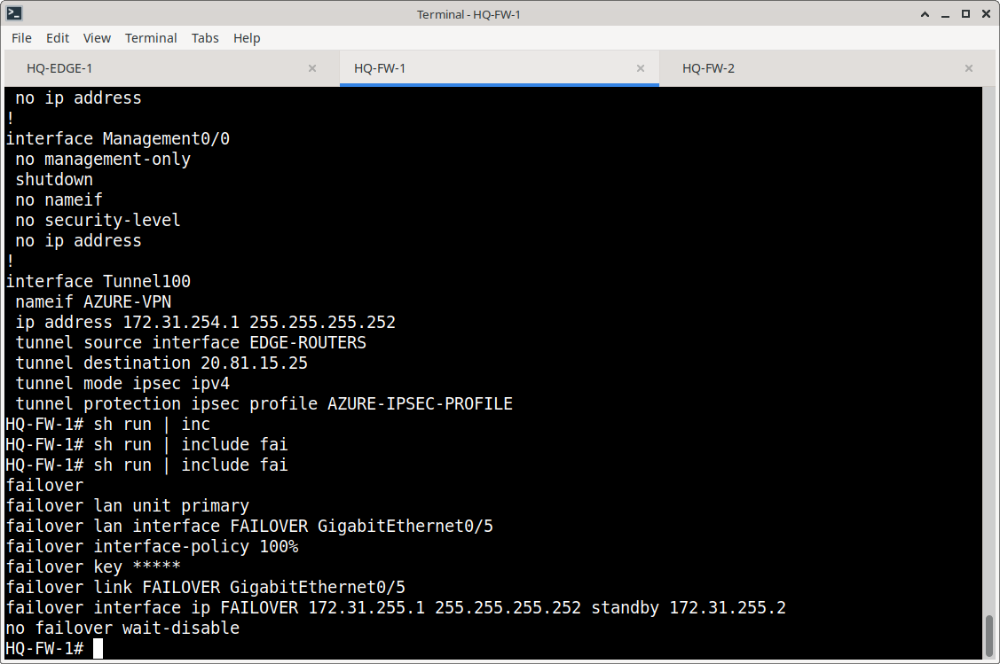

# Cisco ASA High Availability & DMZ Security Implementation

## Overview

This section documents the deployment of Cisco ASA Active/Standby High Availability (HA) and the secure publication of DMZ services for the Meridian Financial Services New York Headquarters. 

The implementation ensures business continuity through stateful firewall failover and enforces strict network segmentation using security zones, NAT, and Access Control Lists (ACLs). The design was rigorously validated through controlled failover testing, HTTP service verification, and packet-level isolation testing.

**HA Sync Video: Please enlarge for clearer video**

https://github.com/user-attachments/assets/67745aa3-b243-4254-87ff-124be2f53263

---

## Architecture

---

## High Availability Design

The headquarters utilizes two Cisco ASAv firewalls in an **Active/Standby** configuration to provide stateful redundancy.
- **Primary Unit (HQ-FW-1):** Currently Active, processing all traffic.
- **Secondary Unit (HQ-FW-2):** Currently Standby Ready, monitoring the primary unit.
- **Failover Link:** `GigabitEthernet0/5` (172.31.255.0/30) handles both failover control messages and stateful connection table updates.

---

## DMZ Security & NAT Model

To securely host public-facing services, a DMZ zone was established with a security level of 50, sitting between the Outside (0) and Inside (100) zones.

- **Static NAT:** The internal DMZ web server (`10.10.80.10`) is translated to the public IP `198.18.0.50` for external access.
- **Zone Isolation:** By default, the ASA permits traffic from higher security levels to lower ones (Inside -> DMZ -> Outside), but blocks traffic from lower to higher (Outside -> Inside) unless explicitly permitted by ACLs.

---

## Validation & Testing Summary

The implementation was validated across two primary vectors:

### 1. HA Failover Testing
A controlled interruption was introduced to the Active firewall. The Standby firewall successfully assumed the Active role, and OSPF adjacencies were re-established, proving stateful redundancy.

**show failover before failure FW-1 **

**show failover before failure FW-2**

**show ospf neighbor before failure FW-2**

**show ospf neighbor during failure FW-2**

### 2. DMZ Security & Isolation Testing
| Test Scenario | Source | Destination | Expected Result | Observed Result |
| :--- | :--- | :--- | :--- | :--- |
| **Internal Access** | HQ-LAN Client | DMZ Web Server | Allowed (High to Mid) | ✅ HTTP 200 OK |
| **External Access** | Ext Client (203.0.113.10) | Public IP (198.18.0.50) | Allowed via NAT/ACL | ✅ HTTP 200 OK |
| **DMZ Isolation** | DMZ Web Server | Internal Host (10.10.10.101) | Blocked (Mid to High) | 🛑 ICMP Requests Sent, No Replies |
| **Direct IP Access** | Ext Client | Private DMZ IP (10.10.80.10) | Blocked (No NAT match) |  Host Unreachable |

**Please enlarger for clearer video: External to DMZ Web Server**

https://github.com/user-attachments/assets/60b0a6e6-7976-4952-8b85-6190bee31837

---

## Operational Observations & Security Review

During the post-implementation verification, two operational states were noted for further review in a production environment:
1. **Configuration Sync:** The `show failover state` output reported `Sync Skipped`. While HA is functional, configuration synchronization should be verified to ensure both units share identical policies.
2. **ACL Ordering:** The `EDGE-IN` ACL contains a `permit ip any any` statement at line 1. In a production environment, this should be reviewed to ensure it does not inadvertently bypass the restrictive rules defined later in the ACL.

---

## Documentation Structure

| Document | Purpose |
| :--- | :--- |
| `README.md` | Architecture, HA design, DMZ security model, and testing summary. |
| `configuration.md` | Interface addressing, NAT rules, ACL structure, and detailed test procedures. |
| `screenshots/` | Curated evidence of CLI outputs, packet captures, and browser tests. |
