## Overview

This document details the configuration, addressing, and security policies implemented on the Meridian ASA firewalls. It serves as a technical reference for the HA state, NAT translations, and the functional validation of the DMZ security model.

---

## 1. Interface & Zone Configuration

The ASA interfaces are segmented into security zones based on trust levels.

| Interface | Zone Name | Security Level | Active IP | Standby IP | Subnet Mask |
| :--- | :--- | :---: | :--- | :--- | :--- |
| **Gi0/0** | EDGE-ROUTERS | 0 | 10.255.110.3 | 10.255.110.4 | 255.255.255.240 |
| **Gi0/2** | HQ-LAN | 100 | 10.255.111.1 | 10.255.111.2 | 255.255.255.248 |
| **Gi0/4** | DMZ | 50 | 10.10.80.1 | 10.10.80.2 | 255.255.255.0 |
| **Gi0/5** | FAILOVER | N/A | 172.31.255.1 | 172.31.255.2 | 255.255.255.252 |

---

## 2. High Availability Configuration and Testing

The firewalls are configured for Active/Standby failover. The `GigabitEthernet0/5` interface serves a dual purpose, handling both failover control traffic and stateful update synchronization.

**Verification Commands:**
```cisco
show failover
show failover state
show failover interface
```

**Captured State:**
- **This host:** Primary / Active
- **Other host:** Secondary / Standby Ready
- **Failover Status:** Enabled
- **Stateful Updates:** Active

**show failover before failure FW-1 **

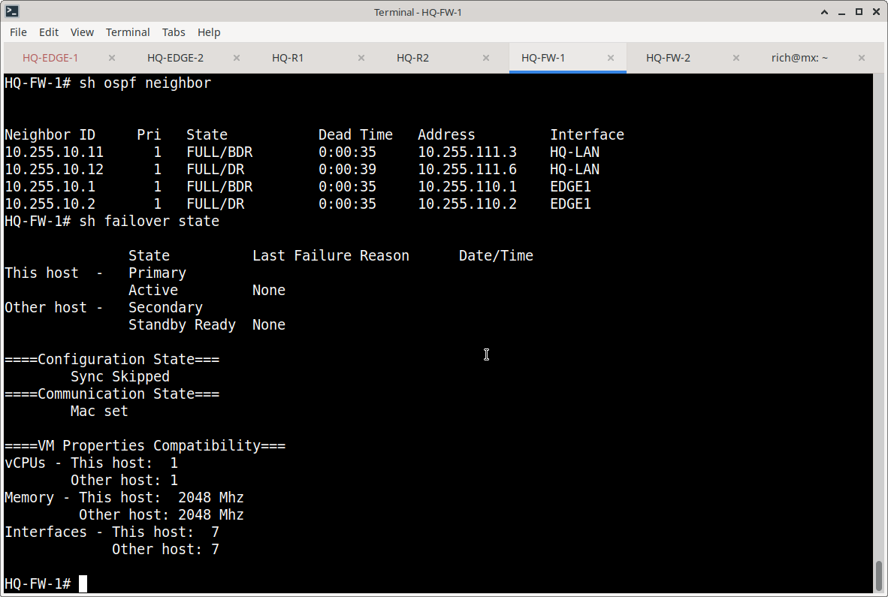

**show failover before failure FW-2**

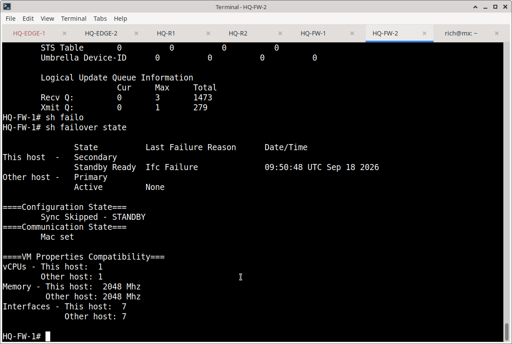

**show ospf neighbor before failure FW-2**

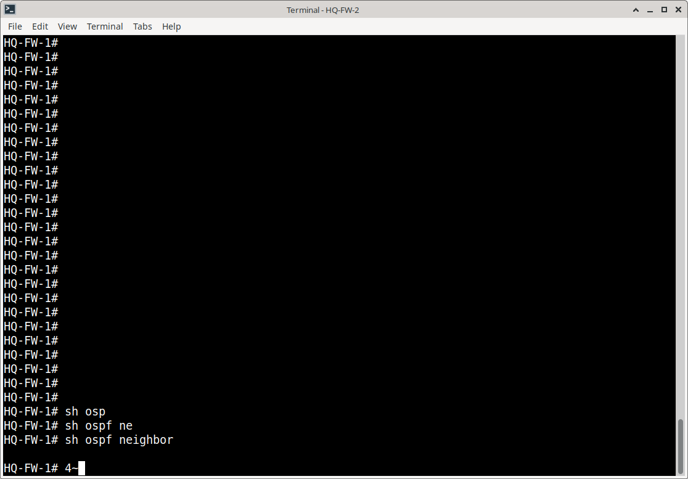

**show int ip brief FW-2 before failure**

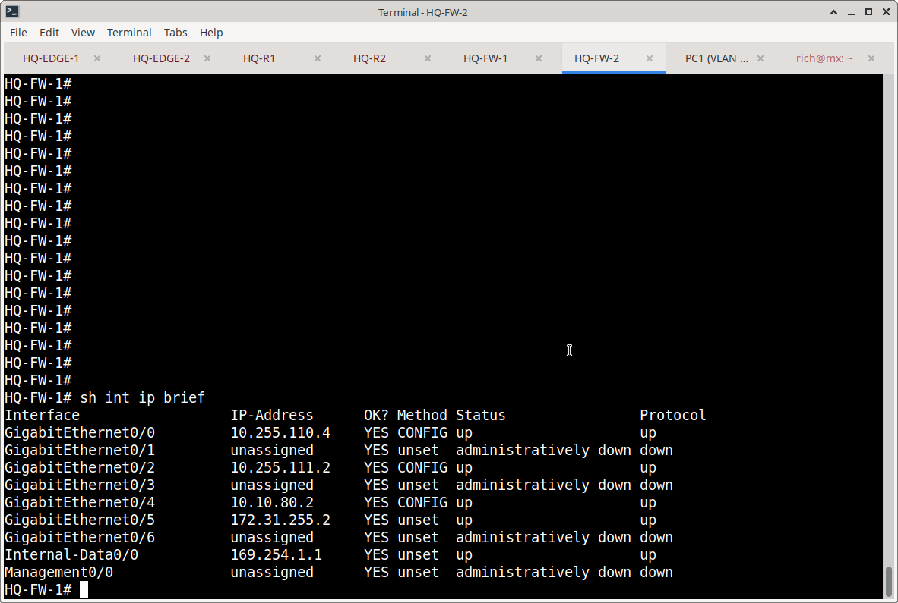

**FW-1 intentional failure: no failover active**

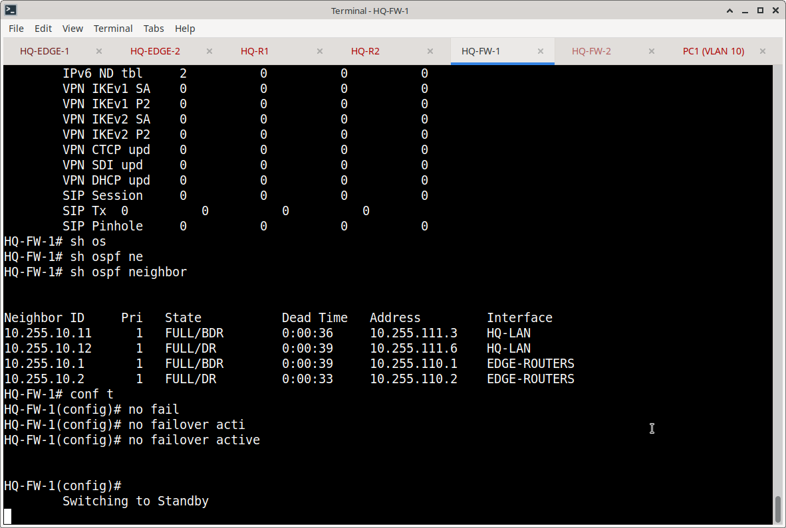

**show int ip brief during failure FW-2**

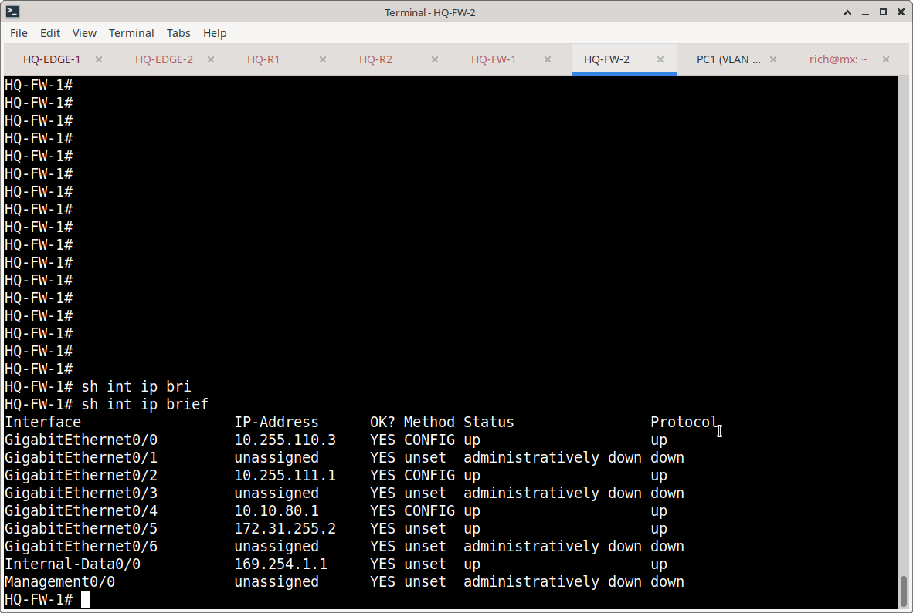

**show ospf neighbor during failure FW-2**

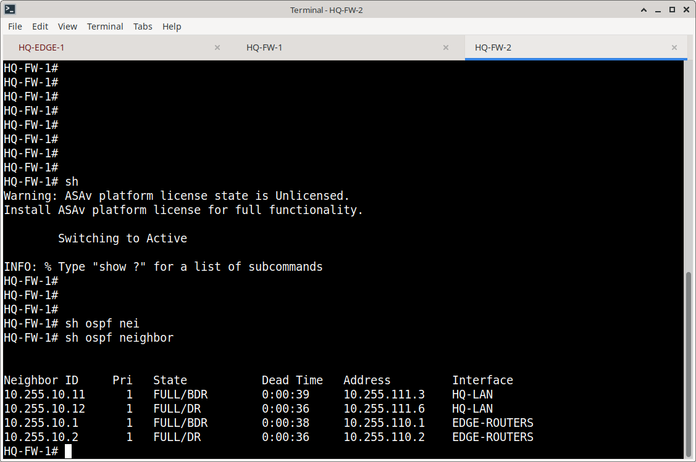


---

## 3. NAT & DMZ Publishing

To allow external access to the DMZ web server without exposing its private IP, a Static NAT rule was configured.

| Object | Private IP | Public (Translated) IP |
| :--- | :--- | :--- |
| DMZ-WEB-FW1 | 10.10.80.10 | 198.18.0.50 |

**Verification:**
```cisco
show nat detail
show xlate
```
*Packet captures confirm that external HTTP requests to `198.18.0.50` are successfully translated to `10.10.80.10` and return HTTP 200 OK responses.*

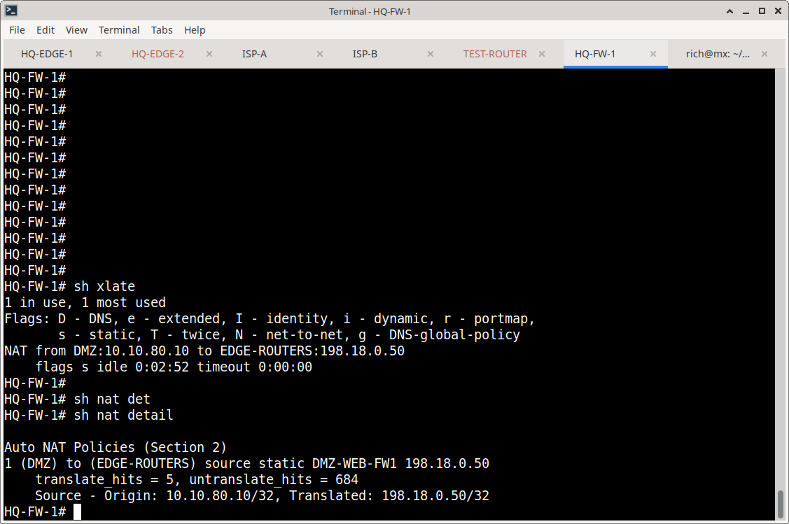


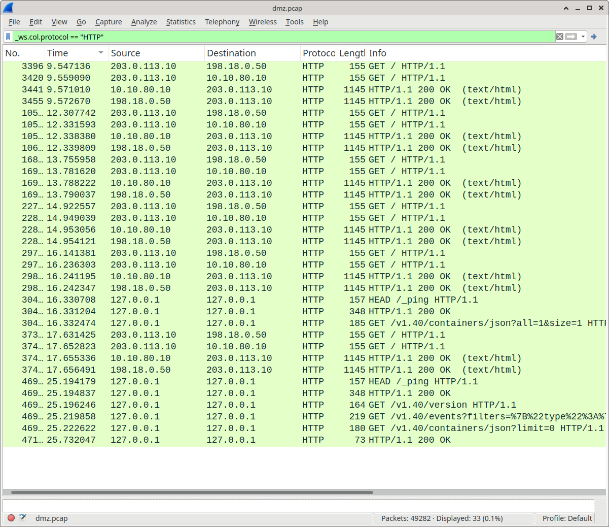

---

## 4. Access Control & Security Policy

Traffic from the Outside zone (Security Level 0) to the DMZ (Security Level 50) is controlled by the `EDGE-IN` access-list.

**Captured ACL Entries:**
```cisco
access-list EDGE-IN extended permit tcp 203.0.113.0 255.255.255.0 host 10.10.80.10 eq www
access-list EDGE-IN extended permit icmp 203.0.113.0 255.255.255.0 host 10.10.80.10
access-list EDGE-IN extended deny ip any any log informational interval 300
```
---

## 5. Functional Validation Procedures

### Test A: Internal-to-DMZ Access
- **Source:** HQ-LAN Client
- **Destination:** `10.10.80.10` (HTTP)
- **Result:** ✅ **Success.** The ASA permits traffic from Security Level 100 to 50 by default.

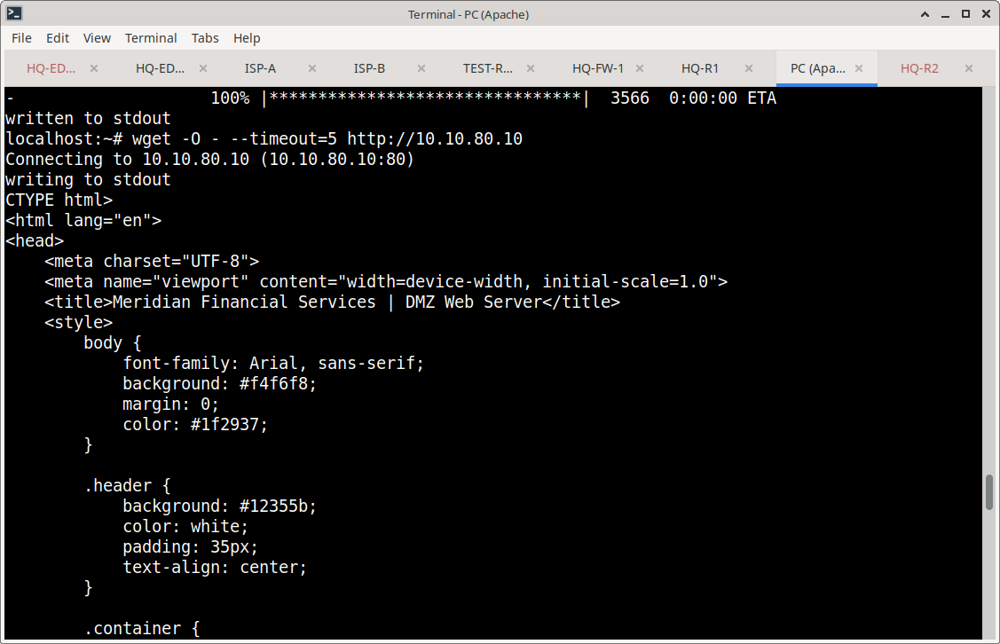


### Test B: External-to-DMZ Access (NAT Traversal)
- **Source:** External Client (`203.0.113.10`)
- **Destination:** `198.18.0.50` (HTTP)
- **Result:** ✅ **Success.** Wireshark captures confirm the HTTP GET request was NATed to `10.10.80.10` and the server responded with HTTP 200 OK.

**Please enlarger for clearer video**

https://github.com/user-attachments/assets/1d6e5a5f-8697-4d75-a9d2-c144f0b6d05a


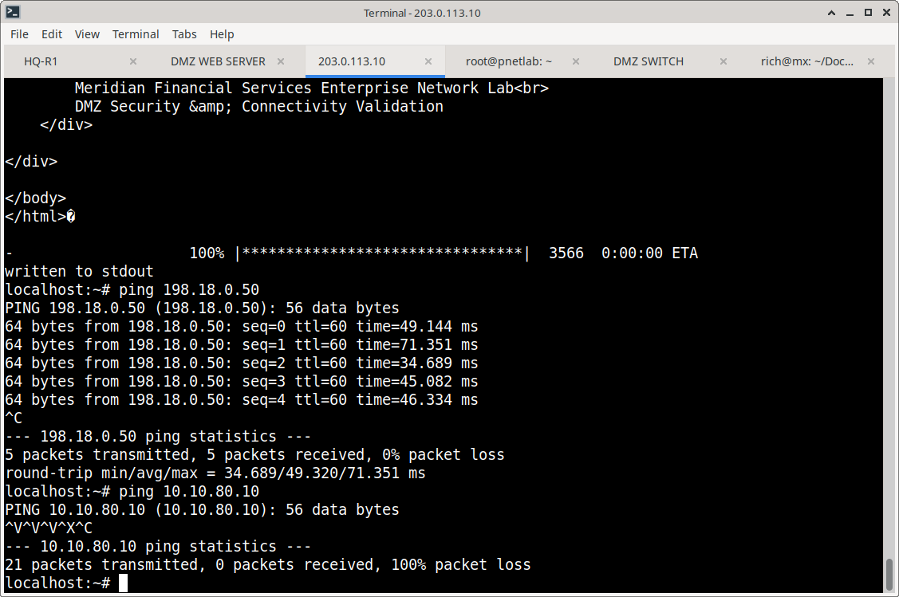

### Test C: DMZ-to-Internal Isolation
- **Source:** DMZ Web Server (`10.10.80.10`)
- **Destination:** Internal Host (`10.10.10.101`) (ICMP)
- **Result:** 🛑 **Blocked.** Wireshark captures show ICMP Echo Requests leaving the DMZ server, but no Echo Replies are received, proving the ASA successfully blocks traffic from Security Level 50 to 100.

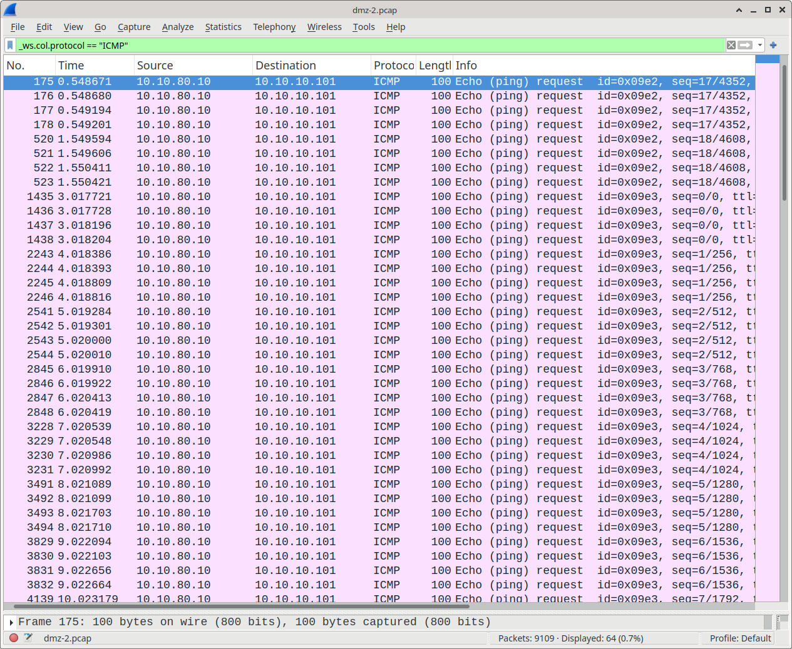

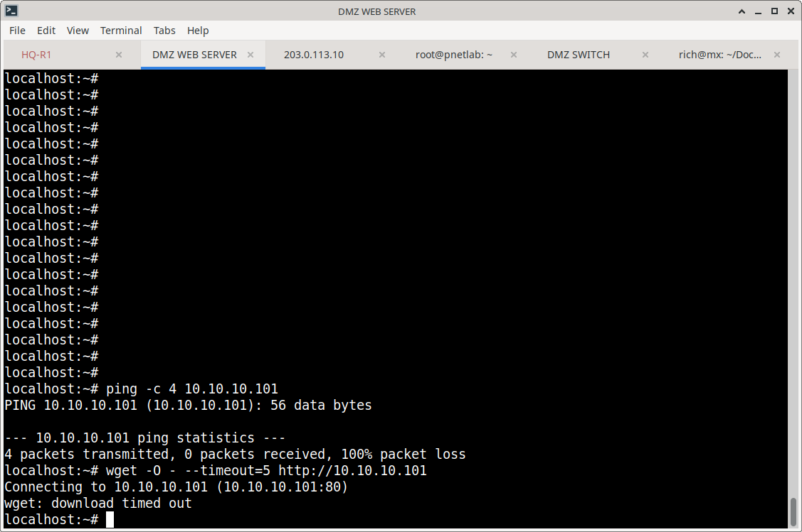


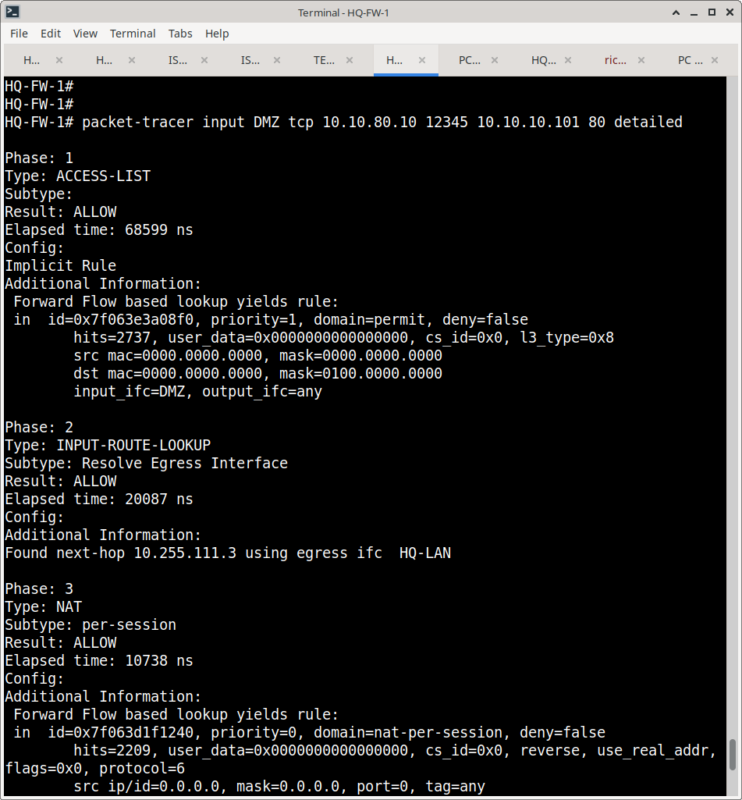


### Test D: Direct Private IP Access
- **Source:** External Client
- **Destination:** `10.10.80.10` (Private IP)
- **Result:** 🛑 **Blocked.** The external host cannot route to or access the private DMZ IP directly, proving that access is strictly controlled via the NAT public IP.

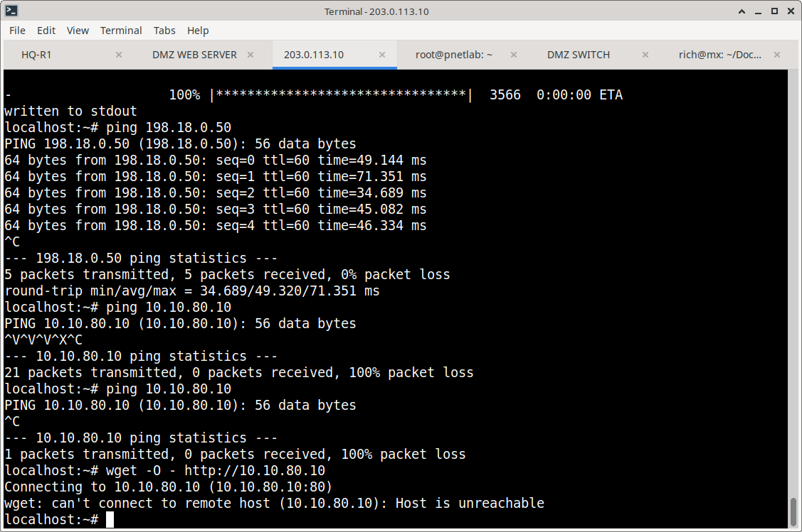

---

## 6. Evidence Matrix

| Verification Stage | Evidence File | What It Proves |
| :--- | :--- | :--- |
| **HA Baseline** | `fw-1-sh-failover-state-before.png` | HQ-FW-1 is Active, HQ-FW-2 is Standby Ready. |
| | `fw-2-sh-failover-state-before.png` | Secondary firewall confirmed in Standby Ready state. |
| **Failover Testing** | `fw-1-intentional-shutdown.png` | Controlled failover trigger on primary firewall. |
| | `fw-2-sh-int-ip-brief-during-failure.png` | FW-2 interface status after failover. |
| | `fw-2-sh-ospf-neighbor-during-failure.png` | OSPF adjacency re-established after failover. |
| **NAT Configuration** | `sh-nat-detail.png` | Static NAT mapping DMZ server to public IP. |
| | `sh-xlate.png` | Active translation table verification. |
| **External Access** | `wireshark-http-overview.png` | HTTP 200 OK confirms successful NAT traversal. |
| | `internet-to-dmz-ping.png` | External reachability to DMZ service. |
| **Internal Access** | `internal-reaches-dmz.png` | Internal client can reach DMZ web server. |
| | `internal-to-dmz-success.png` | HTTP access from HQ-LAN to DMZ successful. |
| **DMZ Isolation** | `wireshark-no-replies-dmz.png` | ICMP from DMZ to Internal receives no reply. |
| | `dmz-unable-to-reach-internal.png` | DMZ-to-Internal traffic blocked. |
| | `packet-tracer-dmz-to-internal.png` | ASA Packet Tracer confirms implicit deny. |
| | `packet-tracer-implicit-deny.png` | Packet Tracer shows ACL deny action. |
| **Private IP Protection** | `external-unable-to-reach-private-dmz.png` | External host cannot access private DMZ IP directly. |
| **Pre-Failure State** | `fw-2-sh-ospf-neighbor-before.png` | OSPF adjacency before failover. |
| | `fw-2-sh-int-ip-brief-before.png` | Interface status before failover. |

---
