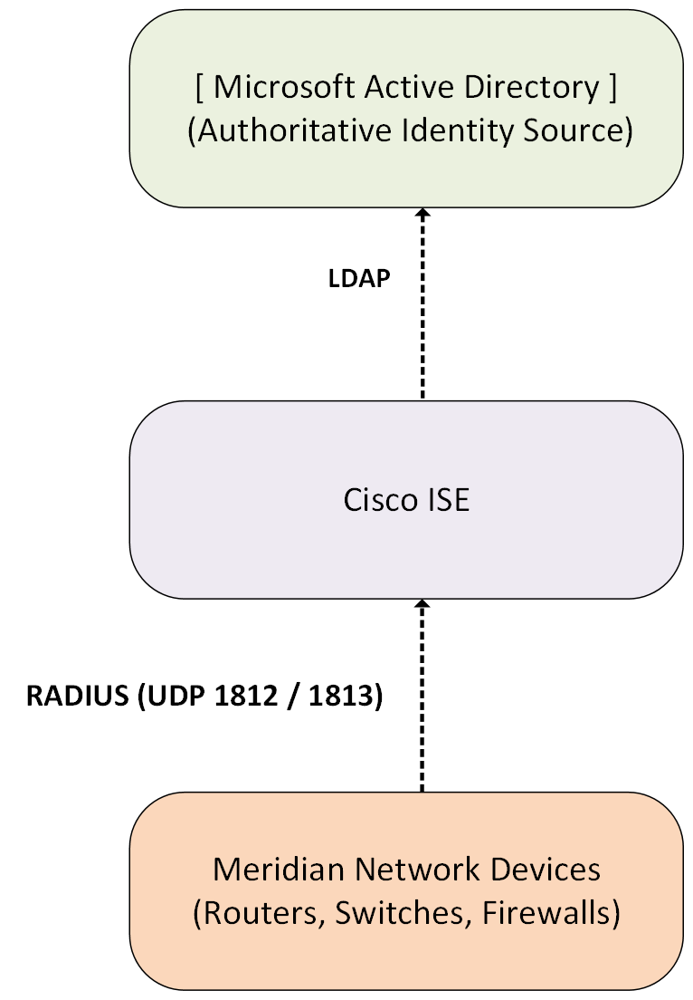

### `Cisco-ISE/01-AD-RADIUS/README.md`

# Cisco ISE — Active Directory & RADIUS Integration

## Overview

This section documents the foundational integration between Cisco Identity Services Engine (ISE), Microsoft Active Directory (AD), and the RADIUS protocol within the Meridian Financial Services network. 

The primary objective is to establish ISE as the centralized policy enforcement point, leveraging Active Directory as the authoritative external identity source. This eliminates the need for local user accounts on individual network devices and enables scalable, identity-based access control.

---

## Architecture

- **Active Directory:** Provides centralized user accounts, group memberships, and credential validation.
- **Cisco ISE:** Acts as the RADIUS server, evaluating authentication requests against AD and applying centralized authorization policies.
- **Network Devices:** Act as RADIUS Network Access Servers (NAS), forwarding authentication requests to ISE without storing user credentials locally.

---

## Design Objectives

- **Centralized Identity Management:** Leverage existing AD infrastructure for network access, reducing administrative overhead.
- **Group-Based Policy Enforcement:** Utilize AD Security Groups to dynamically assign network access privileges in ISE.
- **Secure Authentication Transport:** Utilize RADIUS with strong shared secrets for communication between network devices and ISE.
- **Comprehensive Auditing:** Centralize all authentication successes and failures in ISE Live Logs for security monitoring and compliance.

---

## Authentication Flow

1. A user attempts to access the network (e.g., via SSH or 802.1X).
2. The Network Device intercepts the request and formats a RADIUS Access-Request.
3. The request is forwarded to Cisco ISE.
4. ISE evaluates the Authentication Policy and identifies Active Directory as the required identity source.
5. ISE securely queries the Domain Controller to validate the user's credentials.
6. Upon successful validation, ISE evaluates the Authorization Policy (e.g., checking AD group membership).
7. ISE returns a RADIUS Access-Accept (or Access-Reject) to the Network Device, granting or denying access.

---

## Scope & Boundaries

This directory strictly covers the **foundational AD/RADIUS integration**. 

Related but distinct ISE capabilities are documented in their respective sections to maintain clarity:
- **802.1X Wired/Wireless:** `Cisco-ISE/02-802.1X/`
- **Guest Access:** `Cisco-ISE/03-Guest/`
- **TACACS+ Device Administration:** `Cisco-ISE/04-TACACS/`

---

## Documentation Structure

| Document | Purpose |
| :--- | :--- |
| `README.md` | Architecture, design objectives, and scope. |
| `configuration.md` | Implementation model, policy framework, and network device configuration. |
| `screenshots/` | Curated evidence of successful AD join, group mapping, and authentication. |
