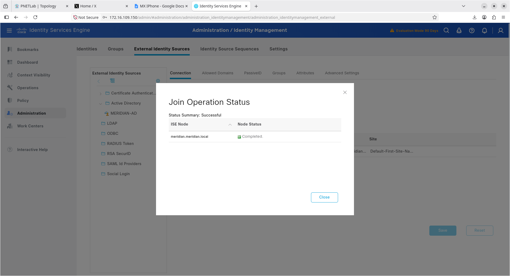
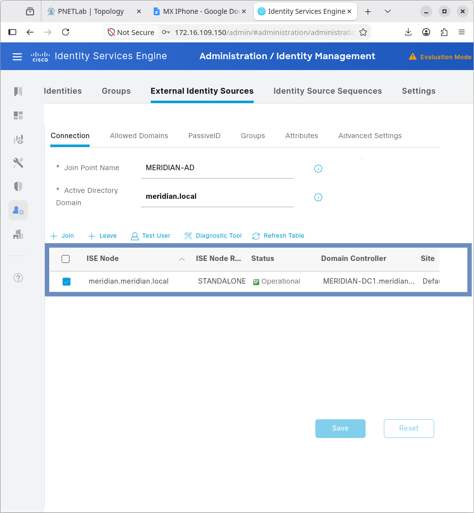
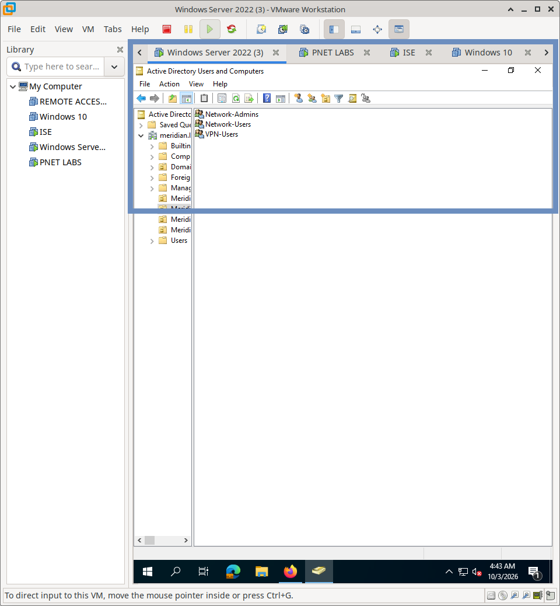
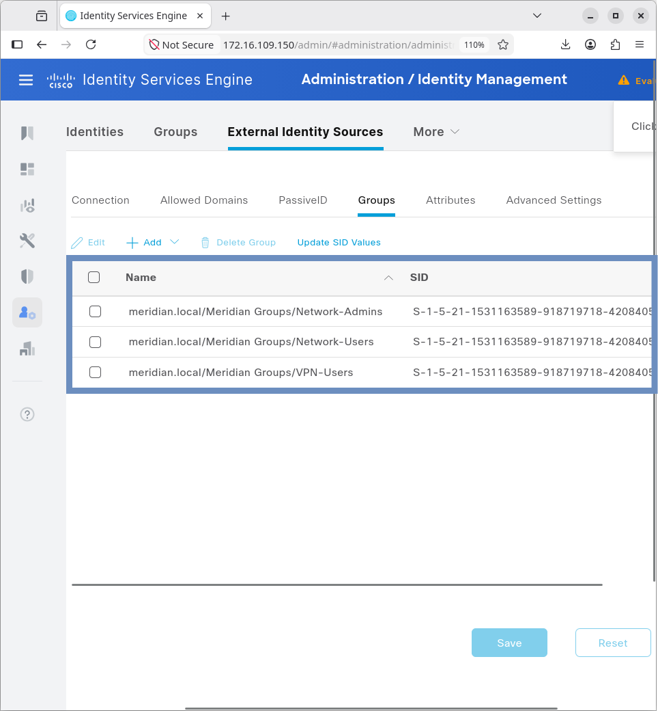
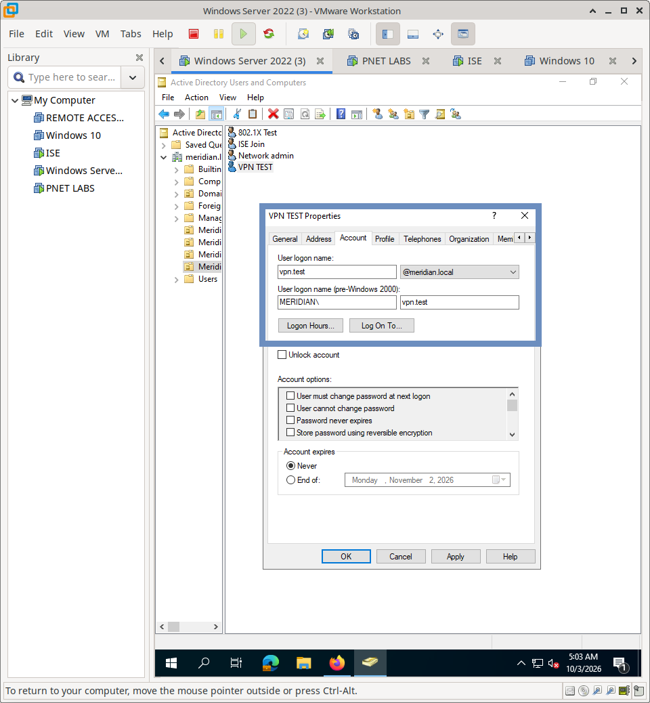
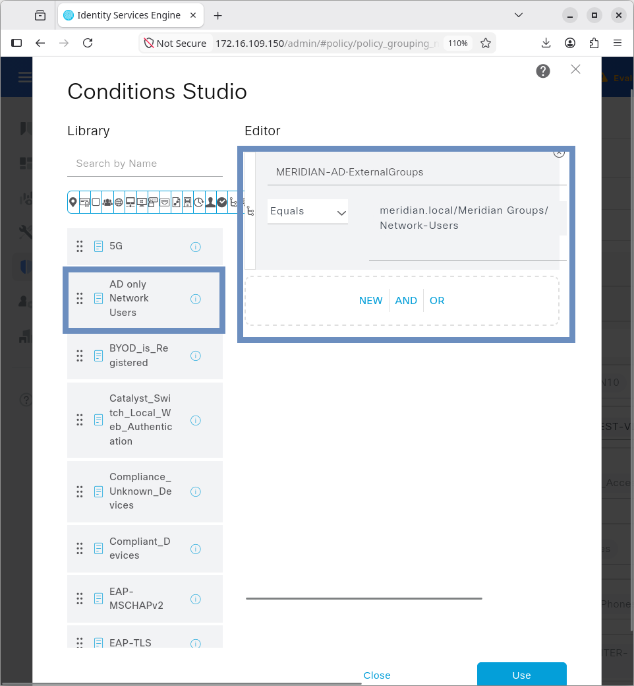
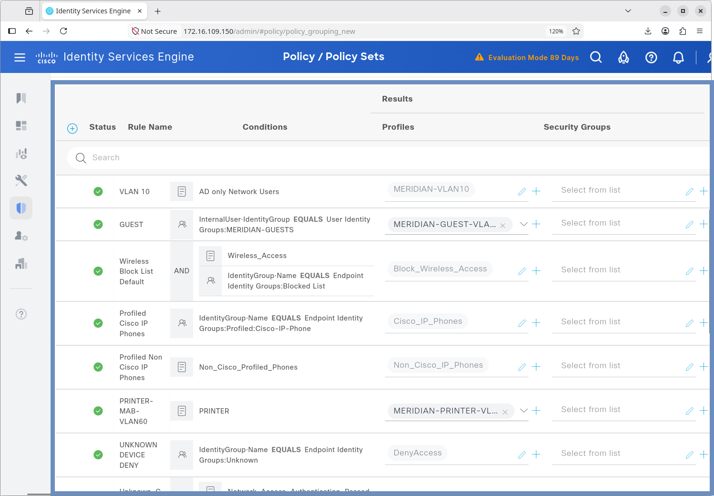
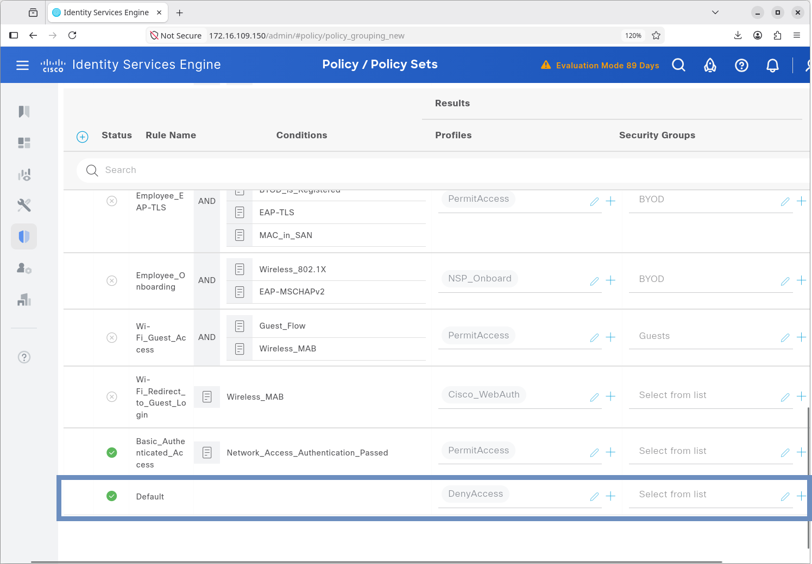
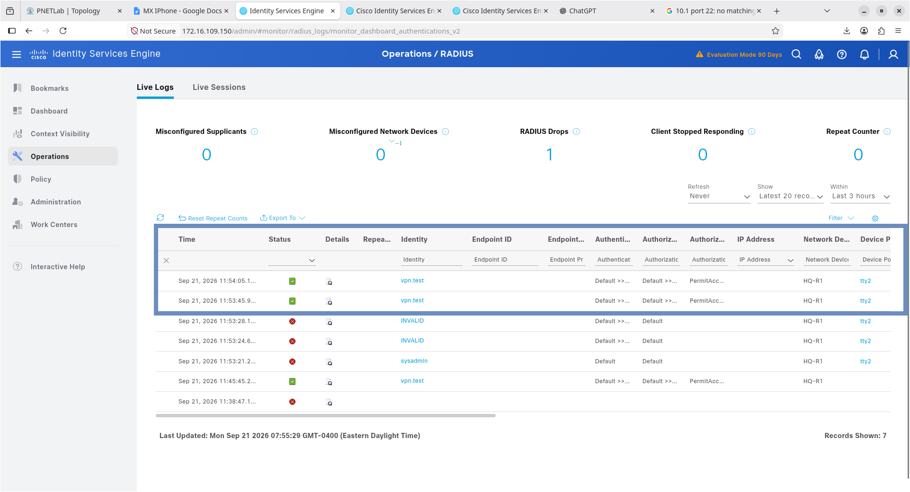

# Cisco ISE — AD & RADIUS Implementation Model

## Overview

This document details the configuration model used to integrate Cisco ISE with Microsoft Active Directory and define the RADIUS trust relationship with Meridian network devices.

---

## 1. Active Directory Integration

### 1.1 Domain Join
ISE was joined to the Meridian Active Directory domain to establish a secure, trusted relationship. This allows ISE to perform machine-account authentication and securely query the directory.

**Configuration Path:** `Administration` → `Identity Management` → `External Identity Sources` → `Active Directory`

**Validation:** 
- ISE node successfully joined the domain.
- Connectivity to Domain Controllers verified.





### 1.2 Group & User Mapping
Specific Active Directory Security Groups were imported into ISE to be used as conditions in Authorization Policies. A dedicated test user (`VPN_USER`) was validated to ensure directory synchronization.

**Validation:**
- AD Groups successfully resolved and listed in ISE.
- Test user attributes correctly populated.





### 1.3 Integration Verification
To validate the Active Directory join and ensure ISE can successfully query the directory, the built-in ISE "Test User Authentication" tool is used.

**Test Parameters:**
*   **Identity Source:** `MERIDIAN-AD`
*   **Test User:** `vpn.test@meridian.local` (Located in the `Meridian Users` OU in AD)
*   **Authentication Type:** MS-RPC

**Results:**
*   **Authentication Result:** `SUCCESS`
*   **Groups Retrieved:** 3 (Crucial for Authorization Policy group matching)
*   **Attributes Retrieved:** 35




---

## 2. RADIUS Network Device Definition

For network devices to communicate with ISE, they must be explicitly defined as RADIUS clients. This establishes the trust relationship via a shared secret.

**Configuration Path:** `Administration` → `Network Resources` → `Network Devices`

**Required Parameters:**
- **Name:** Descriptive hostname (e.g., `HQ-R1`)
- **IP Address:** Management IP of the network device
- **RADIUS Authentication Port:** `1812`
- **RADIUS Accounting Port:** `1813`
- **Shared Secret:** Strong, matching pre-shared key


---

## 3. Policy Framework

### 3.1 Authentication Policy
The Authentication Policy dictates *how* a user is validated based on the type of network access request.

**Implementation:**
Within the Default Policy Set, specific rules route authentication requests to the correct identity store:
*   **MAB Rule:** Routes MAC Authentication Bypass requests to `Internal Endpoints` (ISE local database).
*   **Dot1X Rule:** Routes 802.1X requests (Wired and Wireless) to `All_User_ID_Stores`, which includes the integrated Active Directory.


### 3.2 Authorization Policy
The Authorization Policy dictates *what* network access the user receives after successful authentication. This leverages the Active Directory integration and device profiling to enforce role-based access control.

**Implementation:**
The policy evaluates the authenticated identity against specific conditions to assign the appropriate permission profile:
*   **Corporate Users:** The `VLAN 10` rule uses the condition `AD only Network Users` to assign the `MERIDIAN-VLAN10` permission profile.
*   **Guests:** The `GUEST` rule assigns users in the `MERIDIAN-GUESTS` identity group to `MERIDIAN-GUEST-VLAN40`.
*   **IoT/Printers:** The `PRINTER-MAB-VLAN60` rule assigns profiled printers to the IoT VLAN.
*   **Security Baseline:** The `UNKNOWN DEVICE DENY` rule ensures that any unrecognized endpoint is explicitly denied access (`DenyAccess`).

**AD only Network Users condition policy**







---

## 4. Network Device Configuration (Cisco IOS)

To forward authentication requests to ISE, the network devices are configured with the RADIUS server details and the matching shared secret.

**Example Configuration:**
```cisco
! Enable AAA
aaa new-model

! Define the RADIUS authentication method list
aaa authentication login ISE-LOGIN group MERIDIAN-RADIUS local

! Define the RADIUS server group
aaa group server radius MERIDIAN-RADIUS
 server name MERIDIAN-ISE

! Define the RADIUS server
radius server MERIDIAN-ISE
 address ipv4 172.16.109.150 auth-port 1812 acct-port 1813
 key <STRONG_SHARED_SECRET>

! Apply the ISE-LOGIN method list to console access
line con 0
 login authentication ISE-LOGIN
```

---

## 5. Operational Validation & Logging

Successful integration is validated through both functional testing and ISE's native logging capabilities.

### 5.1 Functional Testing
- **Positive Test:** Valid AD credentials result in successful network access (e.g., SSH login).
- **Negative Test:** Invalid credentials result in immediate rejection, with no network access granted.

**Enlarge for clearer video**

https://github.com/user-attachments/assets/8c8f75a4-2d0f-4a13-8a7b-30a92bc39b8f

### 5.2 ISE Live Logs
All authentication attempts are captured in `Operations` → `RADIUS` → `Live Logs`. This provides real-time visibility into:
- Requesting Network Device (NAS IP)
- Username and Identity Group
- Authentication Method (e.g., PAP, CHAP, MSCHAPv2)
- Final Result (Access-Accept / Access-Reject)



---

## 6. Evidence Repository

Curated screenshots validating this implementation are stored in:
`Cisco-ISE/01-AD-RADIUS/screenshots/`

**Evidence Checklist:**
- [x] `ise-ad-join.png` / `ise-ad-join-success.png` (Proof of domain trust and successful AD join)
- [x] `ad-groups.png` / `ise-ad-groups.png` (Proof of AD group mapping and import)
- [x] `vpn.test-ad.png` / `vpn.test-ise.png` (Proof of user resolution and successful test authentication)
- [x] `authentication-policy.png` / `authorization-policy.png` (Proof of Authentication and Authorization policy logic)
- [x] `ad-only-network-users-condition.png` (Proof of AD condition mapping in Authorization)
- [x] `default-deny.png` (Proof of security baseline for unknown devices)
- [x] `ad-network-device-r1.png` (Proof of RADIUS Network Device definition in ISE)
- [x] `vpn.test-ise-logs.png` (Proof of functional authentication in Live Logs)

---
