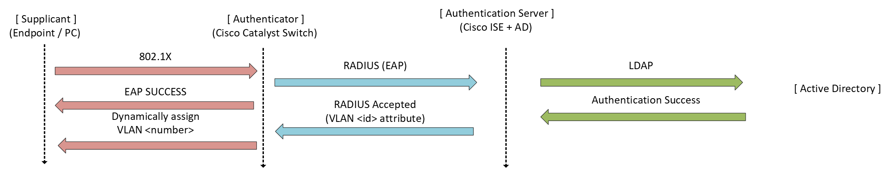

# Cisco ISE — 802.1X Network Access Control (NAC)

## Overview

This section documents the deployment of IEEE 802.1X port-based Network Access Control (NAC) within the Meridian Financial Services environment, powered by Cisco Identity Services Engine (ISE).

802.1X serves as the primary enforcement mechanism for wired network access, ensuring that no endpoint can communicate on the network until its identity is cryptographically validated. The implementation leverages the existing Active Directory integration to provide seamless, identity-driven network access and dynamic VLAN assignment.

---

## Architecture & Roles

The Meridian 802.1X deployment follows the standard RADIUS framework, utilizing three distinct roles:

1.  **Supplicant:** The endpoint (e.g., PC1, Alpine Linux) requesting network access, configured with user credentials.
2.  **Authenticator:** The Cisco switch port, which acts as the gatekeeper, blocking all traffic except 802.1X EAPOL frames until authentication succeeds.
3.  **Authentication Server:** Cisco ISE, which validates the credentials against Active Directory and returns an authorization result (e.g., assign to VLAN 10).

---

## Design Objectives

- **Zero-Trust Edge:** Prevent network access at the port level until identity is proven.
- **Dynamic VLAN Assignment:** Automatically place authenticated users into the correct broadcast domain (VLAN 10) based on their AD group membership, rather than static port configuration.
- **Centralized Policy:** Manage access rules centrally in ISE rather than on individual switch CLI.
- **Comprehensive Visibility:** Capture all authentication events (success and failure) in ISE Live Logs for security auditing.

---

## Testing & Validation Scope

To prove the resilience and security of the 802.1X implementation, three distinct testing scenarios were executed:

### 1. Positive Testing (Authorized Access)
Validating that a legitimate user with correct AD credentials successfully authenticates and is dynamically placed into VLAN 10.

### 2. Negative Testing (Credential Failure)
Validating that an endpoint supplying incorrect credentials is denied access and receives no network connectivity.

### 3. Security Testing (Rogue Endpoint)
Validating the behavior of an unauthenticated, rogue device connecting to an 802.1X-enabled port. This proves the switch correctly blocks the device and generates security alerts.

---

## Scope & Boundaries

This directory strictly covers **802.1X wired authentication for known network users**. 

Related but distinct ISE capabilities are documented in their respective sections:
- **Foundation (AD/RADIUS):** `Cisco-ISE/01-AD-RADIUS/`
- **Guest & Unknown Devices:** `Cisco-ISE/03-Guest/`
- **Device Administration (TACACS+):** `Cisco-ISE/04-TACACS/`

---

## Documentation Structure

| Document | Purpose |
| :--- | :--- |
| `README.md` | Architecture, design objectives, and testing scope. |
| `configuration.md` | ISE policy logic, switch authenticator configuration, and evidence matrix. |
| `screenshots/` | Curated evidence of policy configuration, switch state, and test results. |
