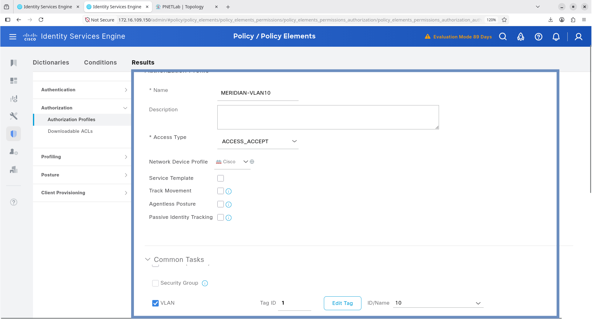
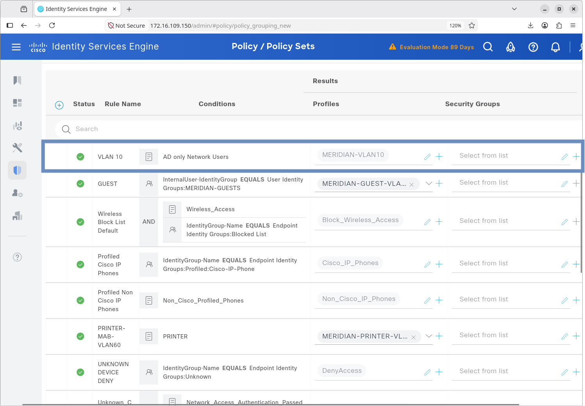
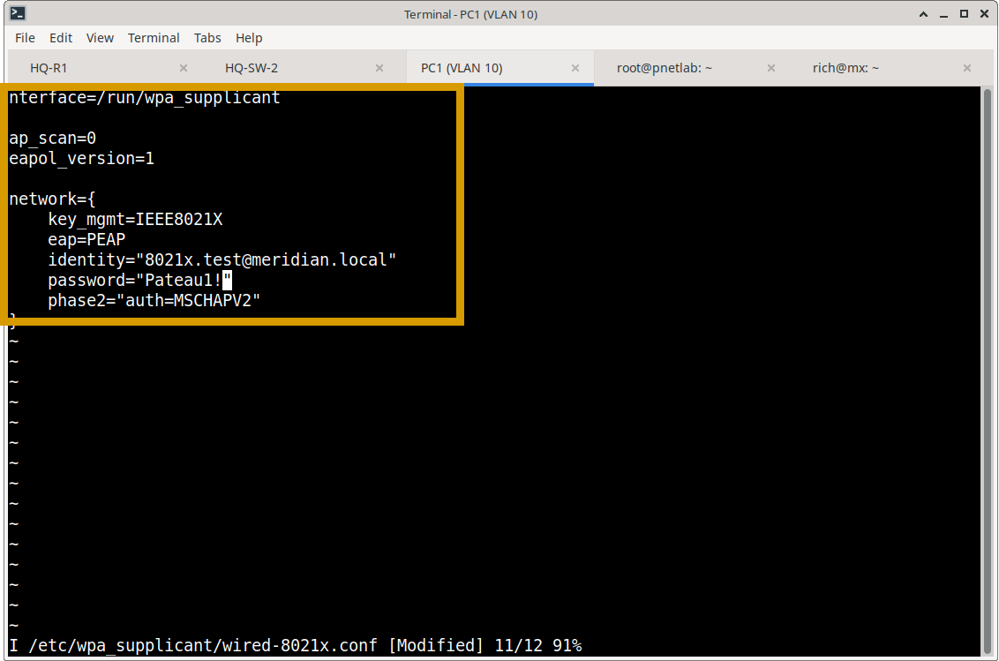
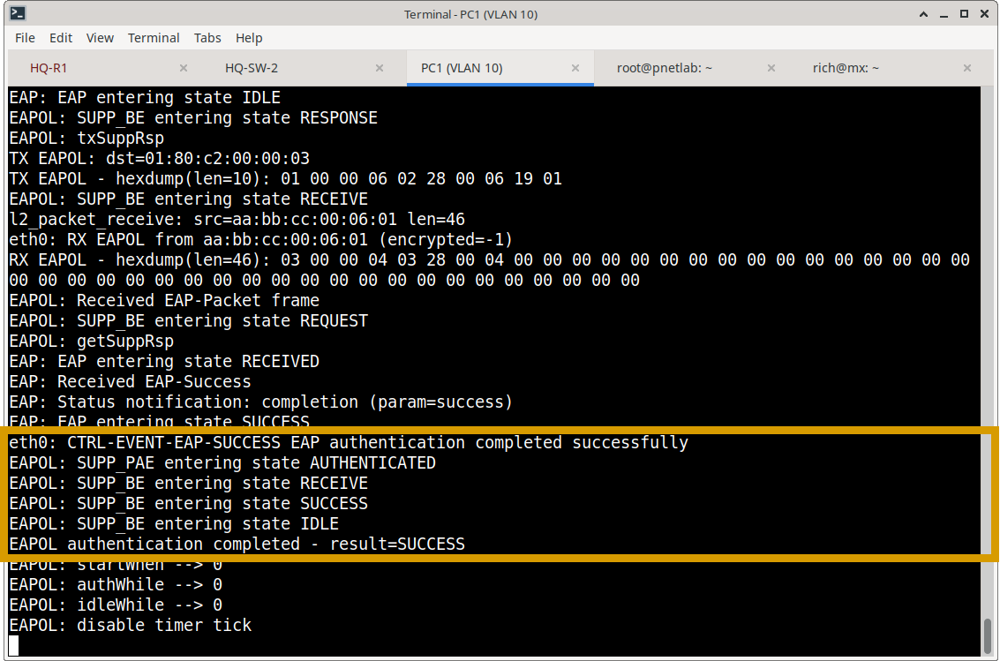
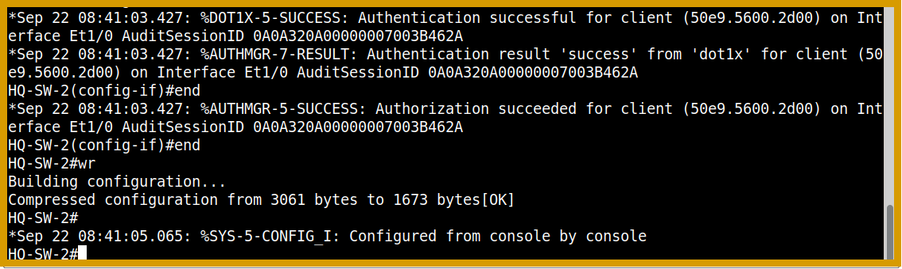
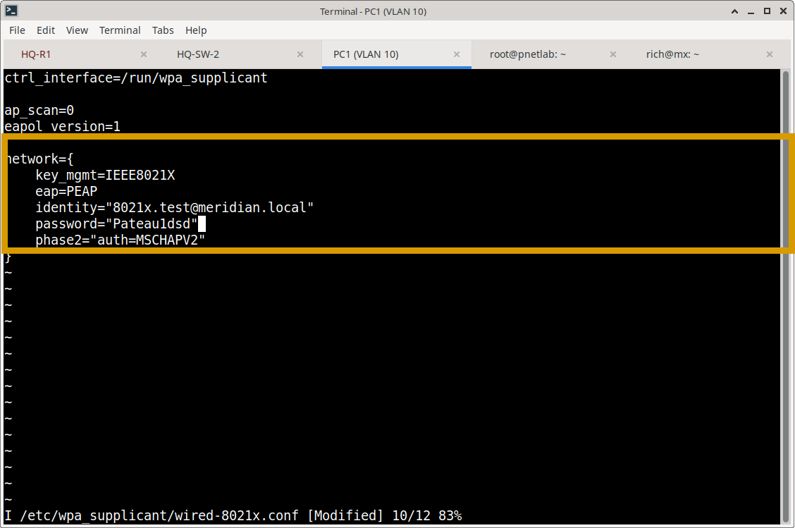
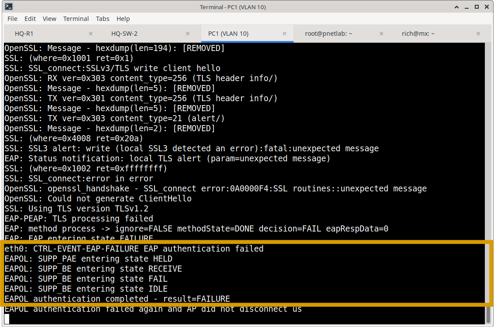
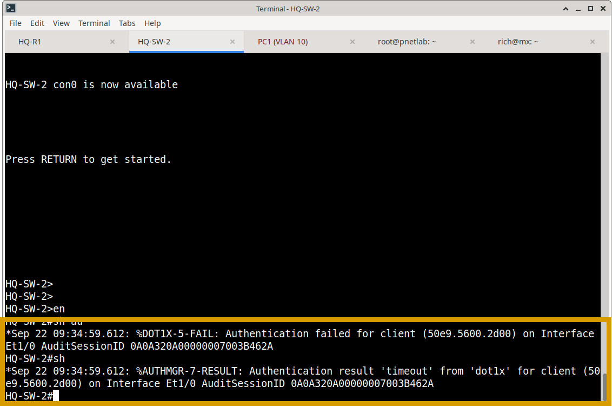
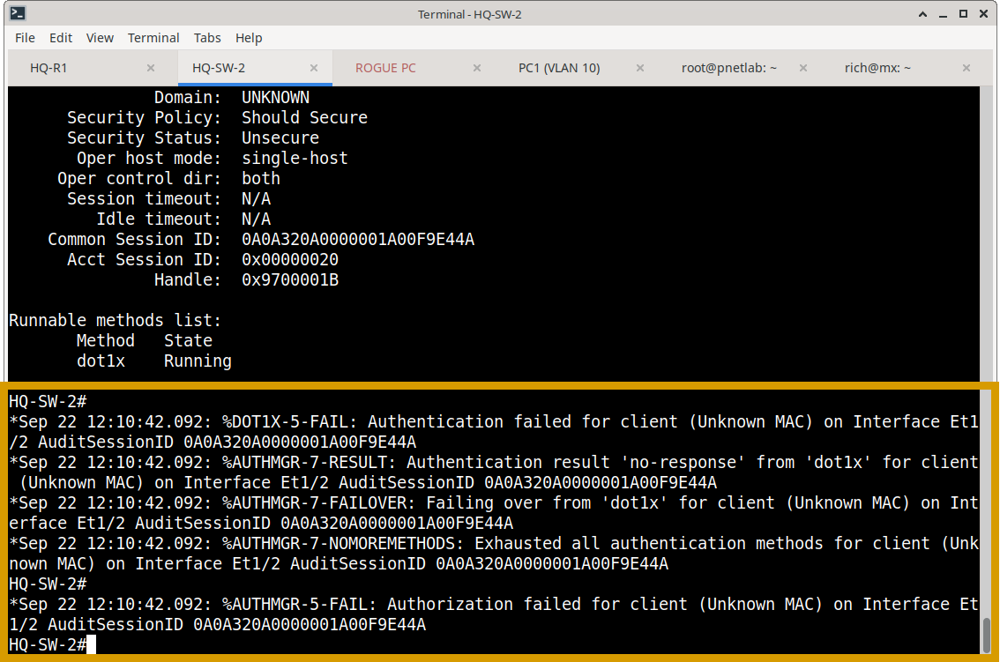
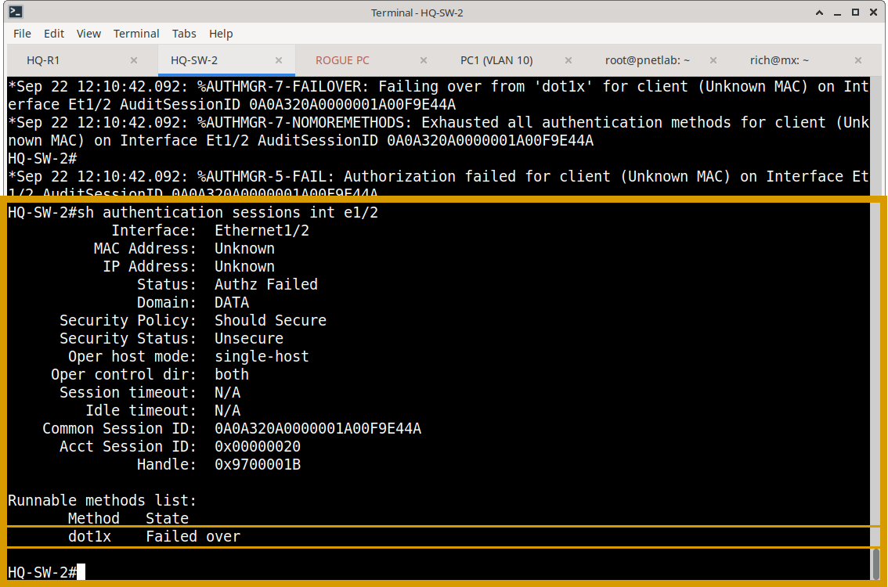

# Cisco ISE — 802.1X Implementation & Policy Model

## Overview

This document details the configuration model used to enforce 802.1X authentication at the network edge. It covers both the Cisco ISE policy framework and the Cisco IOS switch authenticator configuration.

---

## 1. ISE Policy Framework

The 802.1X workflow relies on the Active Directory integration established in `01-AD-RADIUS`.

### 1.1 Authentication Policy
The Authentication Policy routes 802.1X requests to the correct identity store. 
*   **Condition:** `Wired_802.1X` OR `Wireless_802.1X`
*   **Action:** Use Identity Source Sequence: `All_User_ID_Stores` (which queries Active Directory).


### 1.2 Authorization Policy & Dynamic VLAN Assignment
Upon successful authentication, ISE evaluates the Authorization Policy to determine network access.
* **Condition:** `AD only Network Users` (Validates the user is in the correct AD Security Group).
* **Action:** Apply Authorization Profile: `MERIDIAN-VLAN10`.
* **Mechanism:** ISE returns a RADIUS Access-Accept containing the `Tunnel-Private-Group-ID` attribute (VLAN 10). The **Cisco Switch** receives these attributes and dynamically moves the authenticated port into VLAN 10, overriding any static access VLAN configuration.

**Creating MERIDIAN-VLAN10**





---

## 2. Network Device (Authenticator) Configuration

The Cisco switch must be configured to act as an 802.1X Authenticator, communicating with ISE via RADIUS.

### 2.1 Global AAA & RADIUS Configuration
```cisco
! Enable AAA and 802.1X globally
aaa new-model
dot1x system-auth-control

! Define ISE as the RADIUS server
radius server MERIDIAN-ISE
 address ipv4 10.50.50.10 auth-port 1812 acct-port 1813
 key <STRONG_SHARED_SECRET>

! Configure AAA to use RADIUS for 802.1X
aaa authentication dot1x default group radius
aaa authorization network default group radius
```

### 2.2 Interface-Level Enforcement
The access port is configured to block traffic until authentication succeeds.

```cisco
interface GigabitEthernet1/0/1
 description 802.1X-ACCESS-PORT
 switchport mode access
 ! Note: switchport access vlan 10 is NOT required here; ISE assigns it dynamically.
 
 ! Enable 802.1X authentication
 authentication port-control auto
 dot1x pae authenticator
 
 ! Edge port optimizations
 spanning-tree portfast
 spanning-tree bpduguard enable
```
*Key Directive:* `authentication port-control auto` ensures the port starts in an `unauthorized` state, dropping all non-EAPOL traffic until ISE returns an `Access-Accept`.

---

## 3. Operational Validation & Evidence Matrix

The implementation was validated through rigorous functional testing. The following evidence matrix maps the test scenarios to the captured artifacts.

### 3.1 Positive Testing (Authorized Access)
**Objective:** Verify successful AD authentication and dynamic VLAN assignment.
*   **ISE Evidence:** Live Logs showing `Authentication: SUCCESS` and `Authorization: MERIDIAN-VLAN10`.
*   **Switch Evidence:** `show authentication sessions interface e1/0 details` showing `Status: Authz Success` and `Vlan: 10`.
*   **Endpoint Evidence:** PC1 successfully obtains an IP in the 10.10.10.0/24 subnet.

**Username and password**



**PC1 success**



**SW2 show authentication sessions interface e1/0 details**


**SW2 authentication successful syslog**



### 3.2 Negative Testing (Credential Failure)
**Objective:** Verify that invalid credentials result in access denial.
*   **ISE Evidence:** Live Logs showing `Authentication: FAILED` with reason `Invalid credentials`.
*   **Switch Evidence:** Port remains in `unauthorized` state; endpoint receives no IP address.

**PC1 injecting bad password**



**PC1 failure**



**SW2 Authentication failure**



### 3.3 Security Testing (Rogue Endpoint)
**Objective:** Verify the network rejects unauthenticated devices.
*   **Scenario:** A rogue PC is connected to an 802.1X-enabled port without a supplicant configured.
*   **Result:** The switch port remains unauthorized. The rogue PC fails to ping the default gateway.
*   **ISE Evidence:** Live Logs show failure due to `No valid credentials` or timeout.
*   **Switch Evidence:** Syslog messages generated for authentication failure; `show authentication sessions` shows `Status: Authz Failed`.

**Rogue PC unable to ping: 100% packet loss**


**SW2 failover syslogs**

`%DOT1X-5-FAIL: Authentication failed for client (Unknown MAC) on Interface Et1/2 AuditSessionID 0A0A320A00000001A00F9E44A`

` %AUTHMGR-7-RESULT: Authentication result 'no-response' from 'dot1x' for client (Unknown MAC) on Interface Et1/2 AuditSessionID 0A0A320A00000001A00F9E44A`

` %AUTHMGR-7-RESULT: Authentication result 'no-response' from 'dot1x' for client (Unknown MAC) on Interface Et1/2 AuditSessionID 0A0A320A00000001A00F9E44A`



**SW2: show authentication sessions int e1/2**


---

## 4. Evidence Repository

Curated screenshots validating this implementation are stored in:
`Cisco-ISE/02-802.1X/screenshots/`

**Evidence Checklist:**

**ISE Policy Configuration:**
- [x] `authentication-policy.png` (Proof of 802.1X Authentication Policy routing to AD)
- [x] `authorization-policy.png` (Proof of Authorization Policy evaluating AD groups)
- [x] `creating-vlan-10.png` (Proof of VLAN 10 Authorization Profile creation)

**Positive Testing (Authorized Access):**
- [x] `pc1-username-password.png` / `pc1-success.png` (Proof of successful endpoint authentication)
- [x] `ise-log-success.png` (ISE Live Logs showing Authentication: SUCCESS)
- [x] `sw2-authentication-result.png` / `sw2-success-syslog.png` (Switch-side proof of Authz Success & VLAN assignment)

**Negative Testing (Credential Failure):**
- [x] `pc1-injecting-bad-password.png` / `pc1-failure.png` (Proof of failed authentication with invalid credentials)
- [x] `ise-log-failure.png` (ISE Live Logs showing Authentication: FAILED)
- [x] `sw2-authentication-failed.png` / `sw2-failed-over.png` (Switch-side proof of Authz Failed)

**Security Testing (Rogue Endpoint):**
- [x] `rouge-pc-unable-to-ping.png` (Proof of rogue device isolation - no gateway connectivity)
- [x] `sw2-rogue-pc-syslog.png` (Switch syslog showing authentication failure for rogue device)

