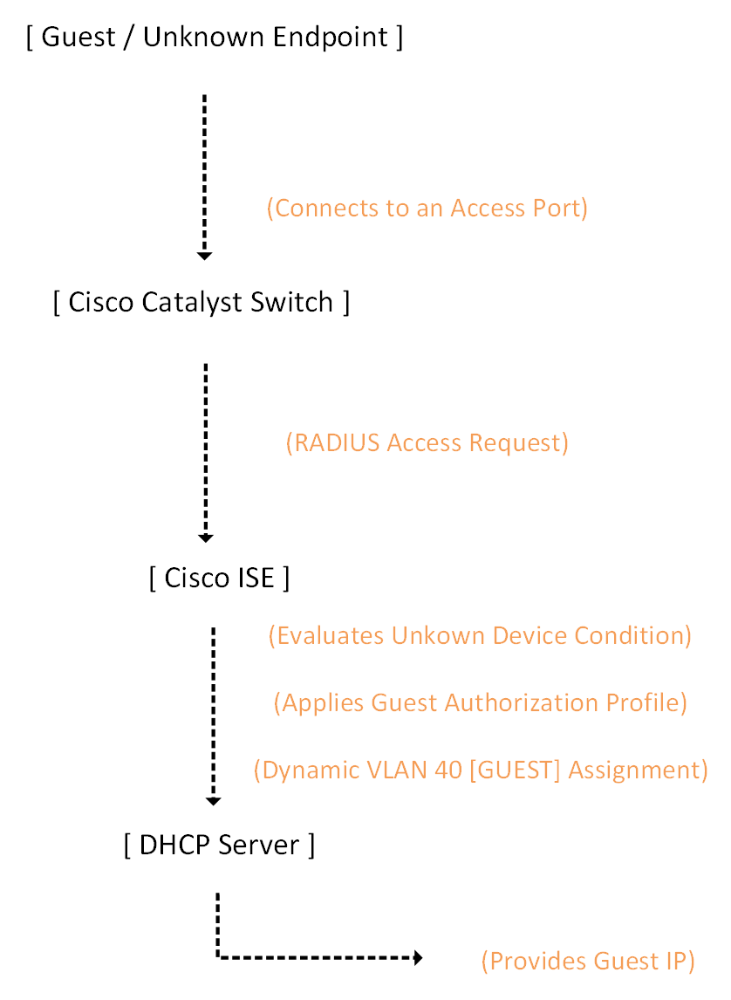

# Cisco ISE — Guest Network Access & Isolation

## Overview

This section documents the Guest network access implementation within the Meridian Financial Services environment, powered by Cisco Identity Services Engine (ISE). 

The primary objective of this workflow is to safely identify unmanaged or unknown endpoints and automatically isolate them into a restricted guest network (VLAN 40). This ensures that guest devices receive basic network connectivity (via DHCP) while being strictly segregated from corporate resources (VLAN 10, Servers, Management).

*Note: While MAC Authentication Bypass (MAB) is the underlying mechanism that allows an unknown device to communicate with ISE, this document focuses strictly on the **Guest Identity Classification and VLAN 40 Authorization** workflow.

---

## Architecture

---

## Design Objectives

- **Automated Isolation:** Dynamically place unrecognized or guest devices into a dedicated, restricted broadcast domain (VLAN 40) without manual switch configuration.
- **Zero-Touch Provisioning:** Allow guest endpoints to seamlessly acquire an IP address via DHCP immediately upon authorization.
- **Centralized Policy:** Manage guest access rules centrally in ISE, ensuring consistent enforcement across all Meridian access switches.
- **Comprehensive Visibility:** Capture all guest connection attempts in ISE Live Logs for security auditing and compliance.

---

## Authorization Workflow

1. **Connection:** A guest endpoint connects to an 802.1X/MAB-enabled switch port.
2. **Identification:** The switch forwards the endpoint's MAC address to ISE via RADIUS.
3. **Policy Evaluation:** ISE evaluates the request. Because the device lacks 802.1X credentials, it matches the **Unknown Device** condition.
4. **Authorization:** The policy directs the request to the **Guest Authorization Profile**.
5. **Enforcement:** ISE returns a RADIUS Access-Accept containing the `Tunnel-Private-Group-ID = 40` attribute.
6. **Network Access:** The switch dynamically moves the port to VLAN 40, allowing the endpoint to successfully communicate with the Guest DHCP server.

---

## Scope & Boundaries

This directory strictly covers the **Guest Identity and VLAN 40 Authorization** workflow.

Related but distinct ISE capabilities are documented in their respective sections:
- **Foundation (AD/RADIUS):** `Cisco-ISE/01-AD-RADIUS/`
- **Corporate 802.1X:** `Cisco-ISE/02-802.1X/`
- **Device Administration (TACACS+):** `Cisco-ISE/04-TACACS/`

---

## Documentation Structure

| Document | Purpose |
| :--- | :--- |
| `README.md` | Architecture, design objectives, and authorization workflow. |
| `configuration.md` | ISE policy logic, switch integration, and evidence matrix. |
| `screenshots/` | Curated evidence of policy configuration, Live Logs, and DHCP validation. |

---
