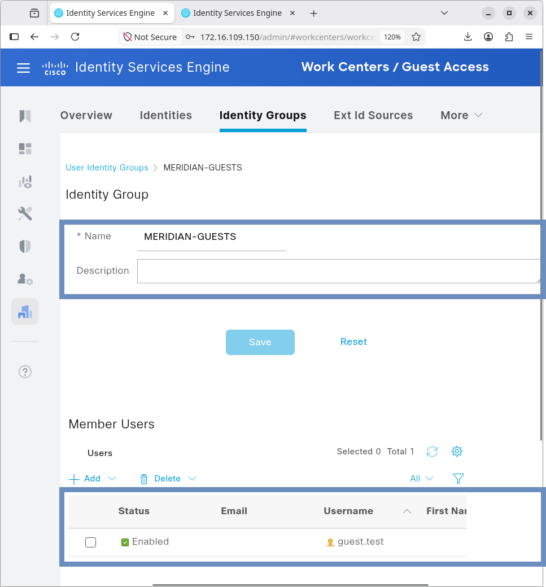
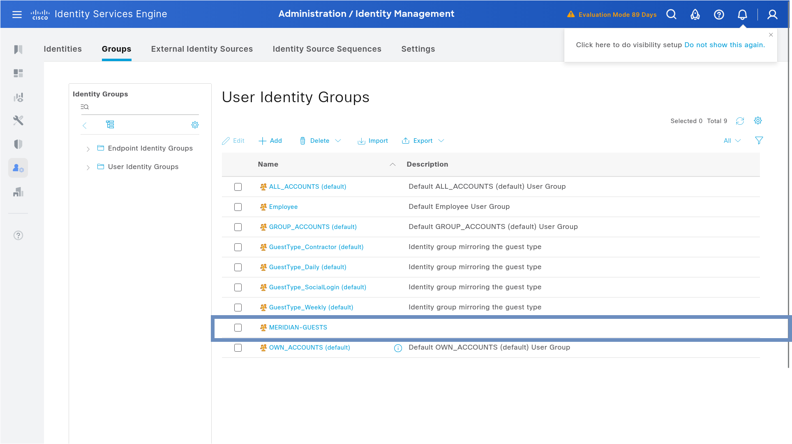
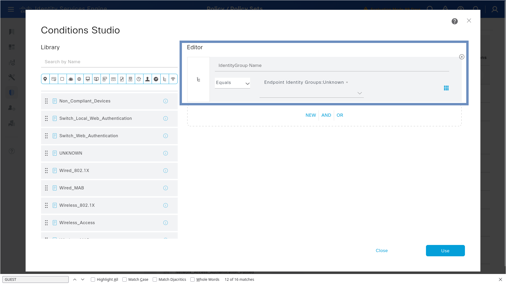
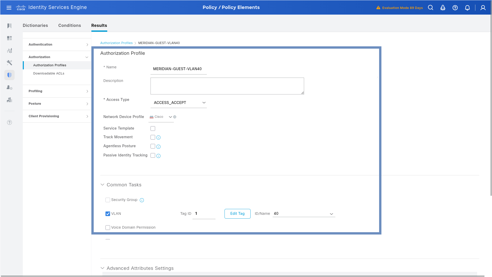
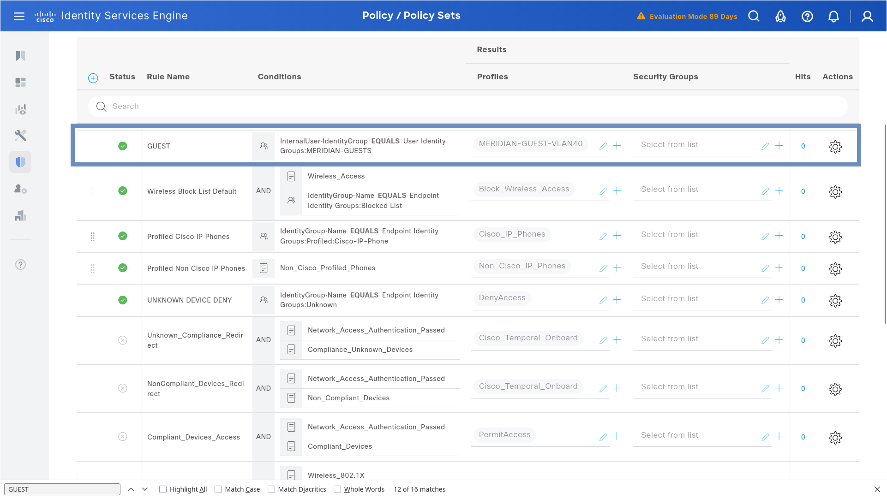
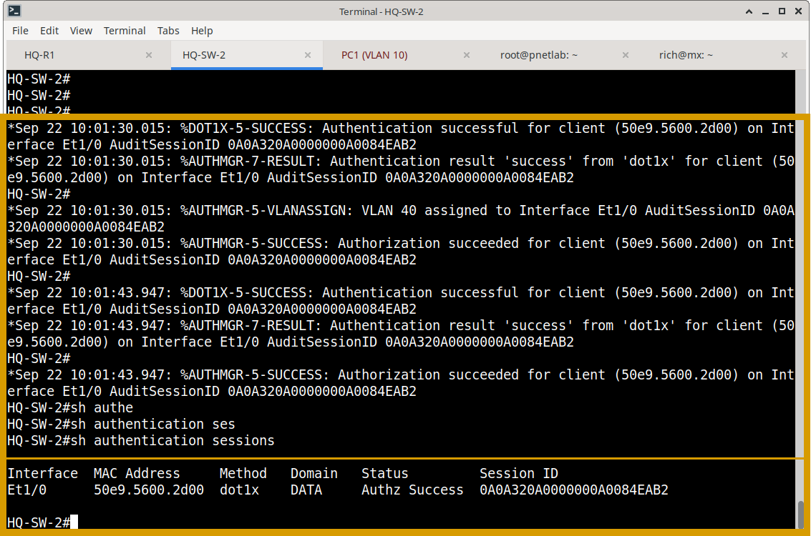

# Cisco ISE — Guest Authorization Implementation

## Overview

This document details the configuration model used to enforce Guest network isolation within the Meridian environment. It covers the ISE policy framework required to identify unknown devices and assign them to VLAN 40, alongside the functional validation of the workflow.

---

## 1. ISE Policy Framework

The Guest workflow relies on specific conditions and profiles to automate network isolation.

### 1.1 Identity Group
A dedicated `Guests` identity group is maintained in ISE to logically categorize unmanaged devices. This allows for targeted reporting and policy scaling.





### 1.2 Authorization Condition
The policy utilizes an **Unknown Device** condition (often leveraging ISE Endpoint Profiling or the absence of known 802.1X credentials) to trigger the guest workflow.
*   **Condition:** `Unknown` (or specific profiling attributes indicating a non-corporate device).
*   **Action:** Evaluate against the Guest Authorization Policy.



### 1.3 Guest Authorization Profile
Upon matching the condition, ISE applies the `Guest-VLAN40` authorization profile.
*   **Mechanism:** ISE returns standard RADIUS Tunnel Attributes:
    *   `Tunnel-Type = VLAN`
    *   `ID/Name = 40`



---

## 2. Network Device (Switch) Integration

The Cisco switch enforces the policy decision returned by ISE. The access port must be configured to accept dynamic VLAN assignments from the RADIUS server.

**Example Interface Configuration:**
```cisco
interface GigabitEthernet1/0/2
 description GUEST-TEST-PORT
 switchport mode access
 ! Static VLAN is overridden by ISE upon successful authorization
 
 ! Enable authentication (802.1X)
 authentication port-control auto
 dot1x pae authenticator
```
---

## 3. Operational Validation & Evidence Matrix

The implementation was validated through functional testing to prove that an unknown device is correctly identified, authorized, and provisioned with network access.

### 3.1 Policy Configuration Validation
- **ISE Evidence:** Screenshots confirming the `Unknown Device` condition is correctly linked to the `Guest` authorization profile within the active Policy Set.






### 3.2 Functional Guest Test (VLAN 40 & DHCP)
**Objective:** Verify that a guest endpoint successfully authenticates and receives an IP address in the guest subnet.
- **ISE Evidence:** Live Logs showing `Authentication: SUCCESS` (via MAB) and `Authorization: Guest-VLAN40`.
- **Switch Evidence:** `show authentication sessions interface Gi1/0/2` confirming the session is authorized and the operational VLAN is 40.
- **Endpoint Evidence:** The guest PC successfully executes `ip a` (or `ipconfig`), displaying a valid IP address and subnet mask belonging to the VLAN 40 DHCP scope.

**Guest Credentials**


**SW2: show authentication interface e1/0**


**SW2: Authentication syslogs / show authentication sessions**

`%DOT1X-5-SUCCESS: Authentication successful for client (50e9.5600.2d00) on Int erface Et1/0 AuditSessionID 0A0A320A00000000A0084EAB2`

`%AUTHMGR-7-RESULT: Authentication result 'success' from 'dot1x' for client (50e9.5600.2d00) on Interface Et1/0 AuditSessionID 0A0A320A00000000A0084EAB2`

`%AUTHMGR-5-VLANASSIGN: VLAN 40 assigned to Interface Et1/0 AuditSessionID 0A0A 320A00000000A0084EAB2`

` %AUTHMGR-5-SUCCESS: Authorization succeeded for client (50e9.5600.2d00) on Int erface Et1/0 AuditSessionID 0A0A320A00000000A0084EAB2`


---

## 4. Evidence Repository

Curated screenshots validating this implementation are stored in:
`Cisco-ISE/03-Guest/screenshots/`

**Evidence Checklist:**

**ISE Policy Configuration:**
- [x] `identity-group-overview.png` / `guest-identity-group.png` (Proof of Guest identity classification)
- [x] `guest-condition-rule.png` (Proof of Unknown Device policy condition)
- [x] `guest-authorization-profile.png` (Proof of VLAN 40 assignment profile)
- [x] `guest-policy-overview.png` (Proof of overall Policy Set logic)

**Functional Testing & Switch Verification:**
- [x] `ise-live-logs-guest-success.png` (Proof of successful ISE authorization in Live Logs)
- [x] `sw2-sh-authentication-interface.png` (Switch-side proof of authorized session state)
- [x] `sw2-guest-success-syslog.png` (Switch syslog confirming successful guest authentication)

**Endpoint Validation:**
- [x] `pc1-successful-dhcp.png` (Endpoint proof of successful IP acquisition in VLAN 40)
- [x] `guest-credentials.png` (Proof of guest endpoint credentials used during test)
