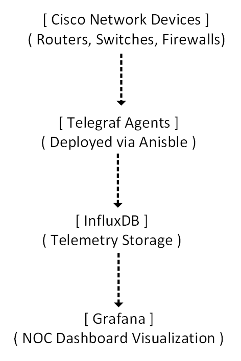
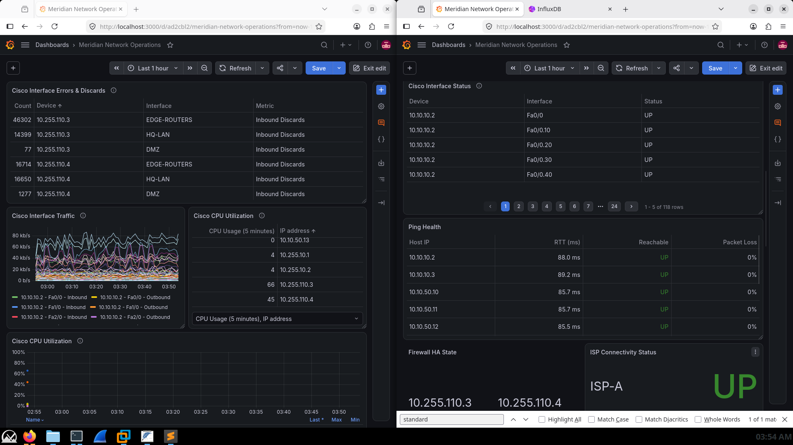
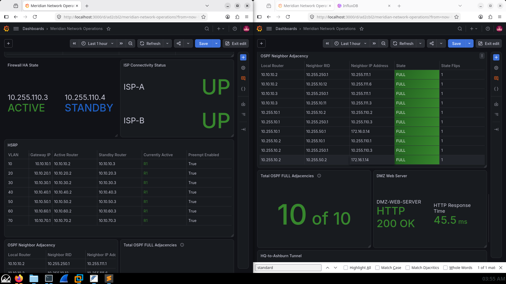
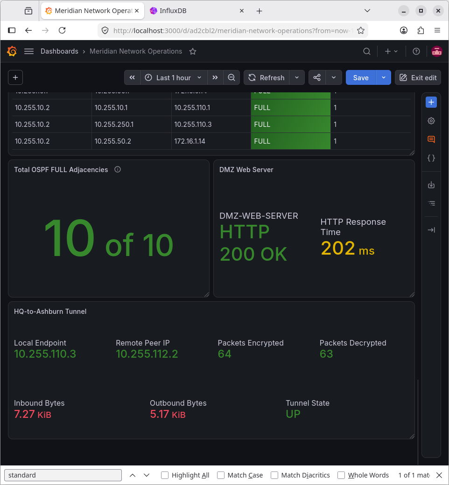

# Meridian Network Operations Dashboard

## Overview

This project implements a centralized Network Operations Center (NOC) dashboard for the Meridian Financial Services enterprise environment, built using **Grafana, InfluxDB, and Telegraf**.

The dashboard collects real-time network telemetry from Cisco routers, switches, and firewalls. It is designed to provide administrators with immediate visibility into network health, routing protocol states, high-availability failovers, and application availability. 

Crucially, this implementation goes beyond static visualization: it includes rigorous, hands-on validation against controlled network failures to prove the dashboard accurately reflects real-world operational state.

---

## Monitoring Architecture

The observability pipeline is built on a modern, scalable stack:

---

## Dashboard Capabilities

The dashboard is organized into logical operational views:
- **Device Health:** CPU utilization, memory, and system uptime.
- **Routing & HA:** OSPF neighbor states (FULL/DOWN), HSRP Active/Standby roles, and Firewall HA status.
- **Edge & Connectivity:** ISP IP SLA reachability (BGP), Site-to-Site IPsec VPN tunnel states, and interface traffic/errors.
- **Application Health:** DMZ Web Server HTTP response time and availability.

---

## Validation & Testing Strategy

A dashboard is only as good as its accuracy. The Meridian dashboard was validated by intentionally inducing network failures and observing the telemetry reaction:

1. **Firewall HA Failover:** Induced a controlled failover and verified the dashboard accurately reflected the Active/Standby role transition.
2. **HSRP Gateway Failover:** Shut down an HSRP interface and captured the dashboard updating to reflect the new Active router (validated via video).
3. **ISP Connectivity Loss:** Simulated an ISP-A path failure and verified the IP SLA panel immediately reflected the outage.
4. **OSPF Adjacency Loss:** Shut down a routing link and confirmed the OSPF neighbor panel dropped from "FULL" to "DOWN".
5. **Site-to-Site VPN:** Cross-referenced Grafana IPsec tunnel counters directly with Cisco ASA `show crypto ipsec sa` CLI output.

*(Detailed evidence and video recordings of these tests are documented in `configuration.md`)*

---

## Automation & Infrastructure as Code (Ansible)

Network monitoring configurations were not applied manually. **Ansible** was utilized to ensure consistent, compliant, and repeatable deployment of SNMPv3 and Telegraf agents across the infrastructure.

The automation code is fully documented in the [`ansible-lab/`](./ansible-lab/) directory and includes:
- **Playbooks:** Sequential execution for base config, SNMPv3 user creation, ACL enforcement, and Telegraf deployment.
- **Templates:** Jinja2 templates (`meridian-snmp-conf.j2`) for dynamic configuration generation.
- **Inventories:** Dynamic and static inventory management for the Meridian environment.

This approach eliminates configuration drift and ensures that monitoring security (SNMPv3) is standardized across all Cisco IOS and ASA devices.

---

## Documentation Structure

| Document | Purpose |
| :--- | :--- |
| `README.md` | Dashboard overview, architecture, and testing strategy. |
| `configuration.md` | Monitoring pipeline setup, Ansible automation, and evidence matrix. |
| `screenshots/` | Curated evidence of dashboard panels and Ansible playbook runs. |
| `videos/` | Screen recordings of live dashboard reactions to network failures. |

---

## Future Enhancements

- **Proactive Alerting:** Implement Grafana alert rules for critical events (e.g., OSPF adjacency loss, ISP reachability, Firewall HA state change) with Slack/Email notifications.
- **Data Freshness Monitoring:** Add panels to detect and alert on missing telemetry data (e.g., Telegraf agent down).
- **Expanded Application Metrics:** Deepen DMZ web server monitoring to include application-level metrics beyond basic HTTP response.
