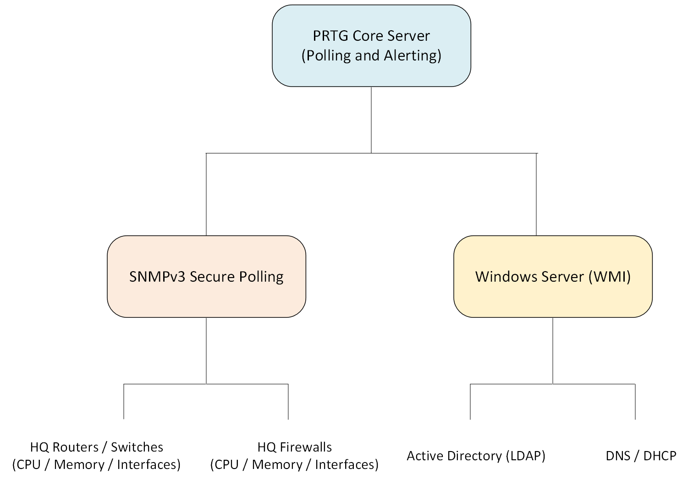
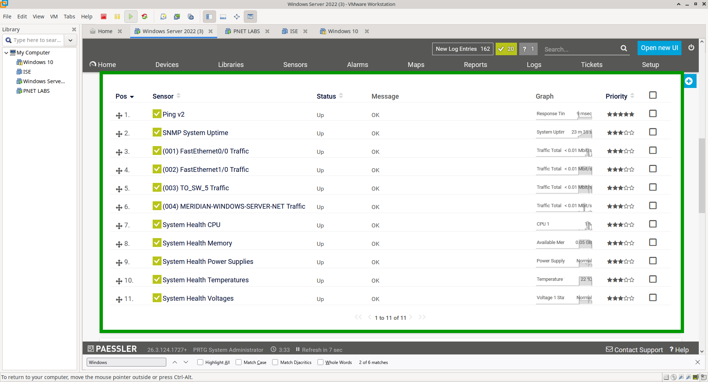
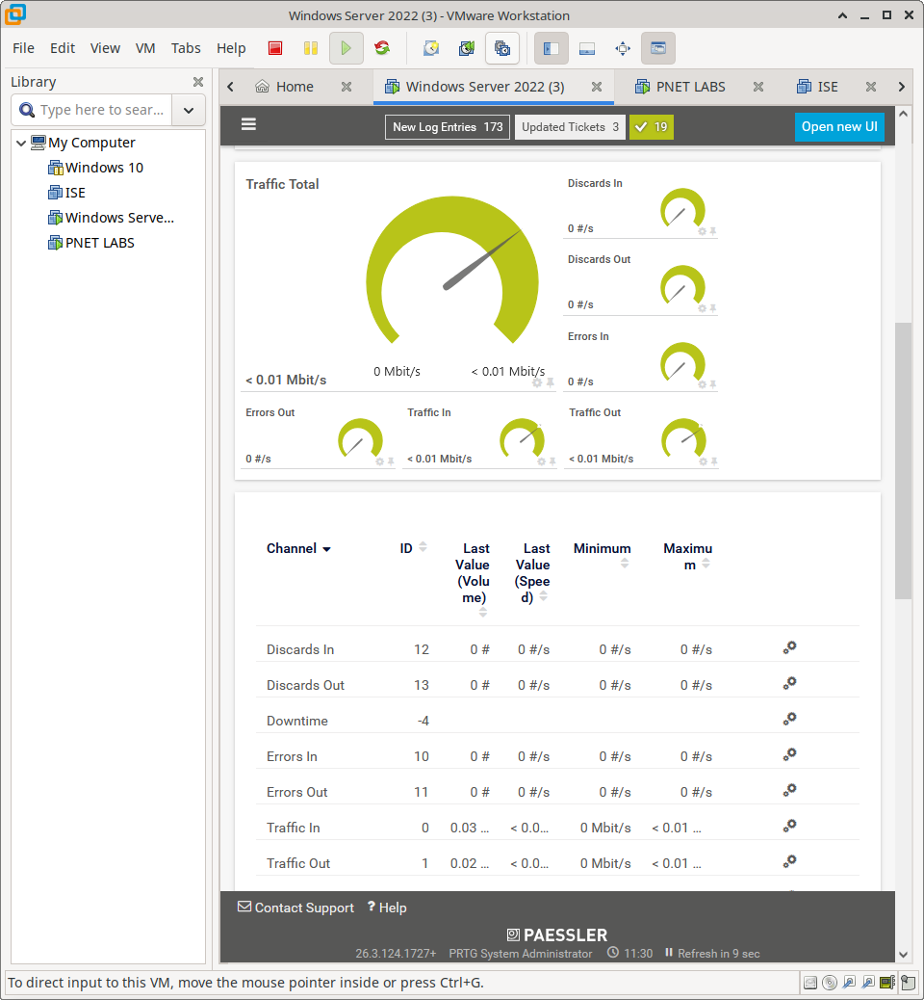
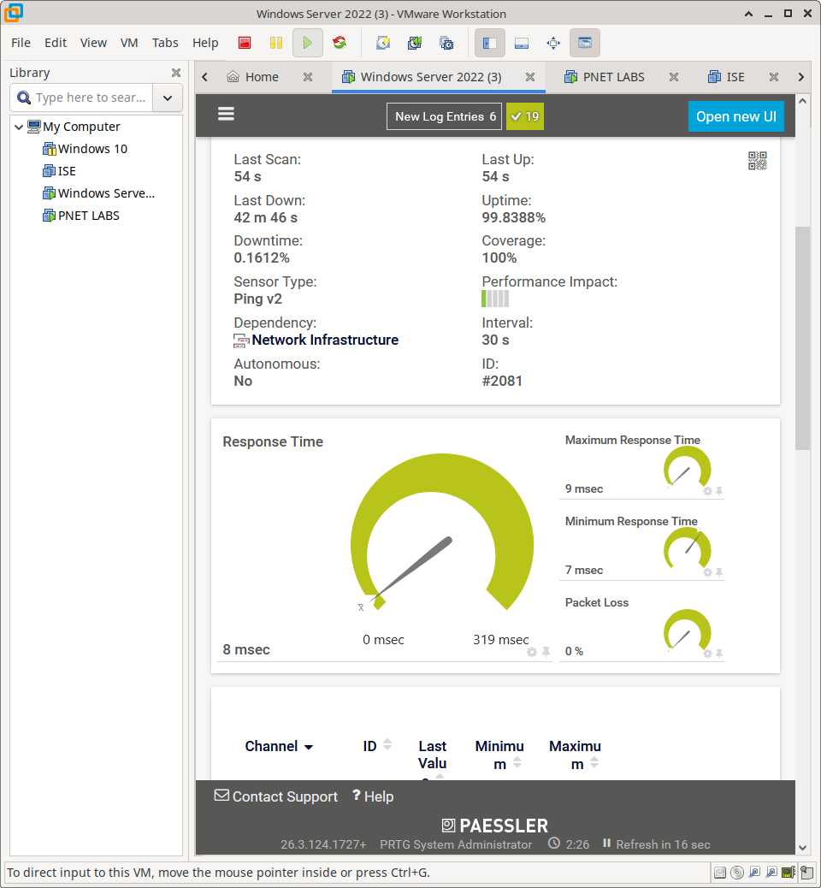
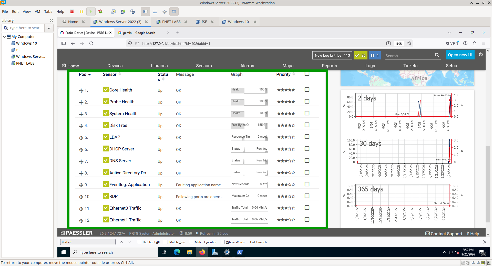
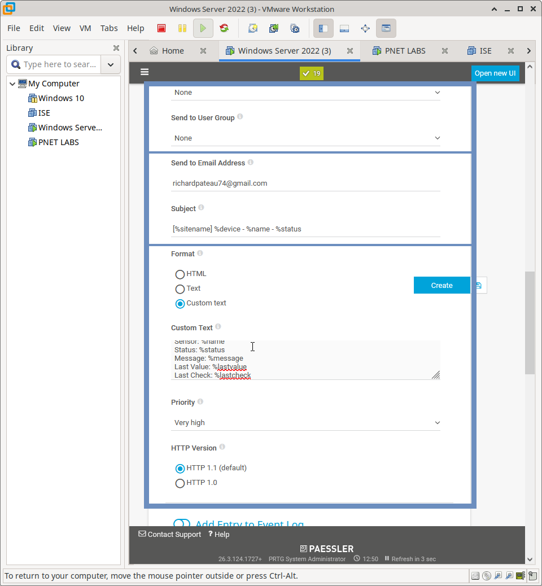
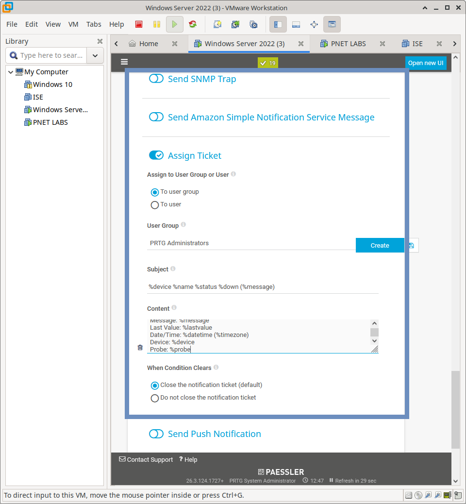
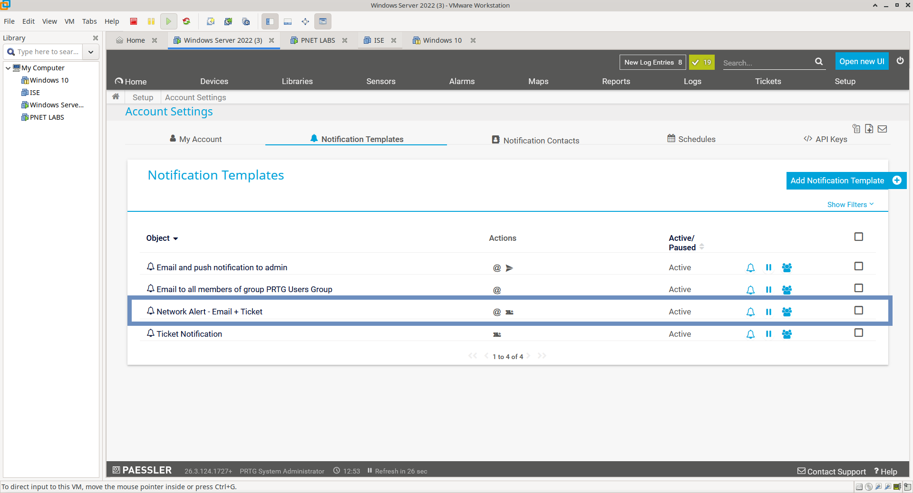

# PRTG Network & Infrastructure Monitoring Strategy

## Overview

This section documents the comprehensive monitoring implementation for the Meridian Financial Services environment using PRTG Network Monitor. 

The primary objective of this deployment is to transition from reactive troubleshooting to **proactive fault detection**. By monitoring key performance indicators (KPIs) across both Cisco network infrastructure and Windows server infrastructure, the design ensures rapid detection of threshold violations, automated alerting, and seamless IT Service Management (ITSM) ticket generation.

---

## Monitoring Architecture

---

## Monitoring Domains

The implementation is divided into four core monitoring domains to ensure comprehensive visibility:

### 1. Network Infrastructure Health (SNMPv3)
Secure SNMPv3 is utilized to poll Cisco devices (e.g., HQ-R1) for critical hardware and software metrics:
- **Resource Utilization:** CPU and Memory thresholds to detect processing bottlenecks.
- **System Stability:** System uptime tracking to identify unexpected reboots.

### 2. Interface & Traffic Analytics
Granular monitoring of critical uplink and access interfaces:
- **Bandwidth Utilization:** Inbound/Outbound traffic with threshold-based alerting for congestion.
- **Interface Health:** Input/Output Errors and Discards to detect physical layer degradation or buffer overflows.

### 3. Availability & Latency Monitoring
- **Ping Sensors:** Continuous ICMP testing to verify baseline reachability.
- **Advanced Ping:** Monitoring for elevated latency (response time) and packet loss, which often precede total link failure.

### 4. Windows Infrastructure Monitoring
Critical Windows services and resources are monitored to ensure core business applications remain available:
- **Core Services:** Active Directory, DNS, and DHCP availability.
- **Remote Access:** RDP port monitoring.
- **System Health:** Application Event Log parsing (filtering for Errors) and Free Disk Space thresholds.

---

## Alerting & ITSM Integration

Monitoring is only valuable if it triggers action. PRTG is configured with a multi-tiered notification workflow:

This ensures that the NOC dashboard reflects real-time status, on-call engineers receive immediate email notifications, and a formal ticket is generated for tracking and resolution.

**Email Configuration**

**Ticket Configuration**

**Notification Ticket Overview**

---

## Scope & Boundaries

This directory documents the PRTG monitoring implementation for:
- Cisco network infrastructure (via SNMPv3)
- Windows server infrastructure (via native sensors)
- Threshold-based alerting and notification workflows
- Intentional failure testing and validation

---

## Documentation Structure

| Document | Purpose |
| :--- | :--- |
| `README.md` | Monitoring architecture, domains, and alerting strategy. |
| `configuration.md` | Sensor implementation model, threshold logic, and evidence matrix. |
| `screenshots/` | Curated evidence of sensor configuration, threshold triggers, and ticket generation. |
