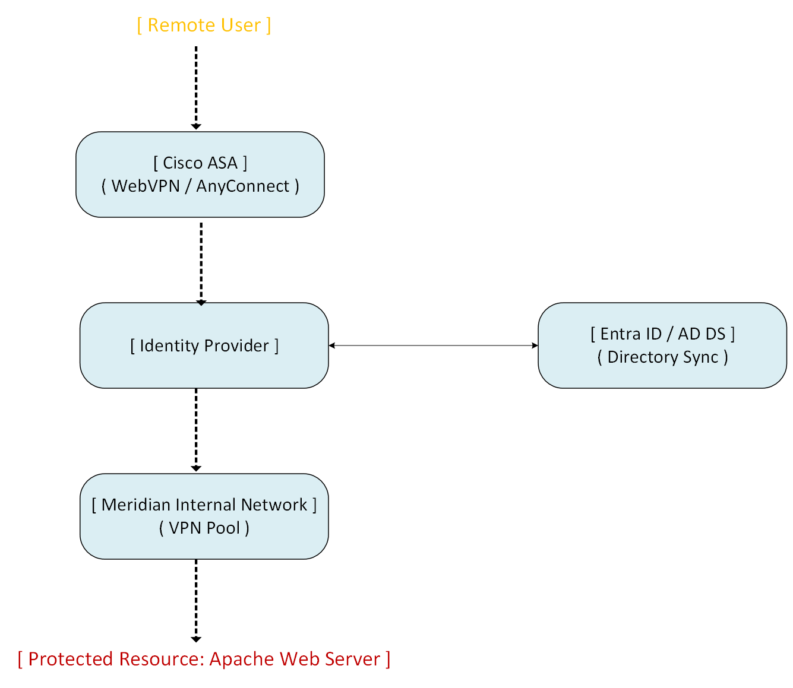

# Remote Access VPN & Identity Integration

## Overview

This section documents the implementation of a secure, identity-driven Remote Access VPN for the Meridian Financial Services environment. 

The solution utilizes a Cisco ASA firewall as the VPN gateway and Cisco AnyConnect as the client. To enforce strict access control, the implementation integrates with the enterprise identity infrastructure (Active Directory and Microsoft Entra ID) using SAML-based Single Sign-On (SSO). 

The deployment was validated end-to-end using an internal Apache web server as a protected resource, proving that access is strictly contingent upon successful VPN authentication.

---

## Architecture

**Please enlarge for clearer video**

https://github.com/user-attachments/assets/4f52c487-2326-4659-98a9-9a6258cde421

---

## Design Objectives

- **Secure Remote Access:** Provide encrypted, tunneled access to internal corporate resources for remote users via Cisco AnyConnect.
- **Identity-Driven Authentication:** Leverage SAML SSO and Microsoft Entra ID/Active Directory to ensure only authorized, synchronized identities can establish a VPN session.
- **Zero Trust Resource Protection:** Validate that internal applications (e.g., the Apache web server) are completely inaccessible without an active, authenticated VPN tunnel.
- **Centralized Policy Enforcement:** Utilize ASA Group Policies, Connection Profiles, and VPN ACLs to strictly control what resources remote users can access.

---

## Implementation Scope

### 1. Identity & SAML Integration
- Active Directory and Entra ID user synchronization.
- User Principal Name (UPN) configuration and password sync.
- SAML Identity Provider (IdP) configuration and SSO certificate installation on the ASA.

### 2. ASA Gateway Configuration
- WebVPN and AnyConnect deployment.
- Group Policy and Connection Profile creation.
- Dedicated VPN IP address pool assignment.
- Split-tunneling/Access Control Lists (ACLs) to restrict internal resource access.

### 3. Client & Application Validation
- Cisco AnyConnect client deployment and successful SSO authentication.
- Positive testing: Successful access to the internal Apache web server via the VPN tunnel.
- Negative testing: Verification that the Apache web server is unreachable without an active VPN session.

---

## Documentation Structure

| Document | Purpose |
| :--- | :--- |
| `README.md` | Architecture, design objectives, and validation strategy. |
| `configuration.md` | Implementation phases, ASA verification, and evidence matrix. |
| `screenshots/` | Curated evidence of identity integration, ASA config, and functional testing. |

---

## Scope & Boundaries

This section documents the **operational implementation and validation** of the Remote Access VPN. 

It focuses on the successful integration of SAML SSO, ASA tunnel establishment, and end-to-end application access. It intentionally does not assert specific cryptographic parameters, exact Entra tenant IDs, or granular ASA CLI commands unless explicitly visible in the provided operational evidence.

---

## Related Documentation

- **Site-to-Site VPN:** `Site-to-Site-VPN/` (IPsec tunnel between HQ and Ashburn)
- **Identity Management:** `Windows/07-Microsoft-365/` (Entra ID and user management)
