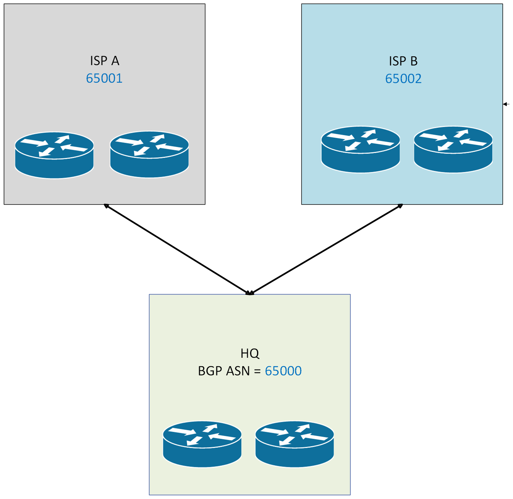

# Border Gateway Protocol (BGP) Architecture

## Overview

Meridian Financial Services utilizes Border Gateway Protocol (BGP) as the Exterior Gateway Protocol (EGP) at the network edge. BGP is strictly separated from the internal OSPF routing domain, providing a scalable, policy-driven control plane for external ISP peering and hybrid-cloud connectivity.

**Core Routing Philosophy:**
- **OSPF (IGP):** Manages internal, site-to-site enterprise routing and rapid convergence.
- **BGP (EGP):** Manages external routing, ISP multi-homing, and hybrid/cloud path selection.

---

## Autonomous System (AS) Design

Meridian operates within a dedicated private Autonomous System, establishing distinct external and internal BGP relationships at the HQ edge.

| Entity | Role | AS Number | Router ID | Peering Method |
| :--- | :--- | :---: | :--- | :--- |
| **Meridian HQ** | Internal Edge | **65000** | `10.255.10.1` / `10.255.10.2` | iBGP (Loopback) |
| **External Peer A** | Primary ISP | **65001** | N/A | eBGP (Point-to-Point) |
| **External Peer B** | Secondary ISP | **65002** | N/A | eBGP (Point-to-Point) |

### HQ Edge iBGP Topology
HQ-EDGE-1 and HQ-EDGE-2 establish a resilient iBGP adjacency using their dedicated loopback interfaces (`10.255.10.1` and `10.255.10.2`). This ensures the BGP control plane remains stable even if a single physical transit link experiences a failure, relying on the underlying OSPF domain to route the loopback traffic.

---

## Protocol Boundaries: BGP vs. OSPF

Maintaining a strict boundary between the IGP and EGP is critical for enterprise network stability and scalability.

| Feature | OSPF (Interior Gateway Protocol) | BGP (Exterior Gateway Protocol) |
| :--- | :--- | :--- |
| **Primary Scope** | Internal enterprise routing (Areas 0, 20, 30, 40, 50). | External routing, ISP multi-homing, and hybrid cloud. |
| **Metric / Path Selection** | Cost (based on interface bandwidth). | Complex attributes (LOCAL_PREF, AS_PATH, MED, Weight). |
| **Convergence Speed** | Fast (sub-second to seconds). | Deliberate (designed for stability over rapid convergence). |
| **Routing Policy** | Limited (basic summarization/filtering at ABRs). | Extensive (prefix-lists, route-maps, AS-path filtering). |

*Integration Point:* The protocols interact only at the network edge (HQ-EDGE routers), where specific internal OSPF routes may be advertised externally, and default or specific external routes are injected into the OSPF domain.

---

## Hybrid Cloud Integration (Azure)

Meridian’s hybrid architecture extends the on-premises network to Microsoft Azure. BGP serves as the dynamic routing control plane for this connectivity (e.g., Azure VPN Gateway or ExpressRoute), allowing seamless, dynamic exchange of routes between the on-premises AS 65000 and the Azure virtual network infrastructure. 

*(Note: Detailed Azure BGP peering configurations and topology are documented within the `Azure/` directory).*

---

## Routing Policy & High Availability

### Routing Policy Controls
BGP is deployed with intentional route-policy controls to govern traffic flow:
- **Inbound Filtering:** Prefix-lists and route-maps are used to accept only expected, legitimate routes from external peers, protecting the Meridian routing table from spoofing or accidental leaks.
- **Outbound Advertisement:** Strict controls dictate which internal Meridian subnets are advertised to external peers.
- **Path Manipulation:** Techniques such as `LOCAL_PREF` or `AS_PATH` prepending are available to influence inbound/outbound traffic engineering across the dual ISP links.

### High Availability
The HQ edge is designed for maximum resilience:
1. **Physical Redundancy:** Diverse uplinks to separate ISPs.
2. **Control Plane Redundancy:** iBGP full-mesh between HQ-EDGE-1 and HQ-EDGE-2.
3. **Data Plane Redundancy:** Underlying OSPF provides alternate paths to the edge routers if a direct link fails.

---

## Verification & Testing Roadmap

Operational BGP verification is maintained separately to ensure a clean separation of configuration design and validation evidence.

**Current Verification Scope (Steady-State):**
- BGP neighbor state (`show ip bgp summary`)
- Established sessions and uptime
- BGP routing table (`show ip bgp`)
- Best-path selection attributes
- Advertised and received routes (`show ip bgp neighbors x.x.x.x advertised-routes`)

**Future Validation Scope (Dynamic Failover):**
- Intentional eBGP peer session termination
- iBGP path failover validation
- BGP convergence timing and routing-table installation

See: [`Routing/verification/bgp-verification.md`](../verification/bgp-verification.md)
