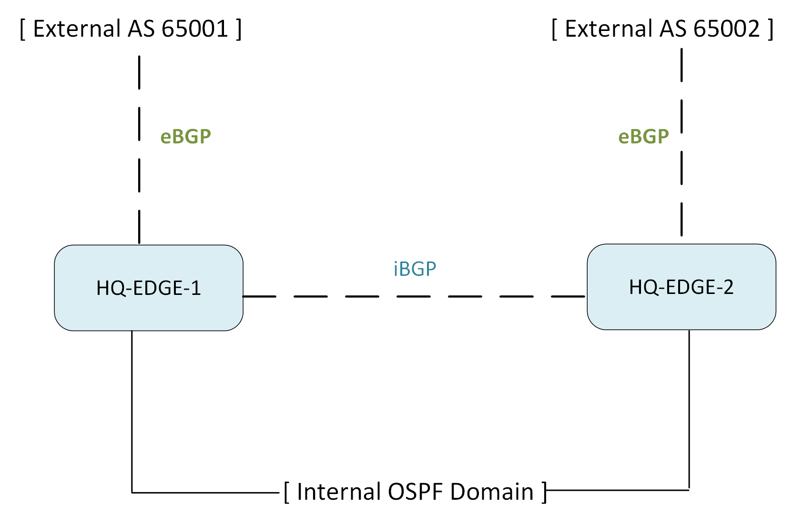

# BGP Configuration & Edge Design Model

## Overview

Meridian Financial Services deploys Border Gateway Protocol (BGP) exclusively at the network edge to manage external routing, ISP multi-homing, and hybrid-cloud connectivity. 

The internal routing domain relies on OSPF, while BGP provides the policy-driven control plane required for secure and scalable external peering.

---

## 1. Edge Topology & Peering Model

The HQ edge utilizes a redundant pair of routers operating within **AS 65000**. They establish an internal iBGP full-mesh for control-plane redundancy, while maintaining separate eBGP sessions to external autonomous systems.



| Router | Local AS | Router ID | iBGP Peer | eBGP Peer AS |
| :--- | :---: | :--- | :--- | :---: |
| **HQ-EDGE-1** | 65000 | `10.255.10.1` | HQ-EDGE-2 | 65001 |
| **HQ-EDGE-2** | 65000 | `10.255.10.2` | HQ-EDGE-1 | 65002 |

---

## 2. Configuration Model

The following represents the standard BGP configuration model applied to the HQ edge routers. 

### HQ-EDGE-1 (Representative Configuration)
```cisco
router bgp 65000
 bgp router-id 10.255.10.1
 bgp log-neighbor-changes
 !
 ! --- iBGP Peering ---
 ! Uses loopback interfaces for stability
 neighbor 10.255.10.2 remote-as 65000
 neighbor 10.255.10.2 update-source Loopback0
 neighbor 10.255.10.2 description iBGP_PEER_HQ_EDGE_2
 !
 ! --- eBGP Peering (External ISP Connectivity) ---
 neighbor 203.0.113.1 remote-as 65001
 neighbor 203.0.113.1 description eBGP_PEER_ISP_A
 !
 ! --- Routing Policy & Security ---
 ! Apply inbound prefix-filtering to prevent route leaks and spoofing
 neighbor 203.0.113.1 route-map ISP-A-IN in
 !
 ! --- network commands ---
 network 10.0.0.0 mask 255.0.0.0 
 
```

### Key Configuration Directives
* **`update-source Loopback0`**: Ensures the iBGP session remains stable even if a physical transit interface fails, provided OSPF maintains reachability to the loopback.
* **`route-map ISP-A-IN in`**: Enforces a strict inbound filtering policy. Only explicitly permitted prefixes from the external peer are accepted into the BGP table.

---

## 3. Protocol Integration & Boundaries

### BGP and OSPF Boundary
The routing domains are strictly separated by function to maintain stability:
* **OSPF (Internal):** Distributes internal subnets and provides next-hop reachability for iBGP loopback addresses.
* **BGP (External):** Manages internet-routable prefixes and external path selection.
* **Integration:** Redistribution between BGP and OSPF is highly controlled. Typically, only a default route (`0.0.0.0/0`) or specific summarized internal prefixes are exchanged at the edge to prevent external route churn from impacting the internal OSPF LSDB.

### Hybrid Cloud Integration (Azure)
BGP also serves as the dynamic routing control plane for Meridian’s hybrid Azure connectivity (e.g., Site-to-Site VPN or ExpressRoute). The on-premises AS 65000 peers dynamically with the Azure Virtual Network Gateway, allowing seamless, automated exchange of cloud and on-premises routes. *(Detailed Azure BGP topology is documented in the `Azure/` directory).*

---

## 4. Verification Strategy

Operational verification is maintained separately to ensure a clean separation of configuration design and validation evidence.

### Steady-State Verification
The following commands are utilized to confirm BGP health and policy enforcement:
* `show ip bgp summary` *(Verifies neighbor state, uptime, and prefixes received)*
* `show ip bgp neighbors` *(Details TCP connection state, capabilities, and timers)*
* `show ip bgp` *(Displays the BGP routing table and best-path selection)*
* `show ip route bgp` *(Confirms BGP routes are installed in the main RIB)*
* `show ip bgp neighbors [IP] advertised-routes` *(Audits outbound policy)*

### Dynamic Failover Validation
*Note: While steady-state neighbor establishment is verified, dynamic BGP failover testing (e.g., intentional session teardown, AS-path manipulation, and convergence timing) is scoped for the advanced validation phase. When executed, evidence of neighbor state transitions, route withdrawal, and alternate-path selection will be documented in:* 

[`Routing/verification/bgp-verification.md`](../verification/bgp-verification.md)
