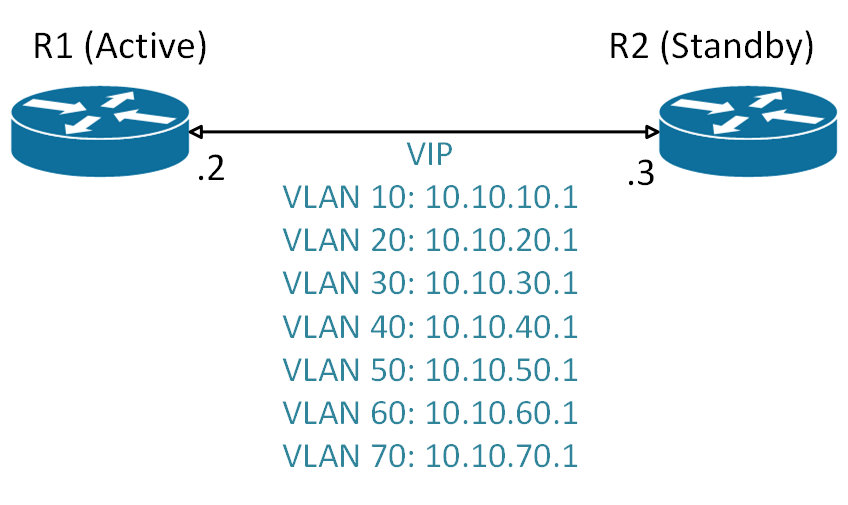

# First-Hop Redundancy: HSRP Architecture

## Overview

Meridian Financial Services utilizes Hot Standby Router Protocol (HSRP) to provide seamless First-Hop Redundancy Protocol (FHRP) for enterprise VLANs. 

HSRP allows a pair of redundant routers to share a virtual default gateway address. One router operates in the **Active** state, forwarding traffic for the Virtual IP (VIP), while the other operates in the **Standby** state, ready to assume forwarding duties instantly if the active router or its uplink fails. This ensures uninterrupted default-gateway availability for all endpoint devices.

---

## HSRP Design Principles

- **Virtual Gateway:** Each VLAN is assigned a dedicated Virtual IP (VIP) ending in `.1`, serving as the default gateway for all endpoints in that subnet.
- **Priority & Preemption:** The preferred router is configured with a higher priority (e.g., `110`) and the `preempt` command. This ensures that upon recovery from a failure, the primary router automatically reclaims the Active role, restoring the intended traffic flow.
- **1:1 Group Mapping:** HSRP group numbers directly correspond to their associated VLAN IDs (e.g., VLAN 10 uses HSRP Group 10). This simplifies configuration auditing, troubleshooting, and operational consistency.
- **Version:** HSRP Version 2 is utilized to support IPv4 and provide enhanced MAC address allocation (`0000.0C9F.FXXX`).

---

## Addressing & Role Assignment

### Headquarters (HQ)
HQ-R1 acts as the primary Active router for all HQ VLANs, with HQ-R2 providing Standby redundancy.

| VLAN | Subnet | HQ-R1 (Active) | HQ-R2 (Standby) | Virtual Gateway (VIP) | HSRP Group |
| :---: | :--- | :--- | :--- | :--- | :---: |
| **10** | `10.10.10.0/24` | `10.10.10.2` | `10.10.10.3` | `10.10.10.1` | 10 |
| **20** | `10.10.20.0/24` | `10.10.20.2` | `10.10.20.3` | `10.10.20.1` | 20 |
| **30** | `10.10.30.0/24` | `10.10.30.2` | `10.10.30.3` | `10.10.30.1` | 30 |
| **40** | `10.10.40.0/24` | `10.10.40.2` | `10.10.40.3` | `10.10.40.1` | 40 |
| **50** | `10.10.50.0/24` | `10.10.50.2` | `10.10.50.3` | `10.10.50.1` | 50 |
| **60** | `10.10.60.0/24` | `10.10.60.2` | `10.10.60.3` | `10.10.60.1` | 60 |
| **70** | `10.10.70.0/24` | `10.10.70.2` | `10.10.70.3` | `10.10.70.1` | 70 |

*(HQ-R1 is configured with `standby <group> priority 110` and `standby <group> preempt`)*



### Standardized Branch Model (Chicago, Dallas, Miami, Ashburn)
To ensure operational consistency, all branch sites follow the exact same addressing and role pattern. Router 1 (e.g., CHI-R1, DAL-R1, MIA-R1, ASH-INTERNAL-1) is designated as the Active router with Priority 110.

| Site | VLAN Range | Router 1 (Active) | Router 2 (Standby) | Virtual Gateway (VIP) |
| :--- | :---: | :--- | :--- | :--- |
| **Chicago** | 10 – 70 | `10.20.x.2` | `10.20.x.3` | `10.20.x.1` |
| **Dallas** | 10 – 70 | `10.30.x.2` | `10.30.x.3` | `10.30.x.1` |
| **Miami** | 10 – 70 | `10.40.x.2` | `10.40.x.3` | `10.40.x.1` |
| **Ashburn** | 110 – 150| `10.50.y.2` | `10.50.y.3` | `10.50.y.1` |

*(Where `x` or `y` represents the specific VLAN/subnet identifier, e.g., VLAN 110 uses `10.50.10.2`, `10.50.10.3`, and VIP `10.50.10.1`)*

---

## Configuration Model

The following represents the standard configuration applied to the preferred (Active) router for a given VLAN:

```cisco
interface Vlan10
 description USERS-VLAN-HSRP-ACTIVE
 ip address 10.10.10.2 255.255.255.0
 !
 ! --- HSRP Configuration ---
 standby version 2
 standby 10 ip 10.10.10.1
 standby 10 priority 110
 standby 10 preempt
 !
 ! --- Optional but Recommended: Interface Tracking ---
 ! standby 10 track GigabitEthernet0/1 20
```

---

## Protocol Interaction: HSRP vs. OSPF

It is critical to distinguish the roles of FHRP and the Interior Gateway Protocol (IGP), as they operate at different layers of the forwarding path but must work in harmony:

| Feature | HSRP (First-Hop Redundancy) | OSPF (Dynamic Routing) |
| :--- | :--- | :--- |
| **Primary Function** | Provides default-gateway redundancy for endpoints within a specific broadcast domain (VLAN). | Provides dynamic, loop-free path selection *between* routed network segments. |
| **Operational Scope** | Local to the Layer 2 segment (VLAN). | Enterprise-wide (across Area 0 and non-backbone areas). |
| **Mechanism** | Hello messages between HSRP peers to elect Active/Standby roles for a Virtual IP. | Link-State Advertisements (LSAs) to build a synchronized topology database (LSDB). |

**Integration:** HSRP ensures endpoints always have a valid next-hop. Once traffic reaches the Active HSRP router, OSPF takes over to route that traffic across the WAN to its final destination.

---

## Verification

Operational verification, including `show standby brief` outputs, preemption behavior, and intentional failover testing (with continuous ping validation), is documented separately.

See: [`Routing/verification/hsrp-verification.md`](../verification/hsrp-verification.md)
