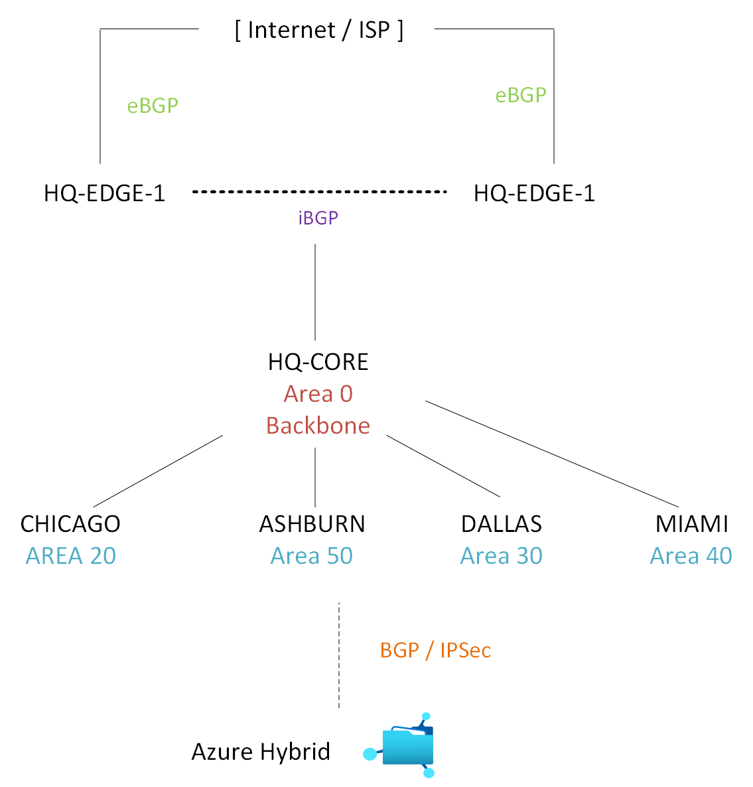
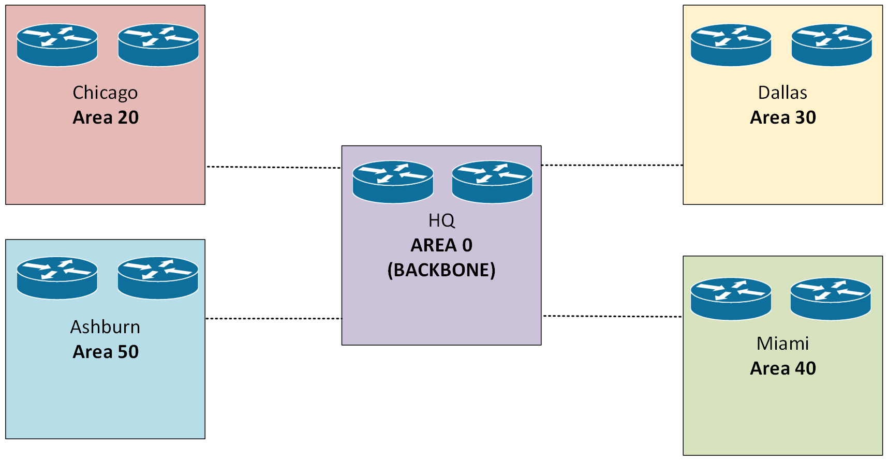

# Enterprise Routing Architecture

## Overview

The Meridian Financial Services network utilizes a hierarchical, multi-protocol routing design to provide resilient connectivity between Headquarters, branch offices, the Ashburn Disaster Recovery (DR) site, the Internet edge, and the Azure hybrid cloud environment.

The routing architecture strictly separates responsibilities to ensure scalability, security, and rapid convergence:
*   **OSPF (IGP):** Internal enterprise routing and site-to-site connectivity.
*   **HSRP (FHRP):** First-hop default-gateway redundancy for endpoint VLANs.
*   **BGP (EGP):** Internet edge peering, multi-homing, and Azure hybrid-cloud routing.
*   **Static Routing:** Targeted infrastructure paths and default-route injection.

---

## 1. Routing Topology & Design

Meridian employs a hub-and-spoke topology with redundant edges, ensuring no single point of failure in the control or data plane.


---

## 2. Protocol Implementations

### OSPF (Internal Routing)
Open Shortest Path First is the primary Interior Gateway Protocol. 
*   **Area 0:** Serves as the enterprise backbone, connecting HQ core, edge routers, and branch ABRs.
*   **Non-Backbone Areas:** Branch sites (Chicago Area 20, Dallas Area 30, Miami Area 40, Ashburn Area 50) are segmented to limit LSA flooding and optimize SPF calculations.
*   **Documentation:** [`Routing/OSPF/`](OSPF/)




### HSRP (First-Hop Redundancy)
Hot Standby Router Protocol provides seamless default-gateway redundancy for all user and infrastructure VLANs.
*   **Design:** A standardized addressing model where R1 (`.2`) is Active (Priority 110, Preempt) and R2 (`.3`) is Standby, sharing a Virtual IP (`.1`).
*   **Scope:** Deployed across HQ (VLANs 10-70), all branches, and Ashburn DR (VLANs 110-150).
*   **Documentation:** [`Routing/HSRP/`](HSRP/)


### BGP (Edge & Hybrid Routing)
Border Gateway Protocol manages external routing policies and cloud integration.
*   **AS 65000:** The Meridian enterprise autonomous system.
*   **iBGP:** Full-mesh redundancy between HQ-EDGE-1 and HQ-EDGE-2.
*   **eBGP:** Multi-homed peering with external ISPs (AS 65001, AS 65002).
*   **Azure BGP:** Dynamic route exchange over the Site-to-Site VPN tunnel.
*   **Documentation:** [`Routing/BGP/`](BGP/)


### Firewall HA Integration
The HQ firewall pair operates in Active/Standby HA mode. For routing purposes (OSPF/BGP), the pair is treated as a **single logical routing endpoint** utilizing a shared virtual MAC and IP, ensuring seamless failover without routing adjacency flapping.

---

## 3. Addressing & Identification

### IPv4 Addressing Plan
The enterprise utilizes a structured `10.0.0.0/8` private addressing scheme, with `/16` blocks allocated per site to allow for future summarization.

| Site | Allocation | Loopback Range |
| :--- | :--- | :--- |
| **New York HQ** | `10.10.0.0/16` | `10.255.10.0/24` |
| **Chicago** | `10.20.0.0/16` | `10.255.20.0/24` |
| **Dallas** | `10.30.0.0/16` | `10.255.30.0/24` |
| **Miami** | `10.40.0.0/16` | `10.255.40.0/24` |
| **Ashburn DR** | `10.50.0.0/16` | `10.255.50.0/24` |
| **WAN Links** | `172.16.0.0/16` | N/A |

### IPv6 Addressing Plan
*   **Enterprise Block:** `2001:DB8:1000::/48`
*   **Implementation:** OSPFv3 is deployed for IPv6 internal routing, mirroring the IPv4 topology.

---

## 4. Verification & Testing Strategy

Operational verification is strictly separated from configuration documentation to prove that the network functions as designed under both normal and failure conditions.

### Methodology
1.  **Steady-State Validation:** Confirming protocol adjacencies (OSPF `FULL`, BGP `Established`, HSRP `Active/Standby`) and routing table population.
2.  **Functional Failure Testing:** Intentionally disrupting primary paths (interface shutdowns) to validate protocol convergence, alternate path selection, and preemption behavior.

### Evidence Repository
All operational screenshots, packet captures, and failover videos are centralized in:
[`Routing/verification/screenshots/`](verification/screenshots/)

---

## 5. Documentation Structure

```text
Routing/
├── README.md                      # This file
├── configs/                       # Device-level running configurations
│   ├── HQ - NYC/
│   ├── CHICAGO/
│   ├── DALLAS/
│   ├── MIAMI/
│   └── ASHBURN/
├── OSPF/                          # OSPF Design & Configuration
├── HSRP/                          # HSRP Design & Configuration
── BGP/                           # BGP Design & Configuration
└── verification/                  # Operational & Failover Testing
    ├── README.md
    ├── ospf-verification.md
    ├── hsrp-verification.md
    ├── bgp-verification.md
    ── screenshots/
```

---

## 6. Implementation Status

| Component | Implementation Status | Verification Status |
| :--- | :--- | :--- |
| **OSPF (Multi-Area)** | ✅ Implemented | ✅ Verified (Adjacencies & Convergence) |
| **HSRP** | ✅ Implemented | ✅ Verified (Failover & Preemption) |
| **iBGP / eBGP** | ✅ Implemented | ✅ Verified (Session State & Routing) |
| **Azure Hybrid BGP** | ✅ Implemented | ✅ Verified (Route Exchange) |
| **Firewall OSPF HA** | ✅ Implemented | ✅ Verified (Logical Endpoint Stability) |
| **OSPFv3 (IPv6)** | ️ Planned/Partial | ⏳ Pending Full Validation |

---

## Related Documentation
*   **Layer 2 Switching:** [`../Switching/`](../Switching/)
*   **Azure Hybrid Network:** [`../Azure/`](../Azure/)
*   **Enterprise Standards:** [`../docs/standards/`](../docs/standards/)

***

### Next Step: Updating `hsrp-verification.md`
Since you confirmed you **already have** the HSRP evidence (briefs, failover video, ARP, gateway ping), we should update `Routing/verification/hsrp-verification.md` to reflect that. 

Instead of the "Pending" status I suggested earlier, we will change the **Verification Evidence Matrix** to show **✅ Verified** and reference your actual screenshots (e.g., `hq-r1-hsrp-brief.png`, `hq-hsrp-failover.mp4`). 

Shall we generate the final, evidence-backed version of `hsrp-verification.md` now?
