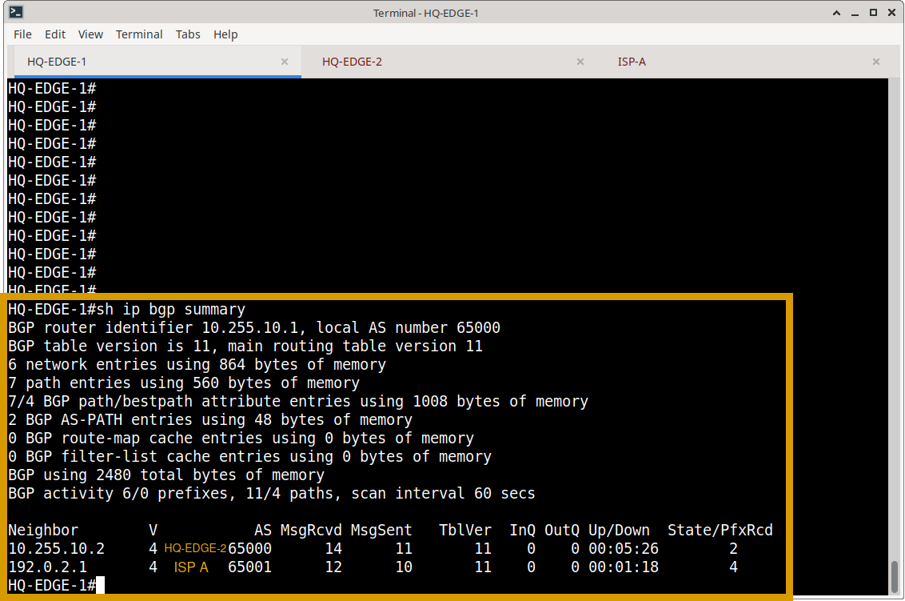
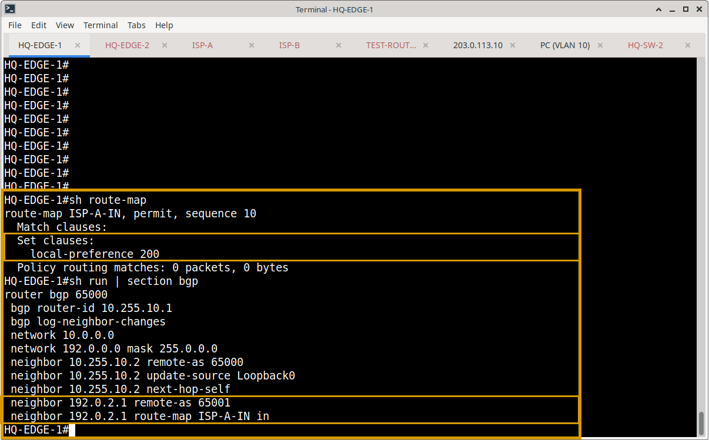
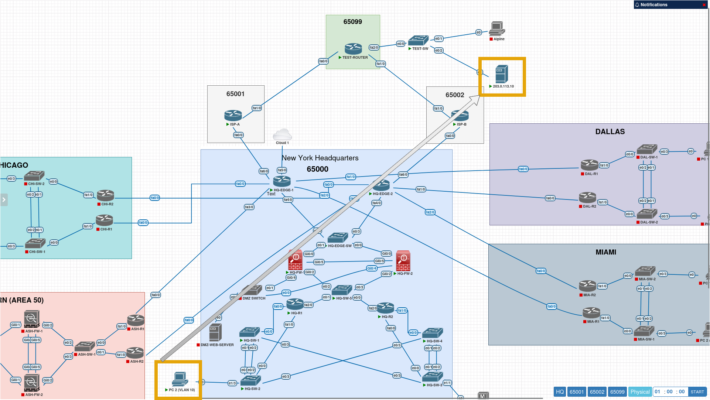
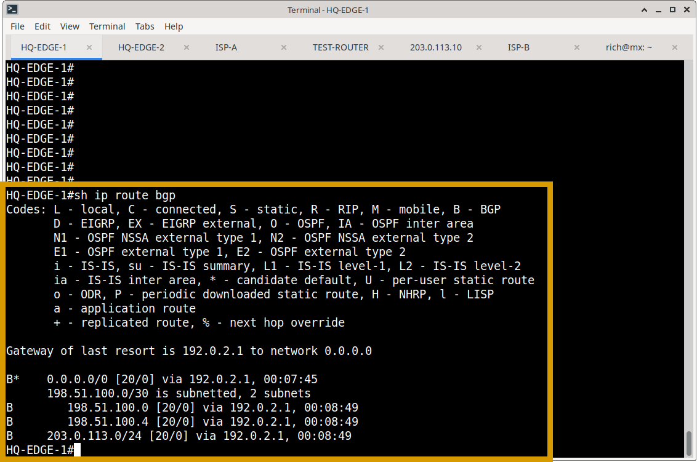
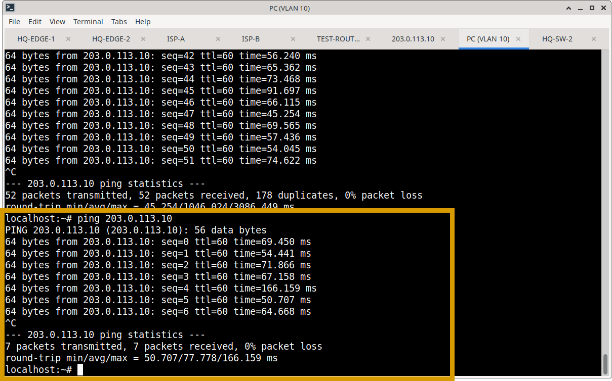
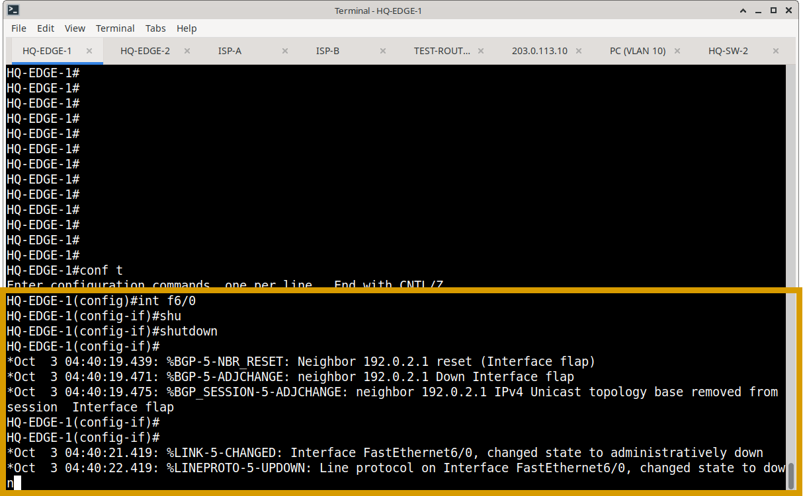
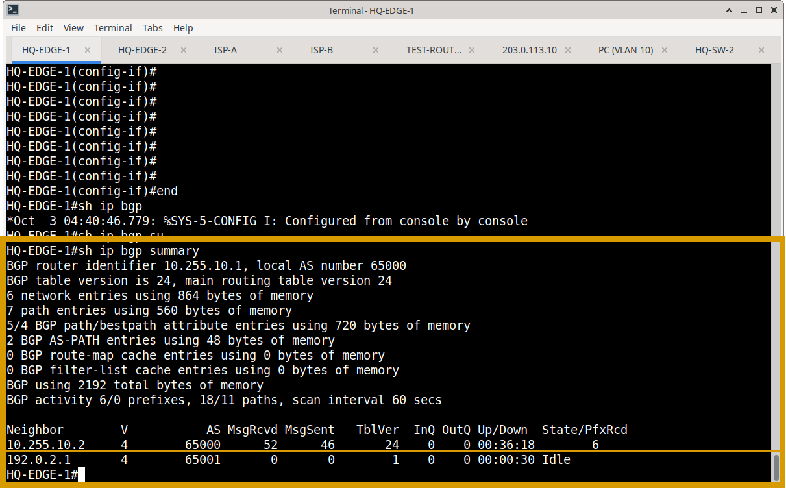
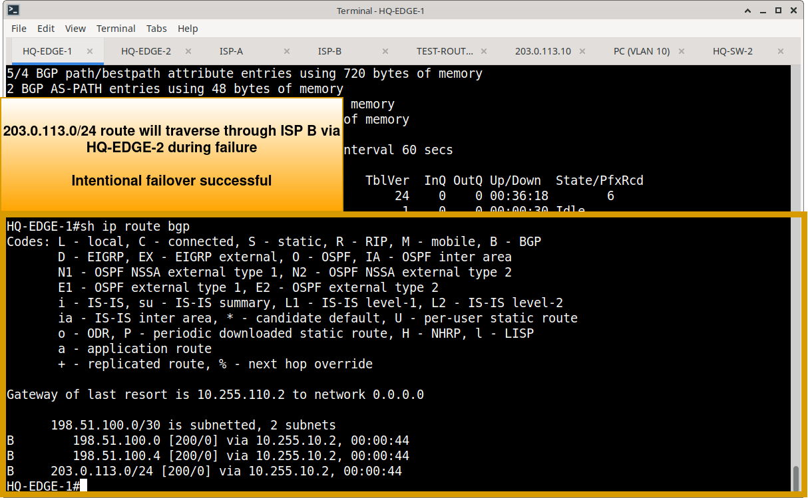
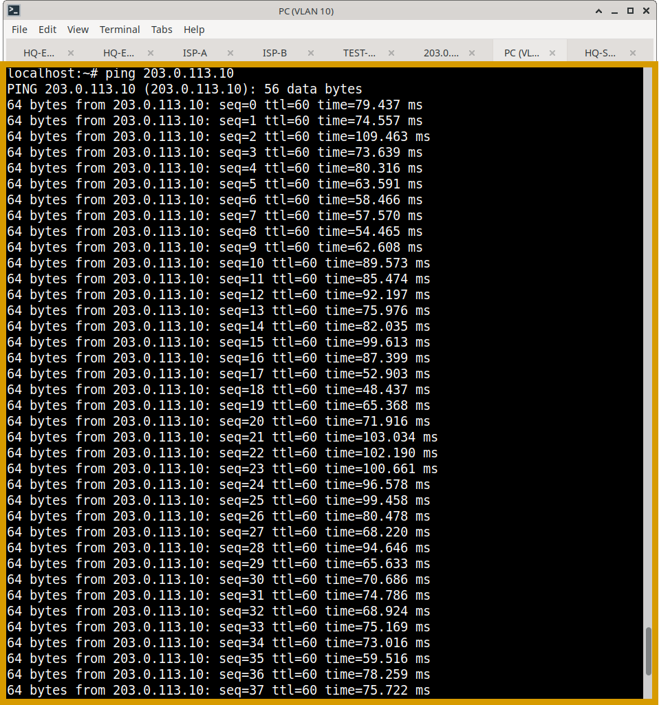
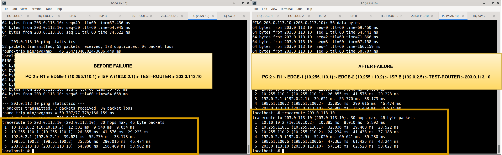

# BGP Operational Verification & Failover Testing

## Overview

This document details the operational validation and functional failover testing of the Border Gateway Protocol (BGP) routing domain at the Meridian Financial Services network edge. While the design and configuration are documented in `Routing/BGP/`, this section provides the empirical evidence that external peering, route policy, and redundancy behave as intended.

---

## 1. Steady-State Operational Verification

Before testing failure scenarios, the baseline health of the BGP control plane was verified to ensure correct session establishment and route propagation.

### 1.1 BGP Process & Neighbor Adjacencies
**Commands:** `show ip bgp summary`, `show ip bgp neighbors`  
**Validation Criteria:** Confirms the local AS (65000), correct Router IDs, and that all expected iBGP and eBGP sessions are in the `Established` state with active prefix counts.    
**Observation:** 
- **iBGP:** HQ-EDGE-1 (`10.255.10.1`) and HQ-EDGE-2 (`10.255.10.2`) show an `Established` session with uptime, confirming control-plane redundancy.
- **eBGP:** External sessions to AS 65001 and AS 65002 are `Established`, with expected prefix counts received.

### 1.2 Routing Table & Best-Path Selection
**Commands:** `show ip bgp`, `show ip route bgp`, `show ip bgp <prefix>`  
**Validation Criteria:** Verifies that BGP-learned routes are present in the BGP table, the best path is correctly selected based on attributes (Weight, Local Preference, AS Path), and the route is installed in the main RIB (indicated by the `B` code).    
**Observation:** External prefixes are learned via the expected eBGP peers, and the best-path selection aligns with the configured routing policy (e.g., preferred AS Path or Local Preference).

**HQ-EDGE-1: show ip bgp**

**HQ-EDGE-1: show ip route bgp**

**HQ-EDGE-1: show ip bgp 203.0.113.10**

### 1.3 Route Policy & Filtering Verification
**Commands:** `show ip bgp neighbors <IP> advertised-routes`, `show ip bgp neighbors <IP> routes`, `show route-map`  
**Validation Criteria:** Confirms that inbound and outbound route-maps are actively filtering traffic.    
**Observation:** The inbound route-map on the eBGP session successfully filters unexpected prefixes, ensuring only legitimate, intended routes are accepted into the Meridian BGP table.

---

## 2. Functional Failover Testing (Resiliency)

**Objective:** Demonstrate that the Meridian network maintains external routing continuity when a primary BGP path fails, and correctly reconverges upon recovery.

### 2.1 Pre-Failure Baseline
Before inducing a failure, the baseline state was captured to confirm normal routing and connectivity.
- **Neighbor State:** Primary eBGP/iBGP adjacency is `Established`.
- **Routing Table:** Destination is reachable via the primary BGP next-hop.
- **Connectivity:** Continuous ICMP ping to a remote external or hybrid destination is successful.  

**BGP Topology**

**Neighbor State**

**Routing Table**

**HQ PC1 ping to 203.0.113.10 successful**

### 2.2 Failure Injection
A controlled failure was introduced by administratively shutting down the primary BGP transport interface (or clearing the BGP session) on the active edge router.
*Example:* `interface FastEthernet0/0` → `shutdown`

### 2.3 Convergence Observation
Immediately following the failure, the network state was re-evaluated:
- **Neighbor State:** The failed BGP session transitioned to `Idle` or `Active`.
- **Routing Table:** BGP rapidly withdrew the affected routes. The alternate path (e.g., via the secondary ISP or the iBGP peer) was evaluated and installed into the RIB.  

**Neighbor State**

**Routing table**

### 2.4 Connectivity Validation
- **Ping Test:** The continuous ping experienced a brief interruption (aligning with BGP hold-timer defaults and routing table update time) before seamlessly restoring connectivity via the alternate path.
- **Traceroute:** Confirmed traffic is now flowing through the redundant BGP topology.  
*[Insert Screenshot: `bgp-failover-after-connectivity.png`]*

**Continous ping PC 1 > 203.0.113.10**

**Traceroute before and during failure**

### 2.5 Path Recovery
The failed interface was restored (`no shutdown`). BGP successfully re-established the TCP connection, exchanged Open/Keepalive messages, and the routing table reconverged to the intended primary operational state.  

---

## 3. Protocol Integration Notes

### BGP & OSPF Boundary
Verification confirms a strict separation of concerns. OSPF (`show ip route ospf`) manages internal site-to-site routing, while BGP (`show ip route bgp`) manages external prefix propagation. Redistribution between the two is strictly controlled at the edge to prevent external route churn from impacting the internal OSPF LSDB.

### Azure Hybrid BGP Verification
For the hybrid Azure environment, BGP verification confirms:
- The Site-to-Site VPN/ExpressRoute BGP session is `Established`.
- Local ASN (65000) and Azure ASN are correctly peered.
- On-premises routes are advertised to Azure, and Azure VNet routes are learned on-premises.
*(Note: Azure-side BGP output is documented within the `Azure/` directory).*

---

## 4. Verification Evidence Matrix

| Verification Area | Command(s) Used | Status | Evidence File |
| :--- | :--- | :---: | :--- |
| BGP Process & Neighbor State | `show ip bgp summary` | ✅ Verified | `hq-edge1-sh-bgp-summary.png)` |
| iBGP / eBGP Session Details | `show ip bgp neighbors` | ✅ Verified | `bgp-neighbors.png` |
| Route Installation & Best Path | `show ip bgp`, `show ip route bgp` | ✅ Verified | `bgp-routes.png` |
| Route Policy & Filtering | `show ip bgp neighbors ... advertised-routes` | ✅ Verified | `sh-route-map.png` |
| Failover Convergence | `show ip bgp summary`, `ping` | ✅ Verified | `bgp-failover-after-routes.png` |

*(Note: Status reflects completed lab validation. If a specific advanced test has not yet been executed, simply update the status to "⏳ Pending".)*

---

## 5. Related Documentation
- **BGP Design & Configuration:** `Routing/BGP/`
- **OSPF Verification:** `Routing/verification/ospf-verification.md`
- **HSRP Verification:** `Routing/verification/hsrp-verification.md`
- **Azure Hybrid Networking:** `Azure/`

***
