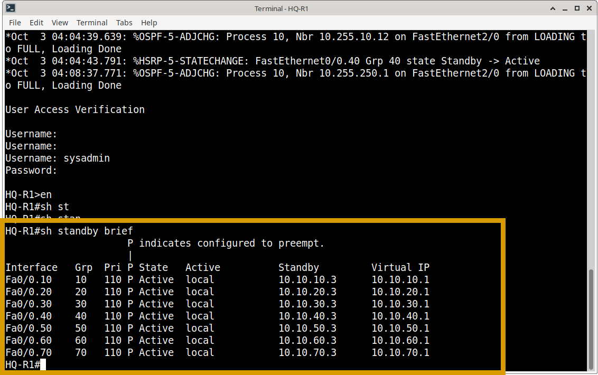
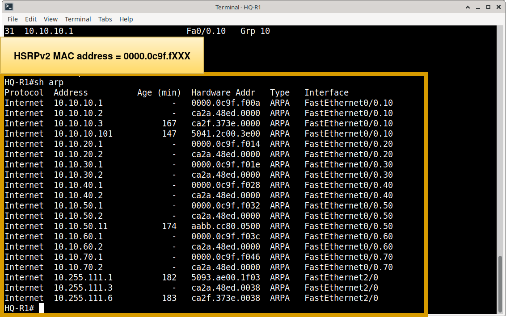
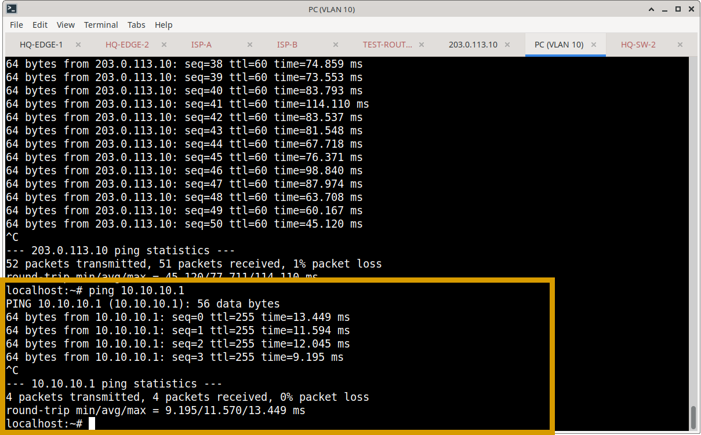
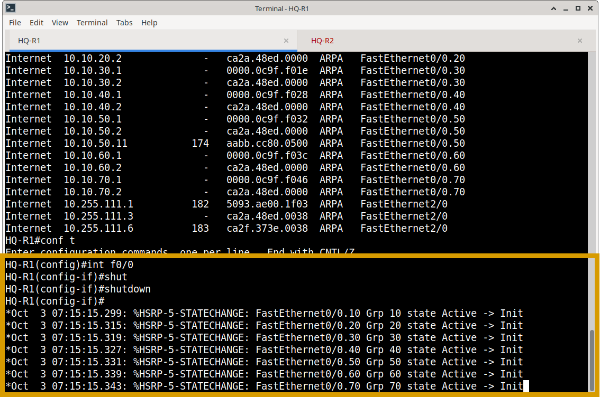
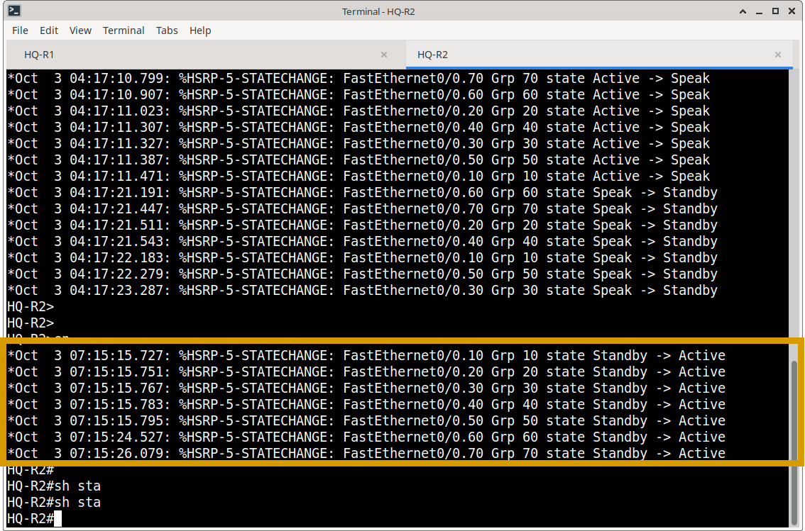

# HSRP Operational Verification & Failover Testing

## Overview

This document details the operational validation and functional failover testing of the Hot Standby Router Protocol (HSRP) implementation across the Meridian Financial Services network. HSRP provides First-Hop Redundancy Protocol (FHRP) for enterprise VLANs, ensuring seamless default-gateway availability.

While the design and configuration are documented in `Routing/HSRP/`, this section provides the empirical evidence that the redundancy model behaves as intended under both steady-state and failure conditions.

---

## 1. HSRP Design & Addressing Model

To ensure operational consistency, Meridian utilizes a standardized HSRP addressing and role-assignment model across all sites.

### Standardized Branch & HQ Model
For any given VLAN `X` (e.g., VLAN 10, 20, 110):
*   **Virtual IP (VIP):** `10.[SiteID].X.1` (Assigned to endpoints as the default gateway).
*   **Active Router (R1):** `10.[SiteID].X.2` (Configured with `priority 110` and `preempt`).
*   **Standby Router (R2):** `10.[SiteID].X.3` (Relies on default priority `100`).

| Site | VLAN Range | Active Router (R1) | Standby Router (R2) | Virtual Gateway (VIP) |
| :--- | :---: | :--- | :--- | :--- |
| **HQ** | 10 – 70 | HQ-R1 (`10.10.X.2`) | HQ-R2 (`10.10.X.3`) | `10.10.X.1` |
| **Chicago** | 10 – 70 | CHI-R1 (`10.20.X.2`) | CHI-R2 (`10.20.X.3`) | `10.20.X.1` |
| **Dallas** | 10 – 70 | DAL-R1 (`10.30.X.2`) | DAL-R2 (`10.30.X.3`) | `10.30.X.1` |
| **Miami** | 10 – 70 | MIA-R1 (`10.40.X.2`) | MIA-R2 (`10.40.X.3`) | `10.40.X.1` |
| **Ashburn** | 110 – 150| ASH-INT-1 (`10.50.X.2`)| INT-2 (`10.50.X.3`) | `10.50.X.1` |

---

## 2. Steady-State Operational Verification

Before testing failure scenarios, the baseline health of the HSRP topology was verified to ensure correct role assignment and gateway reachability.

### 2.1 HSRP State & Role Verification
**Command:** `show standby brief`  
**Validation Criteria:** Confirms the correct router is in the `Active` state (indicated by the `A` flag and priority 110) and the secondary is in the `Standby` state (`S` flag). The Virtual IP column must match the design.    
**Observation:** HQ-R1 correctly holds the Active role for VLANs 10-70, while HQ-R2 is in Standby. Preemption (`P` flag) is active.

### 2.2 Detailed HSRP & ARP Verification
**Commands:** `show standby interface [interface]`, `show arp`  
**Validation Criteria:** Verifies HSRP version (v2), hello/hold timers, and confirms that the ARP table on the switch/router resolves the VIP to the correct HSRP virtual MAC address (`0000.0C9F.FXXX`).  

### 2.3 Gateway Reachability
**Command:** `ping [VIP]` (from an endpoint or management station)  
**Validation Criteria:** Confirms that the virtual gateway is actively responding to ICMP requests, proving the Active router is successfully processing traffic destined for the VIP.  
*[Insert Screenshot: `hq-hsrp-gateway-ping.png`]*

---

## 3. Functional Failover Testing (Resiliency)

**Objective:** Demonstrate that the Meridian network maintains default-gateway continuity when the Active HSRP router fails, and correctly preempts upon recovery.

### 3.1 Pre-Failure Baseline
Before inducing a failure, the baseline state was captured to confirm normal routing and connectivity.
- **HSRP State:** R1 is `Active`, R2 is `Standby`.
- **Connectivity:** Continuous ICMP ping from a VLAN 10 endpoint to a remote destination (e.g., Ashburn DR subnet) is successful via the VIP (`10.10.10.1`).  

### 3.2 Failure Injection
A controlled failure was introduced by administratively shutting down the primary VLAN interface on the Active router (HQ-R1).
*Example:* `interface FastEthernet0/0.10` → `shutdown`

### 3.3 Convergence & Role Transition
Immediately following the failure, the network state was re-evaluated on the secondary router (HQ-R2):
- **HSRP State:** HQ-R2 detected the loss of HSRP hello messages (after the hold timer expired) and immediately transitioned to the **`Active`** state for Group 10.  

### 3.4 Connectivity Validation
- **Ping Test:** The continuous ping from the endpoint experienced a brief, acceptable interruption (typically 3–5 dropped packets, aligning with HSRP hold-timer defaults) before seamlessly restoring connectivity through the new Active router (HQ-R2).  

**Please enlarge for clearer video**

### 3.5 Path Recovery & Preemption
The failed interface on HQ-R1 was restored (`no shutdown`). 
- **Observation:** Because `standby 10 preempt` is configured, HQ-R1 immediately reclaimed the `Active` role upon interface recovery, and HQ-R2 gracefully returned to the `Standby` state.  

---

## 4. Verification Evidence Matrix

| Verification Area | Command(s) Used | Status | Evidence File |
| :--- | :--- | :---: | :--- |
| HSRP State & Roles | `show standby brief` | ✅ Verified | `hq-r1-sh-standby-brief.png` |
| HSRP v2 MAC | `show arp` | ✅ Verified | `hq-r1-sh-arp.png` |
| Gateway Reachability | `ping [VIP]` | ✅ Verified | `hq-hsrp-gateway-ping.png` |
| Failover Convergence | `show standby brief`, `ping` | ✅ Verified | `hsrp-failover.png` |
| Preemption Recovery | `show standby brief` | ✅ Verified | `hsrp-failover-recovered.png` |

*(Note: Status reflects completed lab validation. If a specific advanced test has not yet been executed, simply update the status to "⏳ Pending".)*

---

## 5. Related Documentation
- **HSRP Design & Configuration:** `Routing/HSRP/`
- **OSPF Verification:** `Routing/verification/ospf-verification.md`
- **BGP Verification:** `Routing/verification/bgp-verification.md`

***
