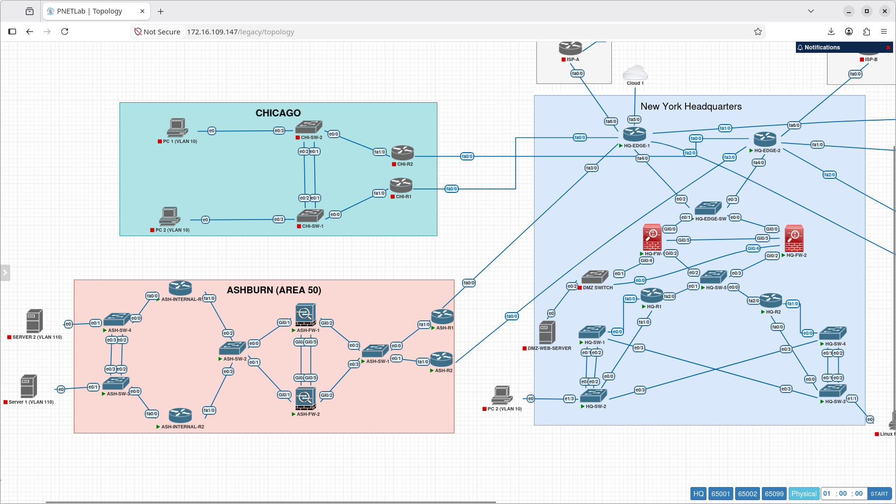

# Site-to-Site IPsec VPN

## Overview

This section documents the implementation and validation of the Site-to-Site IPsec VPN connecting the Meridian Financial Services Headquarters network with the Ashburn Disaster Recovery environment. 

The VPN provides a secure, encrypted tunnel for inter-site traffic, ensuring data confidentiality and integrity across the untrusted transit network. The implementation was rigorously validated at multiple layers: control plane negotiation, data plane encryption, and functional end-to-end connectivity.

---

## Architecture

---

## Validation Layers

The VPN implementation was validated through a multi-tiered approach to prove both configuration and actual data flow:

1. **IKEv2:** Verification of the Internet Key Exchange version 2 (IKEv2) Security Association (SA) on the firewall, supplemented by Wireshark analysis of the ISAKMP negotiation.
2. **IPsec/ESP:** Verification of the active IPsec SA and Wireshark analysis confirming that transit traffic is properly encapsulated in Encapsulating Security Payload (ESP) packets.
3. **Functional Connectivity:** End-to-end ICMP testing from an HQ host to an Ashburn server, proving the tunnel successfully routes and decrypts traffic.

---

## Documentation Structure

| Document | Purpose |
| :--- | :--- |
| `README.md` | Architecture, validation layers, and implementation scope. |
| `configuration.md` | Implementation workflow, packet analysis methodology, and evidence matrix. |
| `screenshots/` | Curated evidence of firewall SA states and Wireshark packet analysis. |
| `ip-sec-pcap.pcap` | Raw packet capture of the IKE negotiation and encrypted ESP/ICMP traffic. |

---

## Scope & Boundaries

This section documents the **operational validation and traffic analysis** of the Site-to-Site IPsec VPN. 

It proves the successful establishment of IKEv2/IPsec Security Associations and the encryption of transit traffic. It intentionally does not assert specific cryptographic parameters (e.g., exact transform sets, lifetimes, or tunnel selectors) unless explicitly visible in the provided operational evidence.

---

## Related Documentation

- **Network Routing:** `Routing/` (OSPF/BGP routing over the tunnel)
- **Firewall High Availability:** `Switching/` or `Security/` (Firewall stateful failover, if applicable)
