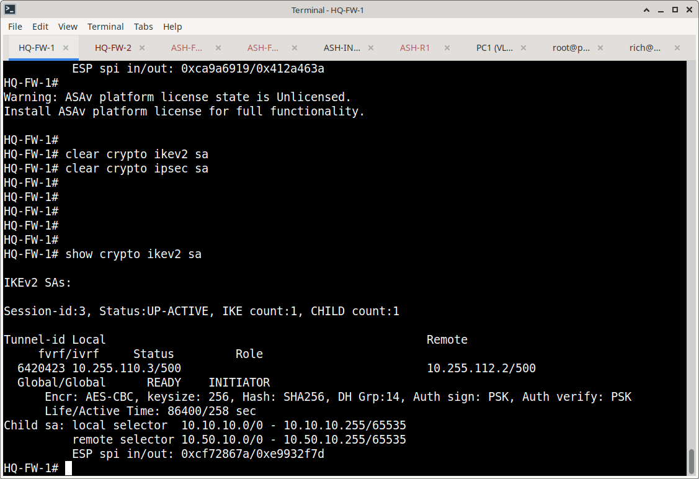
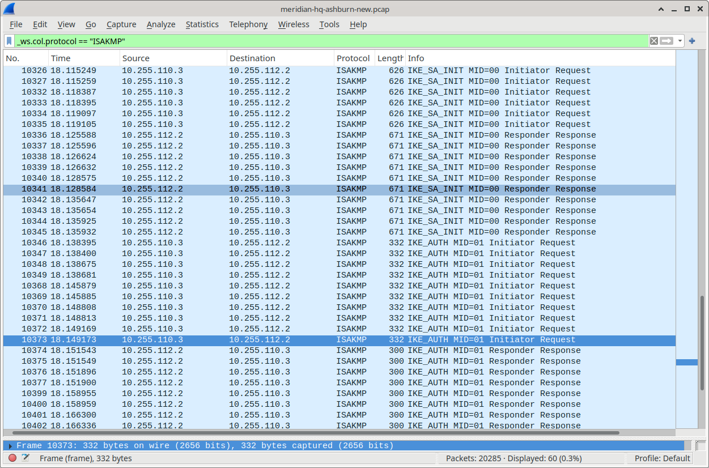
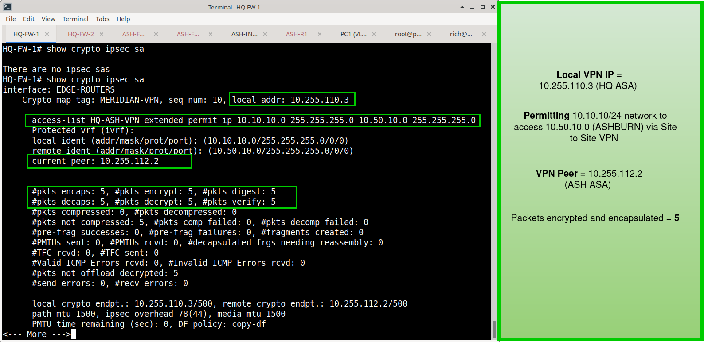
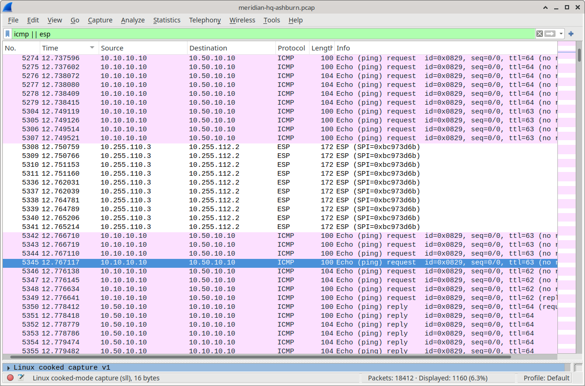
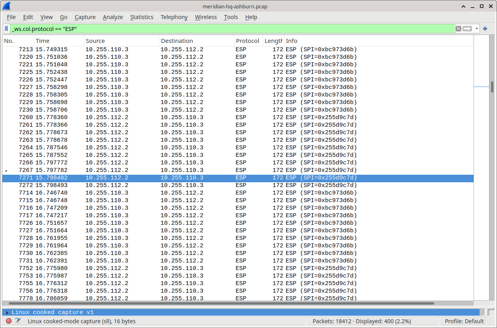
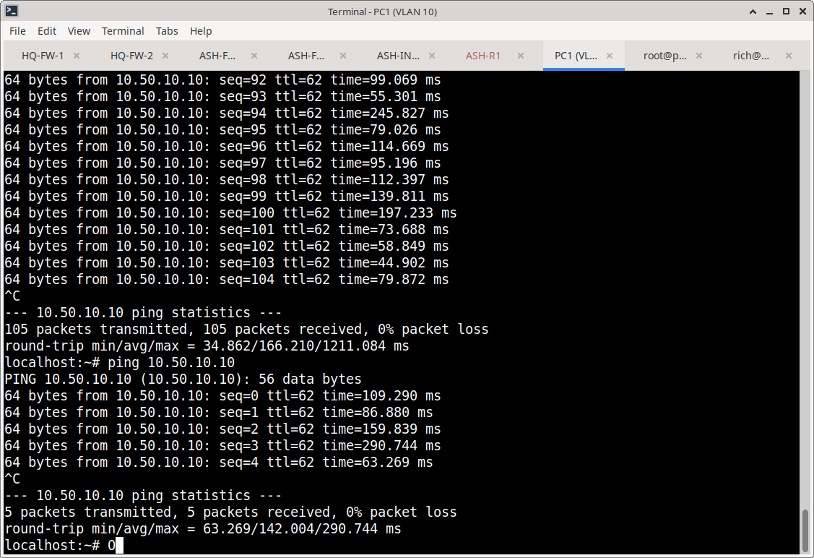
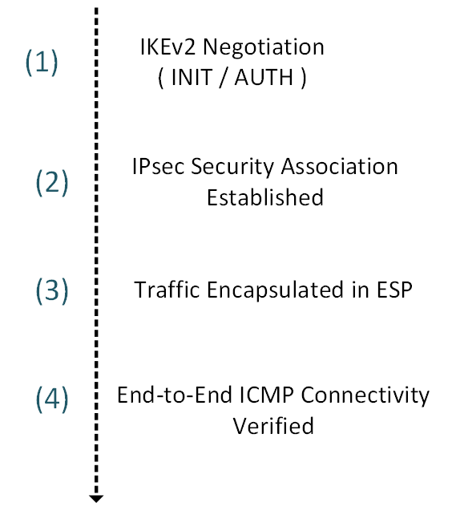

# Site-to-Site IPsec VPN Implementation & Validation

## Overview

This document details the validation workflow for the Meridian HQ-to-Ashburn Site-to-Site IPsec VPN. It covers firewall Security Association (SA) verification, packet-level analysis of the encrypted tunnel, and functional end-to-end connectivity testing.

---

## 1. IKEv2

The foundation of the IPsec tunnel is the IKEv2 negotiation, which establishes a secure channel for key exchange.

**Firewall Verification:**  
The HQ firewall was checked to confirm an active IKEv2 Security Association with the Ashburn peer.  

**Packet Analysis:**  
Wireshark was used to capture and analyze the ISAKMP/IKE negotiation. The capture shows the initiation and response phases of the key exchange.  

**[Download Full Packet Capture (`ip-sec-pcap.pcap`)](pcap/ip-sec-pcap.pcap)** to inspect the complete IKE negotiation and ESP traffic flow in Wireshark.

---

## 2. Data Plane Verification (IPsec SA & ESP)

Once the IKE SA is established, the IPsec SA is negotiated to protect the actual data traffic.

**Firewall Verification:**  
The HQ firewall was verified to show an active IPsec Security Association, confirming the tunnel is ready to encrypt traffic.  

**Packet Analysis:**  
Wireshark filters were applied to observe the traffic crossing the tunnel. The capture confirms that ICMP traffic is successfully encapsulated within Encapsulating Security Payload (ESP) packets, proving that the data plane is actively encrypting the payload.  

---

## 3. Functional End-to-End Connectivity

To validate that the encrypted tunnel is functionally routing traffic, an end-to-end ping test was performed.

**Test Scenario:**  
A host on the Meridian HQ network successfully pinged a server located in the Ashburn DR environment.  

---

## 4. Evidence Matrix

| Validation Area | Evidence File | What It Proves |
| :--- | :--- | :--- |
| **Control Plane (Firewall)** | `01-hq-fw1-ikev2-sa.png` | Active IKEv2 Security Association on HQ firewall. |
| **Control Plane (Packet)** | `02-isakmp-pcap-initiation-response.png` | ISAKMP initiation and response captured. |
| | `03-isakmp-pcap-initiator.png` | IKE initiator details verified. |
| | `06-wireshark-isakmp-filter.png` | Wireshark ISAKMP filter applied successfully. |
| **Data Plane (Firewall)** | `05-hq-fw1-ipsec-sa.png` | Active IPsec Security Association on HQ firewall. |
| **Data Plane (Packet)** | `07-wireshark-esp-icmp-filter.png` | ICMP traffic encapsulated in ESP verified. |
| | `08-wireshark-esp-icmp-filter-part2.png` | Continued ESP/ICMP traffic analysis. |
| | `09-wireshark-esp-overview.png` | High-level overview of ESP packet structure. |
| **Functional Connectivity** | `04-pc1-vpn-connectivity-ashburn-server.png` | Successful end-to-end ping from HQ to Ashburn. |
| **Raw Evidence** | `ip-sec-pcap.pcap` | Full, unaltered packet capture for independent review. |

---

## 5. Validation Sequence

The VPN validation followed this logical progression:

---
