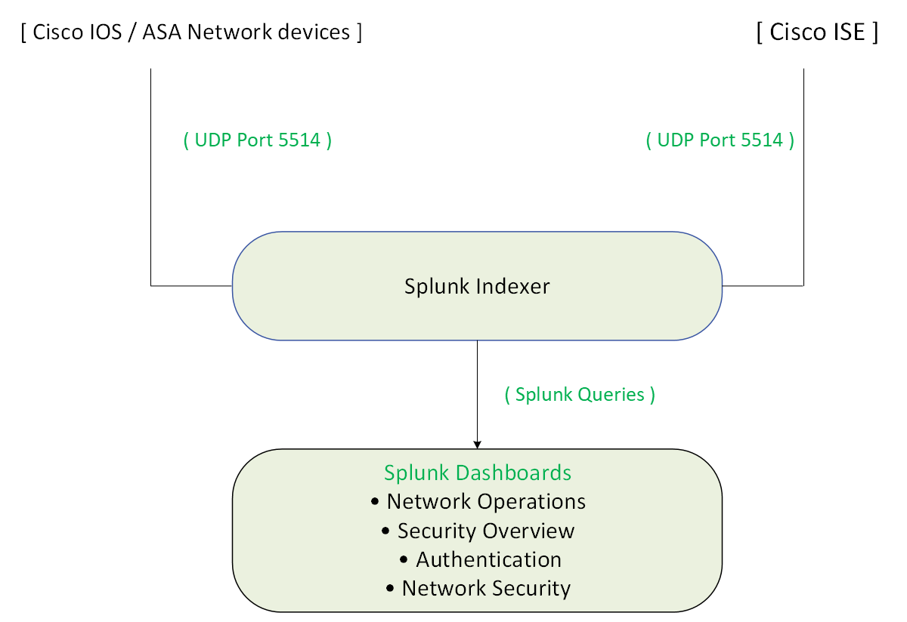
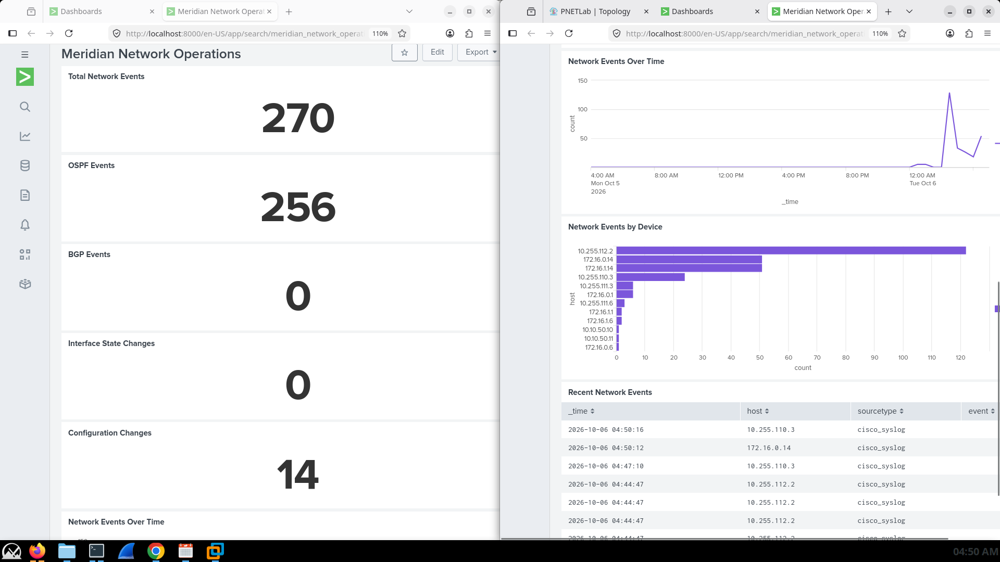
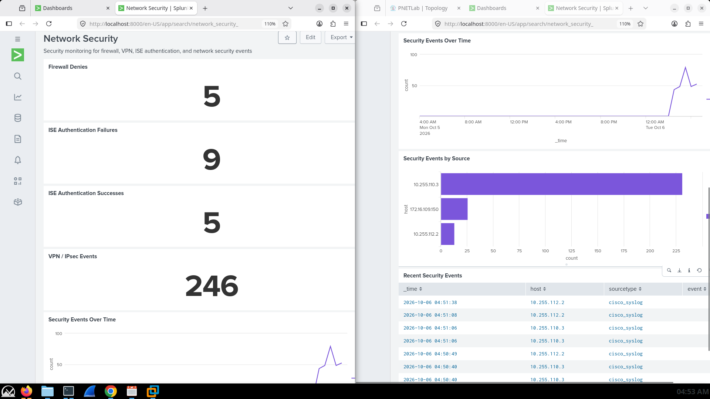
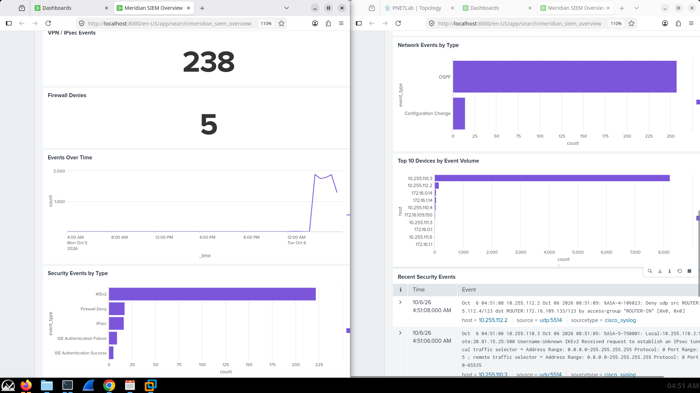
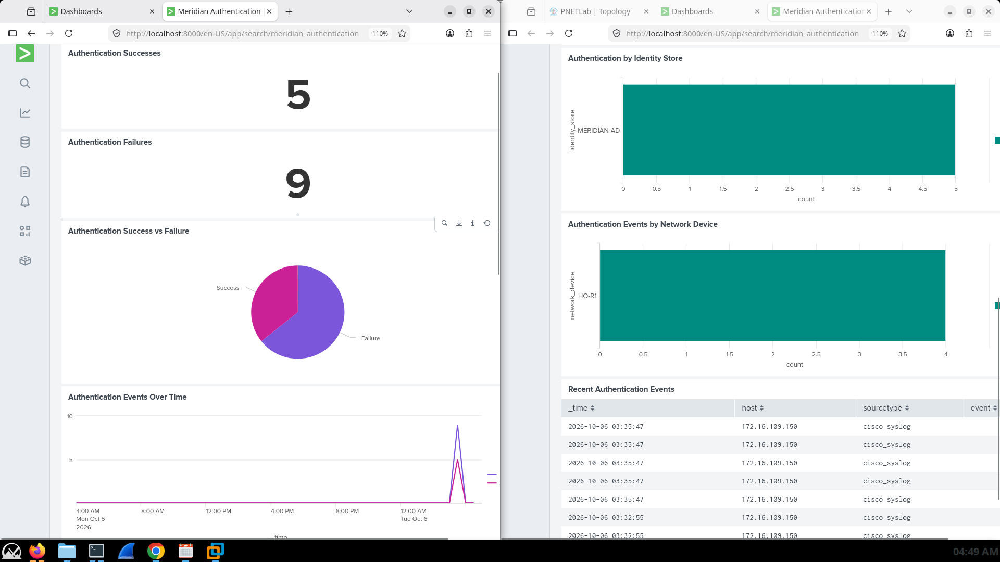
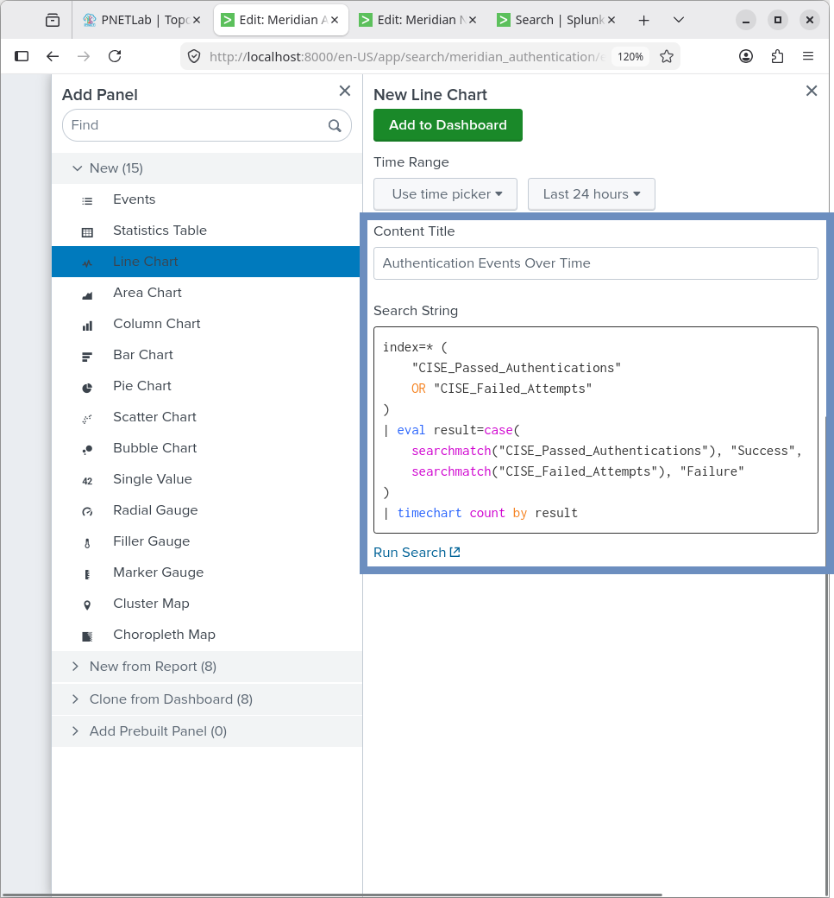

# Meridian Financial Services — Splunk SIEM Implementation

## Overview

This project implements a centralized Security Information and Event Management (SIEM) solution using Splunk for the Meridian Financial Services enterprise network. 

The Splunk deployment aggregates syslog data from Cisco network infrastructure and Cisco Identity Services Engine (ISE) to provide unified visibility into network operations, routing protocol health, interface state changes, and identity-based authentication events.

---

## Monitoring Architecture

The SIEM pipeline ingests telemetry via UDP syslog, processes it using Splunk Search Processing Language (SPL), and presents it through purpose-built dashboards.

---

## Dashboard Portfolio

The implementation includes four specialized dashboards designed for different operational roles:

### 1. Meridian Network Operations
Focuses on infrastructure health and routing stability.
*   Network events over time (trend analysis).
*   Total network event volume.
*   Routing protocol events (OSPF, BGP, HSRP).
*   Interface link and line-protocol state changes.
*   Configuration change tracking.

### 2. Meridian Network Security
Provides a dedicated view for security operations, isolating security-relevant syslog events from general operational noise.

### 3. Meridian SIEM Overview
A consolidated, high-level view of the enterprise security posture.
*   Security events categorized by type and host.
*   Firewall deny events and VPN-related activity (IPsec/IKEv2).
*   Recent security events feed.
*   ISE authentication outcomes (Success vs. Failure).

### 4. Meridian Authentication Monitoring
Deep-dive visibility into Cisco ISE authentication activity.
*   Authentication success versus failure ratios.
*   Authentication volume over time.
*   Breakdown by network device (NAS) and identity source (e.g., Active Directory).

---

## Core Capabilities

This implementation demonstrates the following enterprise monitoring capabilities:
- **Centralized Log Aggregation:** Unified ingestion of multi-vendor/multi-role device logs.
- **Identity-Aware Security Monitoring:** Correlating network events with ISE authentication data.
- **SPL Query Development:** Writing custom Search Processing Language queries to filter, evaluate, and visualize specific event types.
- **Operational Troubleshooting:** Rapid identification of interface flaps, routing adjacency losses, and configuration changes.

**Authentication Query Example**

---

## Documentation Structure

| Document | Purpose |
| :--- | :--- |
| `README.md` | Architecture, dashboard portfolio, and core capabilities. |
| `configuration.md` | Syslog ingestion settings, ISE integration, and SPL query reference. |
| `screenshots/` | Curated evidence of dashboard panels, SPL searches, and device logging config. |
