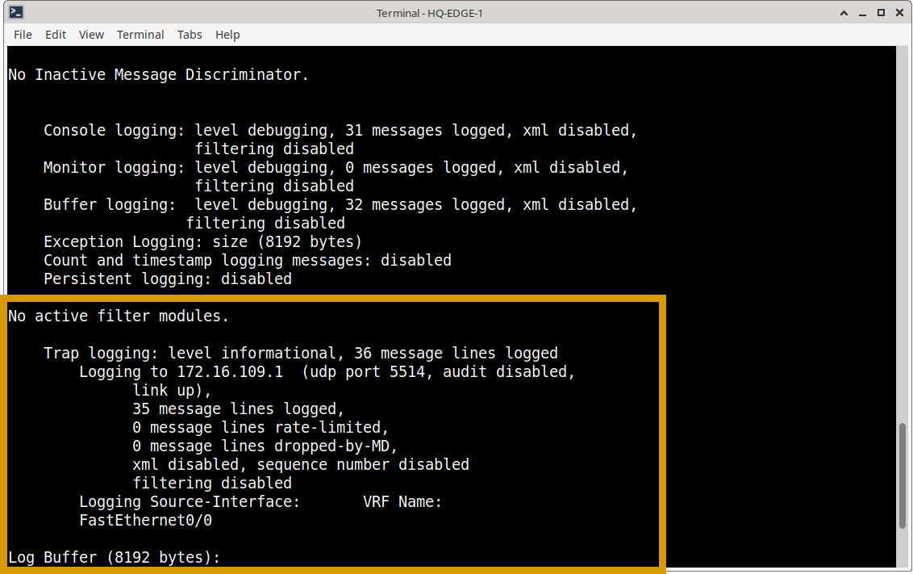
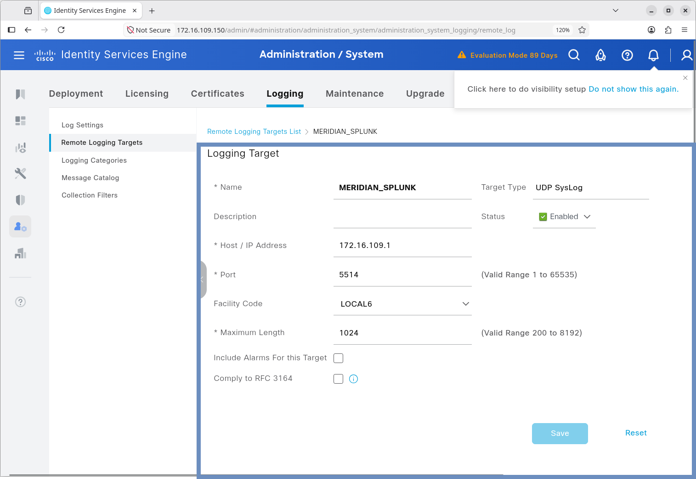
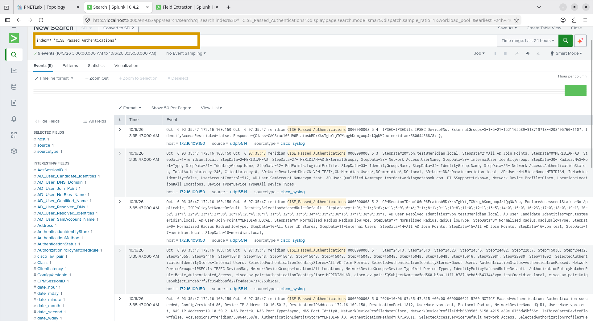
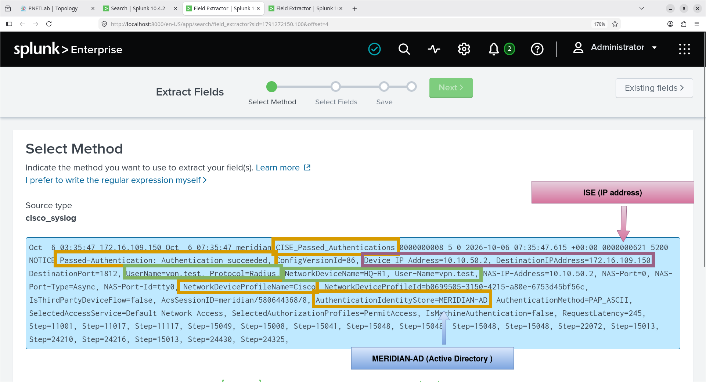
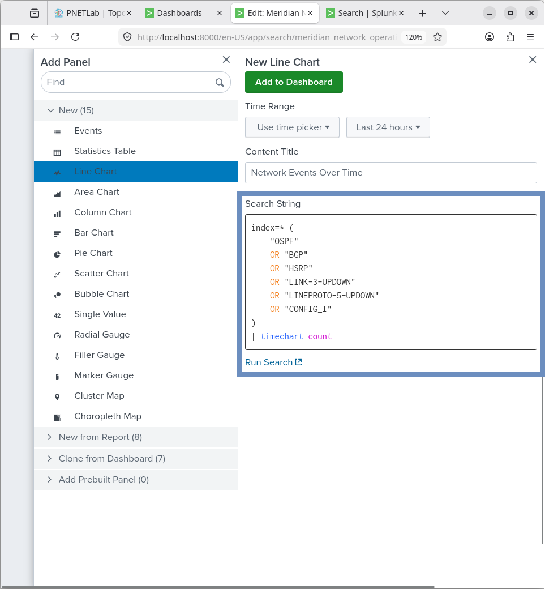
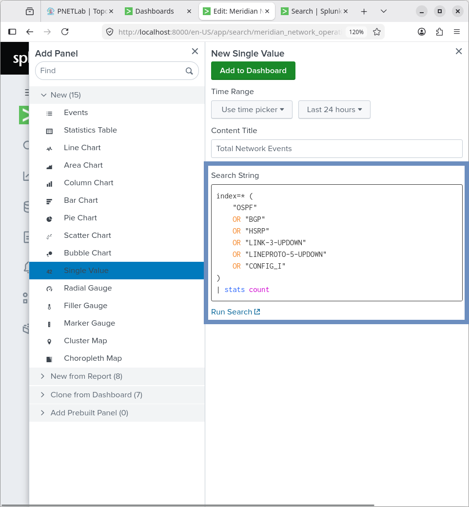
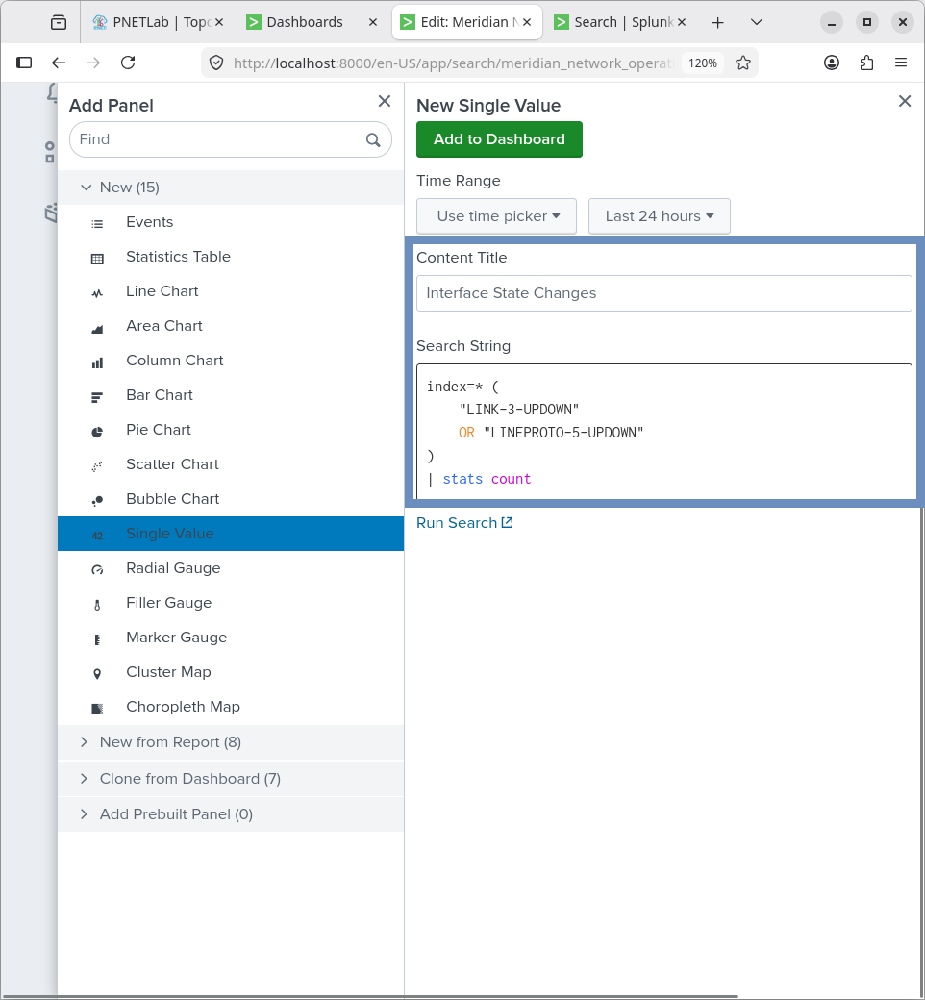
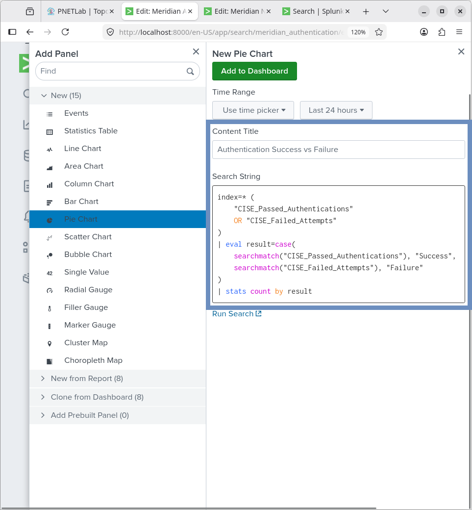
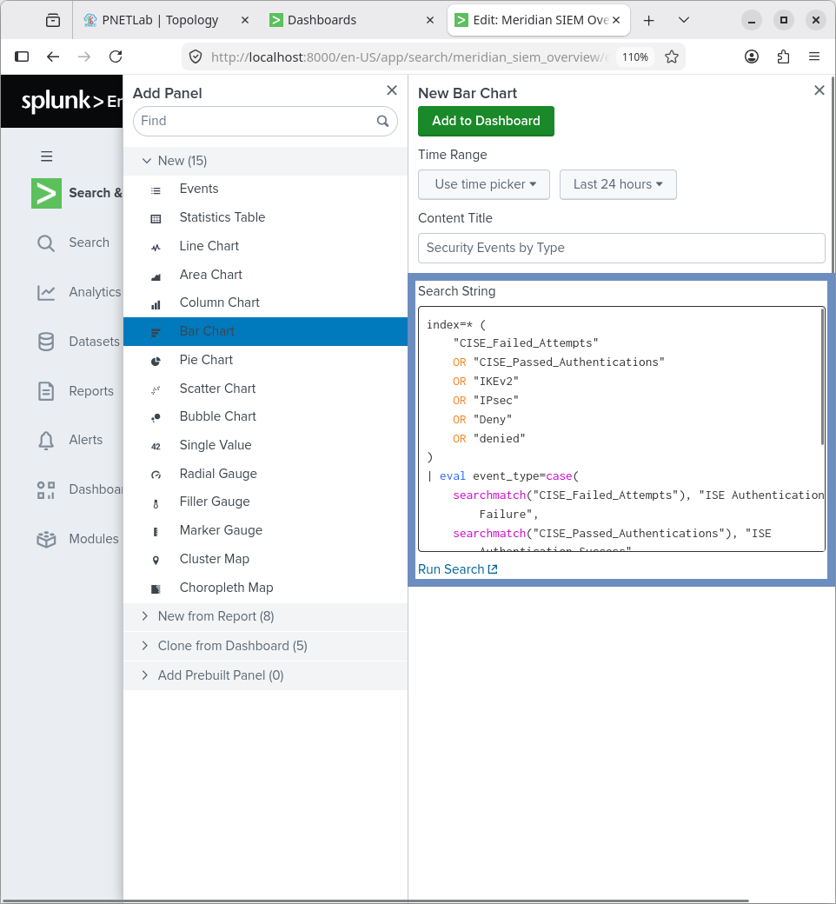

## Overview

This document details the data ingestion methodology and the Search Processing Language (SPL) queries used to power the Meridian Splunk dashboards. It serves as a technical reference for how network and identity telemetry is collected and analyzed.

---

## 1. Network Device Syslog Ingestion

Cisco routers, switches, and firewalls are configured to forward syslog messages to the Splunk host over UDP.

**Cisco IOS Configuration:**
```cisco
! Define the source interface for outgoing syslog packets
logging source-interface FastEthernet0/0

! Define the Splunk destination and transport parameters
logging host 172.16.109.1 transport udp port 5514
```


---

## 2. Cisco ISE Integration

Cisco ISE forwards authentication and system logs to Splunk using a dedicated remote logging target.

**ISE Remote Logging Configuration:**
| Setting | Value |
| :--- | :--- |
| **Target Name** | `MERIDIAN_SPLUNK` |
| **Protocol** | UDP Syslog |
| **Destination IP** | `172.16.109.1` |
| **Destination Port** | `5514` |
| **Status** | Enabled |

This integration allows the Authentication Monitoring dashboard to parse ISE-specific syslog messages (e.g., `CISE_Passed_Authentications`, `CISE_Failed_Attempts`).







---

## 3. SPL Query Reference

The following SPL queries power the dashboard panels. 

*(Note: In this lab environment, `index=*` is used to search all ingested data. In a production environment, specific indexes such as `index=cisco_syslog` or `index=ise_auth` would be used to improve search performance and scope.)*

### 3.1 Network Operations Queries

**Network Events Over Time (Trend Analysis)**
```spl
index=* (
    "OSPF" 
    OR "BGP" 
    OR "HSRP" 
    OR "LINK-3-UPDOWN" 
    OR "LINEPROTO-5-UPDOWN" 
    OR "CONFIG_I"
)
| timechart count
```
*Purpose: Visualizes the frequency of routing, interface, and configuration events over the selected time range.*



**Total Network Events**
```spl
index=* (
    "OSPF" 
    OR "BGP" 
    OR "HSRP" 
    OR "LINK-3-UPDOWN" 
    OR "LINEPROTO-5-UPDOWN" 
    OR "CONFIG_I"
)
| stats count
```
*Purpose: Provides a single-value metric for total operational events.*



**Interface State Changes**
```spl
index=* (
    "LINK-3-UPDOWN" 
    OR "LINEPROTO-5-UPDOWN"
)
| stats count
```
*Purpose: Isolates physical and logical interface flaps for troubleshooting.*



### 3.2 Authentication Monitoring Queries

**Authentication Success vs. Failure**
```spl
index=* (
    "CISE_Passed_Authentications" 
    OR "CISE_Failed_Attempts"
)
| eval result=case(
    searchmatch("CISE_Passed_Authentications"), "Success",
    searchmatch("CISE_Failed_Attempts"), "Failure"
)
| stats count by result
```
*Purpose: Uses the `eval` and `case` functions to classify ISE events into a binary Success/Failure metric for pie charts or single-value panels.*



### 3.3 Security Event Analysis

**Security Events by Type**
```spl
index=* (
    "CISE_Failed_Attempts" 
    OR "CISE_Passed_Authentications" 
    OR "IKEv2" 
    OR "IPsec" 
    OR "Deny" 
    OR "denied"
)
| stats count by <categorized_field>
```
*Purpose: Aggregates firewall denies, VPN tunnel events, and authentication failures to provide a high-level security posture view.*



---

## 4. Dashboard Inventory

| Dashboard | Primary Monitoring Focus |
| :--- | :--- |
| **Meridian Network Operations** | Routing stability, interface health, configuration changes. |
| **Meridian Network Security** | Isolated security-relevant event streams. |
| **Meridian SIEM Overview** | Consolidated enterprise security posture and event volume. |
| **Meridian Authentication** | ISE identity validation, success/failure ratios, and NAS breakdown. |
