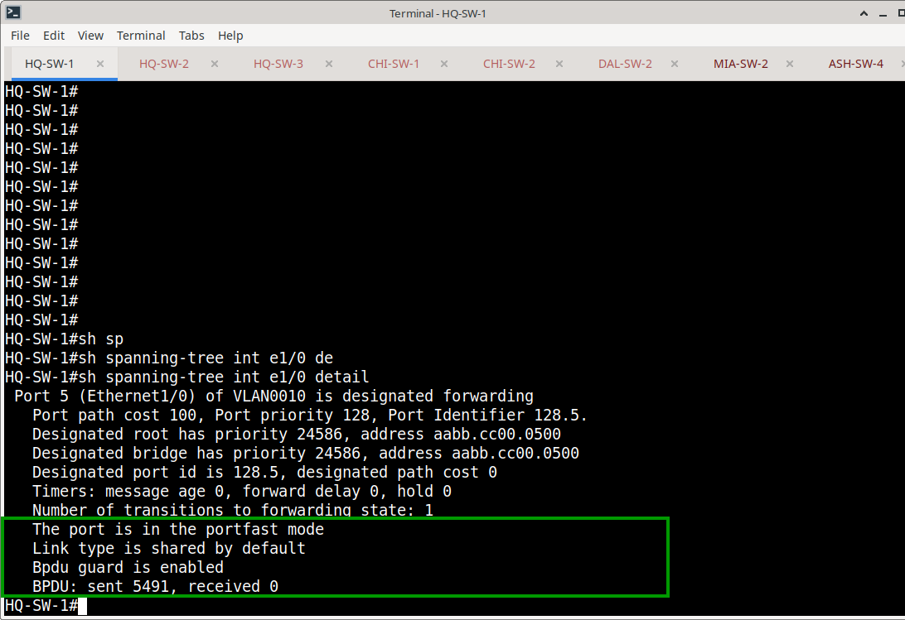
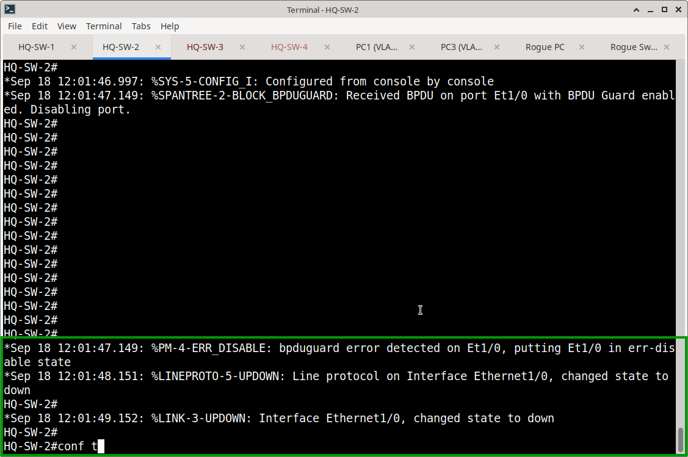
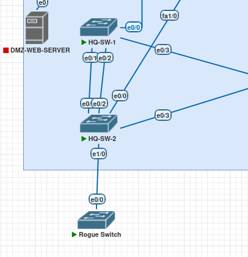

# Access Edge Protection: PortFast & BPDU Guard

## Overview
This section documents the implementation of Spanning Tree Protocol (STP) edge protection across the Meridian Financial Services switching environment. 

To ensure rapid host connectivity while strictly preventing Layer 2 loops, all endpoint-facing access ports are configured with a combined **PortFast** and **BPDU Guard** model.

## Design Objectives
- **Rapid Convergence:** `spanning-tree portfast` allows endpoint ports to bypass STP listening/learning states, transitioning immediately to forwarding.
- **Strict Boundary Enforcement:** `spanning-tree bpduguard enable` ensures that if a rogue switch, hub, or misconfigured device is connected to an access port, the port is immediately placed into an `err-disabled` state.
- **Scope Limitation:** This protection is applied **exclusively** to endpoint-facing access ports. It is explicitly excluded from transit, trunk, and EtherChannel interfaces to preserve legitimate STP topology.

## Integration with Endpoint Security
BPDU Guard does not operate in isolation. On ports requiring advanced authentication (like HQ-SW-2 Ethernet1/1), it is layered with 802.1X and MAB to provide a comprehensive defense-in-depth access model:

```cisco
interface Ethernet1/1
 switchport access vlan 10
 switchport mode access
 authentication order dot1x mab
 authentication port-control auto
 switchport port-security maximum 2
 switchport port-security
 switchport port-security violation restrict
 switchport port-security mac-address sticky
 spanning-tree portfast
 spanning-tree bpduguard enable
```

## Multi-Site Verification Summary
Operational verification was performed across the enterprise to ensure consistent policy application. The table below summarizes the verified state of representative edge ports:

| Site / Switch | Interface | PortFast | BPDU Guard | BPDUs Received | Operational State |
| :--- | :--- | :---: | :---: | :---: | :--- |
| **HQ** (HQ-SW-1) | `Ethernet1/0` | Yes | Yes | 0 | Designated Forwarding |
| **HQ** (HQ-SW-2) | `Ethernet1/0` | Yes | Yes | 0 | Designated Forwarding |
| **HQ** (HQ-SW-3) | `Ethernet1/0` | Yes | Yes | 0 | Designated Forwarding |
| **HQ** (HQ-SW-4) | `Ethernet1/0` | Yes | Yes | N/A | Administratively Down |
| **Branches** (CHI, DAL, MIA) | Endpoint Access | Yes | Yes | 0 | Designated Forwarding |
| **Ashburn DR** | Endpoint Access | Yes | Yes | 0 | Designated Forwarding |



*Note: Trunk and LACP member interfaces were verified to ensure BPDU Guard is NOT applied, preserving legitimate STP BPDUs between switches.*

## Functional Testing: HQ-SW-2
A controlled BPDU Guard test was executed on **HQ-SW-2 Ethernet1/1** to validate the failure behavior. 

**Test Execution:**
1. A rogue switch was connected to the protected endpoint port.
2. The rogue switch transmitted a legitimate STP BPDU.
3. HQ-SW-2 detected the unexpected BPDU on a PortFast-enabled interface.

**Result:** 
The interface immediately transitioned to an `err-disabled` state, dropping all traffic and generating a syslog violation. This successfully prevented a potential Layer 2 loop from propagating into the core network.





## Evidence & Verification
Configuration and operational verification screenshots are stored in:
`Switching/BPDU-Guard/screenshots/`
