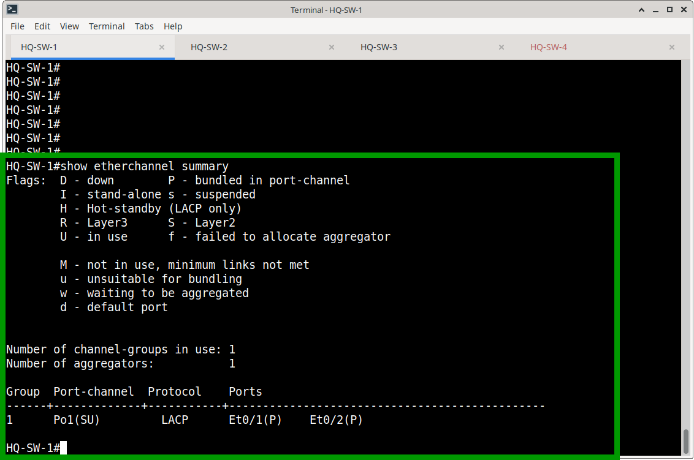
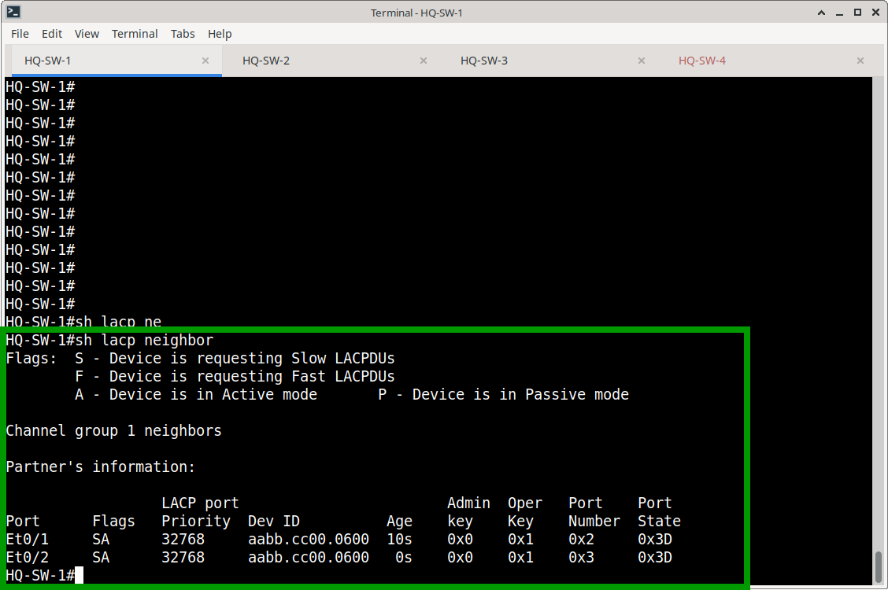
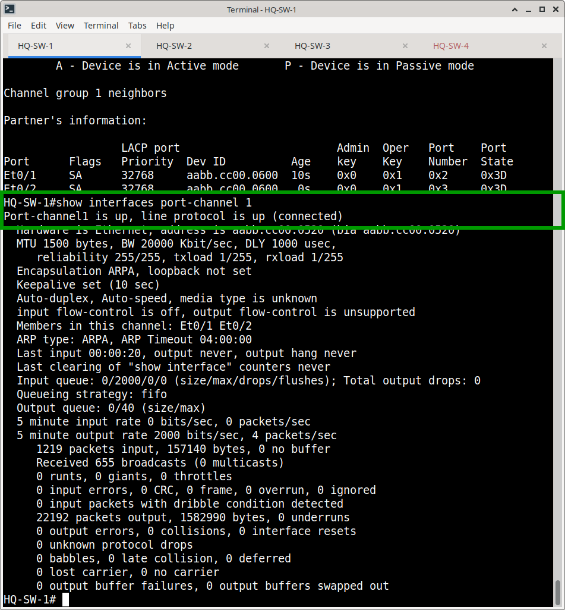
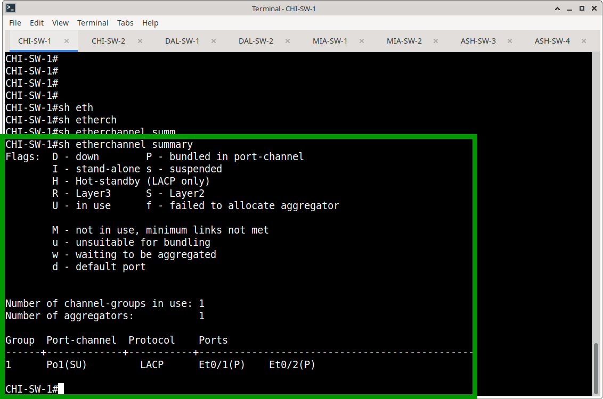
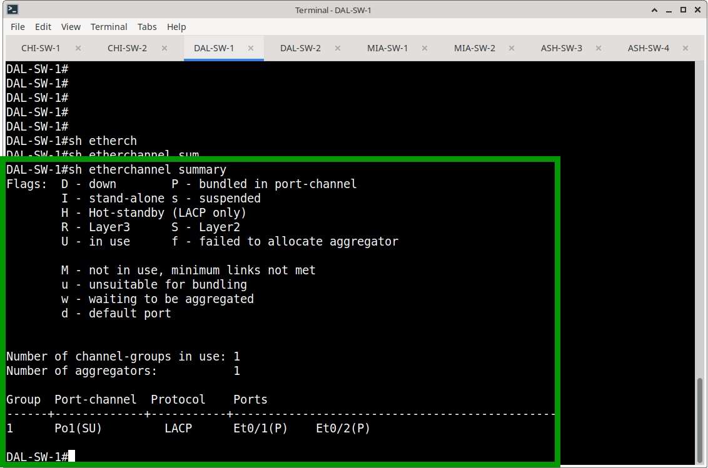
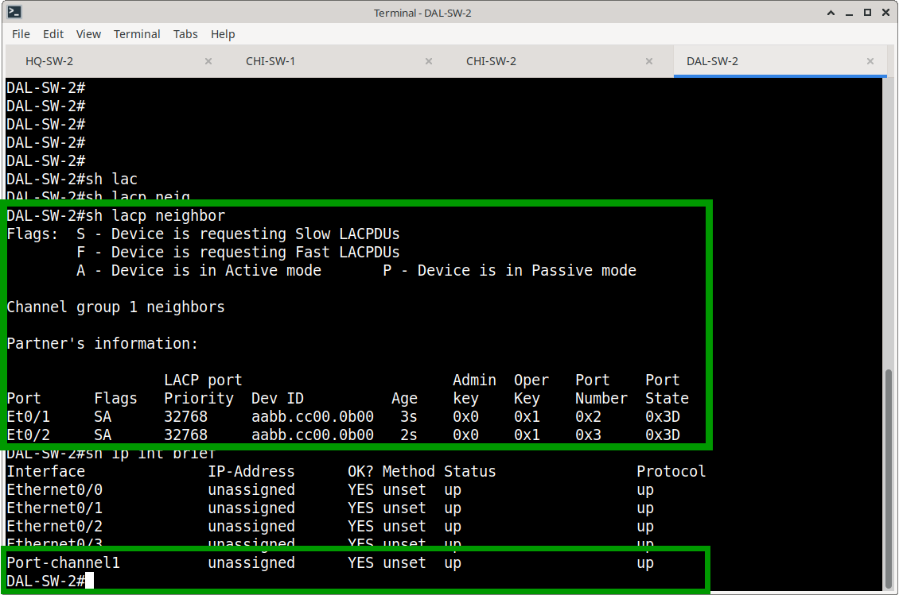
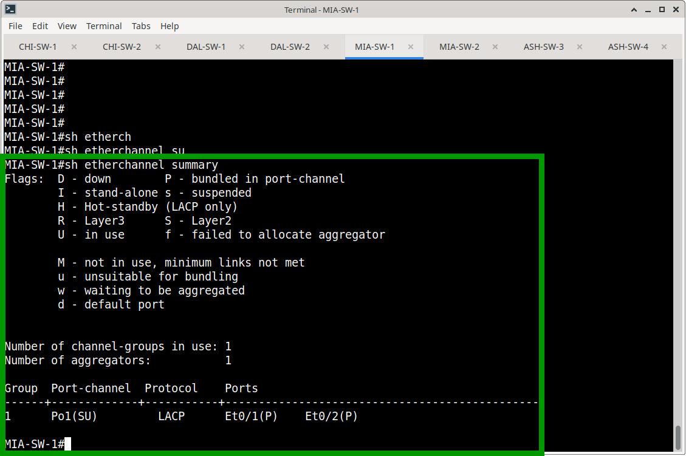
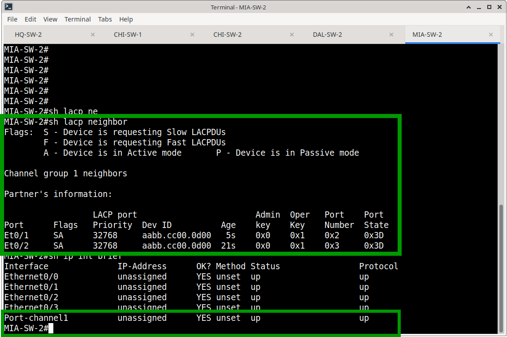
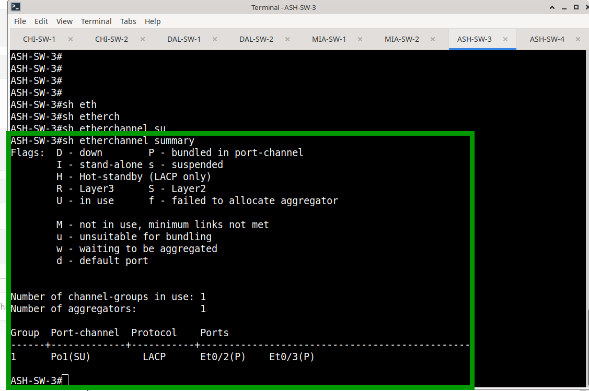

# EtherChannel LACP — Implementation Evidence

## HQ Site Verification

### HQ-SW-1 ↔ HQ-SW-2

**EtherChannel Summary:**

**Observation:** Group 1, Po1(SU), LACP protocol. Both Et0/1 and Et0/2 
show flag **P** (bundled). Port-channel is Layer 2 and in use.

**LACP Neighbor:**

**Observation:** Both neighbors report flags **SA**:
- **S** = Slow LACPDU (1-second intervals)
- **A** = Active mode

Partner Dev ID confirms adjacency with HQ-SW-2. Admin Key `0x0` / 
Oper Key `0x1` match on both ports — consistent LACP parameter negotiation.

**Port-Channel Interface State:**

**Observation:** `Port-channel1 is up, line protocol is up (connected)`. 
Members: `Et0/1 Et0/2`. Bandwidth: 20000 Kbit/sec (2 Gbps aggregate — 
confirms both links active). Zero input/output errors.

**HQ-SW-2 Independent Verification:**
- Po1(SU), LACP, Et0/1(P) + Et0/2(P)
- Port-channel1 up/up
- LACP neighbor: HQ-SW-1

---

## Branch Sites — Representative Evidence

### Chicago (CHI-SW-1 ↔ CHI-SW-2)

**Observation:** Po1(SU), LACP, Et0/1(P) + Et0/2(P). Standard branch design.

**CHI-SW-2 Independent Verification:**
- Po1(SU), LACP, Et0/1(P) + Et0/2(P)
- Port-channel1 up/up
- LACP neighbor Dev ID: `aabb.cc00.0a00` (CHI-SW-1)

---

### Dallas (DAL-SW-1 ↔ DAL-SW-2)

**Observation:** Po1(SU), LACP, Et0/1(P) + Et0/2(P). Consistent with 
Chicago design.

**DAL-SW-2 Independent Verification:**
- Po1(SU), LACP, Et0/1(P) + Et0/2(P)
- Port-channel1 up/up
- LACP neighbor Dev ID: `aabb.cc00.0b00` (DAL-SW-1)

---

### Miami (MIA-SW-1 ↔ MIA-SW-2)

**Observation:** Po1(SU), LACP, Et0/1(P) + Et0/2(P). Standard branch design.

**Observation:** Po1(SU), LACP, Et0/1(P) + Et0/2(P). Standard branch design.

**MIA-SW-2 Independent Verification:**
- Po1(SU), LACP, Et0/1(P) + Et0/2(P)
- Port-channel1 up/up
- LACP neighbor Dev ID: `aabb.cc00.0d00` (MIA-SW-1)

---

### Ashburn DR Site (ASH-SW-3 ↔ ASH-SW-4)

**Observation:** Po1(SU), LACP, **Et0/2(P) + Et0/3(P)**.

 

**Note:** Ashburn uses different member interfaces (Et0/2 + Et0/3) vs. 
standard branch design (Et0/1 + Et0/2) due to interface availability.

**ASH-SW-4 Independent Verification:**
- Po1(SU), LACP, Et0/2(P) + Et0/3(P)
- Port-channel1 up/up
- LACP neighbor Dev ID: `aabb.cc00.1400` (ASH-SW-3)

---

## HQ Second Switch Pair (HQ-SW-3 ↔ HQ-SW-4)

**Verification Summary:**
- HQ-SW-3: Po1(SU), LACP, Et0/1(P) + Et0/2(P), up/up
- HQ-SW-4: Po1(SU), LACP, Et0/1(P) + Et0/2(P), up/up
- LACP neighbor adjacency confirmed both directions

---

## Verification Summary Table

| Site       | Switch    | Port-channel | Members      | Status | LACP Neighbor Verified |
|------------|-----------|--------------|--------------|--------|------------------------|
| HQ         | HQ-SW-1   | Po1          | E0/1, E0/2   | UP     | Yes (HQ-SW-2)          |
| HQ         | HQ-SW-2   | Po1          | E0/1, E0/2   | UP     | Yes (HQ-SW-1)          |
| HQ         | HQ-SW-3   | Po1          | E0/1, E0/2   | UP     | Yes (HQ-SW-4)          |
| HQ         | HQ-SW-4   | Po1          | E0/1, E0/2   | UP     | Yes (HQ-SW-3)          |
| Chicago    | CHI-SW-1  | Po1          | E0/1, E0/2   | UP     | Yes (CHI-SW-2)         |
| Chicago    | CHI-SW-2  | Po1          | E0/1, E0/2   | UP     | Yes (CHI-SW-1)         |
| Dallas     | DAL-SW-1  | Po1          | E0/1, E0/2   | UP     | Yes (DAL-SW-2)         |
| Dallas     | DAL-SW-2  | Po1          | E0/1, E0/2   | UP     | Yes (DAL-SW-1)         |
| Miami      | MIA-SW-1  | Po1          | E0/1, E0/2   | UP     | Yes (MIA-SW-2)         |
| Miami      | MIA-SW-2  | Po1          | E0/1, E0/2   | UP     | Yes (MIA-SW-1)         |
| Ashburn    | ASH-SW-3  | Po1          | E0/2, E0/3   | UP     | Yes (ASH-SW-4)         |
| Ashburn    | ASH-SW-4  | Po1          | E0/2, E0/3   | UP     | Yes (ASH-SW-3)         |

---

## Failover Validation

*(Reference: `LACP Testing/` folder for continuous ping GIF and 
intentional link failure evidence)*

| Test                          | Result                              |
|-------------------------------|-------------------------------------|
| Intentional member shutdown   | Po1 remained up, ping uninterrupted |
| Member recovery               | LACP re-negotiated, link re-bundled |
| Continuous ping during fail   | 0% packet loss                      |

---

## Result

All 12 switches verified. LACP EtherChannels operational across all sites. 
Each bundle provides link aggregation, redundancy, and simplified Layer 2 
topology as designed.
