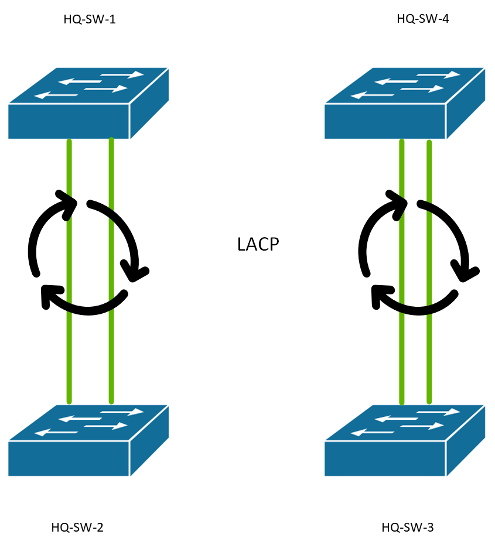
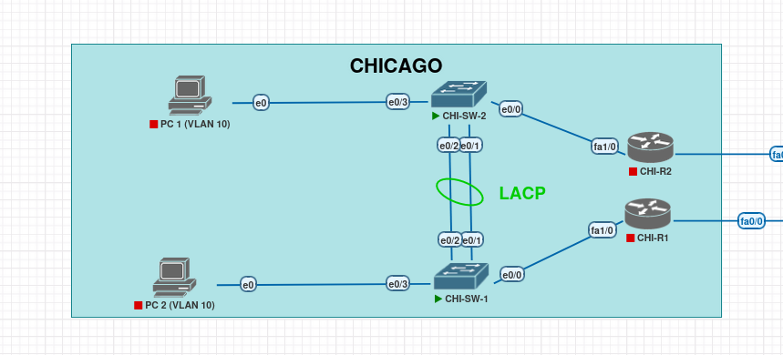
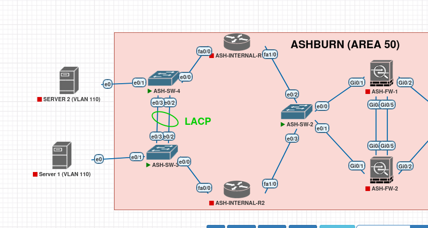

# EtherChannel with LACP — Layer 2 Link Aggregation

## Design Objective

Implement link-level redundancy and increased aggregate bandwidth across all 
switching environments without spanning-tree reconvergence delays.

## Protocol Selection: LACP (IEEE 802.3ad)

**Decision:** LACP was selected enterprise-wide over PAgP (Cisco proprietary).

| Criteria          | LACP (Selected)     | PAgP (Rejected)     |
|-------------------|---------------------|---------------------|
| Standard          | IEEE 802.3ad        | Cisco proprietary   |
| Multi-vendor      | Yes                 | No                  |
| Future-proofing   | Aligns with different vendors   | Vendor lock-in      |

**Rationale:** Maintains consistency across HQ (Cisco) and branch offices, 
aligns with multi-vendor strategy documented in `docs/standards/01-requirements.md`.

## Architecture

### HQ Site — Dual Switch Pairs



### Branch Offices (Chicago, Dallas, Miami)

Standardized 2-link LACP bundles between switch pairs using Et0/1 + Et0/2.



### Ashburn DR Site

Modified design using **Et0/2 + Et0/3** (vs. standard Et0/1 + Et0/2) due to 
interface availability constraints.



## Configuration Model

```cisco
interface range Ethernet0/1 - 2
 description LACP-TO-HQ-SW-<number.
 switchport trunk encapsulation dot1q
 switchport trunk native vlan 999
 switchport trunk allowed vlan 10,20,30,40,50,60,70,999
 switchport mode trunk
 channel-group 1 mode active
!
interface Port-channel1
 switchport trunk encapsulation dot1q
 switchport trunk native vlan 999
 switchport trunk allowed vlan 10,20,30,40,50,60,70,999
 switchport mode trunk
```

**Mode Selection:** Active/Active on both sides ensures LACP negotiation 
initiates from either end, eliminating single-point-of-failure in negotiation.

## Bundle Sizing Rationale

- **Bundle Size:** 2-link bundles were implemented across all switch pairs.
- **Rationale:** While LACP supports up to 8 active member links per bundle, a 2-link configuration was chosen to provide N+1 link-level redundancy while optimizing port availability within the simulated environment. 
- **Scalability:** This design is fully scalable to 4 or 8 active links in a production deployment should aggregate bandwidth requirements increase.
- **Load-Balancing:** Default `src-dst-ip` hashing is configured to ensure even traffic distribution across the active member links, preventing any single link from becoming a bottleneck.

## Failure Behavior

When a member link fails:
- LACP detects loss within ~3 seconds
- Port-channel remains **up** as long as ≥1 member is active
- **No STP reconvergence** — Port-channel interface state unchanged
- Verified via continuous ping test (see `configuration.md`)

## EtherChannel Inventory

| Site       | Switch Pair              | Port-channel | Member Interfaces | Protocol |
|------------|--------------------------|--------------|-------------------|----------|
| HQ         | HQ-SW-1 ↔ HQ-SW-2       | Po1          | E0/1, E0/2        | LACP     |
| HQ         | HQ-SW-3 ↔ HQ-SW-4       | Po1          | E0/1, E0/2        | LACP     |
| Chicago    | CHI-SW-1 ↔ CHI-SW-2     | Po1          | E0/1, E0/2        | LACP     |
| Dallas     | DAL-SW-1 ↔ DAL-SW-2     | Po1          | E0/1, E0/2        | LACP     |
| Miami      | MIA-SW-1 ↔ MIA-SW-2     | Po1          | E0/1, E0/2        | LACP     |
| Ashburn    | ASH-SW-3 ↔ ASH-SW-4     | Po1          | E0/2, E0/3        | LACP     |

## Verification Approach

All 12 switches verified. Representative evidence captured from:
- HQ-SW-1 (primary HQ switch)
- One switch per branch site (CHI-SW-1, DAL-SW-1, MIA-SW-1, ASH-SW-3)

Full verification commands:
- `show etherchannel summary` — Bundle status and member ports
- `show lacp neighbor` — LACP adjacency validation
- `show interfaces port-channel 1` — Logical interface state

## State Indicators

Healthy Layer 2 LACP bundle appearance:

```
Group  Port-channel  Protocol  Ports
1      Po1(SU)        LACP     Et0/1(P)  Et0/2(P)
```

**Flags:**
- **S** = Layer 2 EtherChannel
- **U** = Port-channel in use
- **P** = Physical interface bundled
- **LACP** = Protocol in use

## Evidence

Screenshots: `Switching/EtherChannel-LACP/screenshots/`

- `hq-sw1-etherchannel-summary.png` — HQ bundle verification
- `hq-sw1-lacp-neighbor.png` — LACP adjacency proof
- `hq-sw1-port-channel1.png` — Logical interface state
- `chi-sw1-etherchannel-summary.png` — Branch representative
- `dal-sw1-etherchannel-summary.png` — Branch representative
- `mia-sw1-etherchannel-summary.png` — Branch representative
- `ash-sw3-etherchannel-summary.png` — Ashburn variant (Et0/2 + Et0/3)

## Result

All LACP EtherChannels operational across HQ, branch, and DR sites. 
Each bundle provides:
- Functioning Port-channel interface
- LACP aggregation protocol
- Both physical members bundled
- Established LACP neighbor relationship
- Operational Layer 2 connectivity
